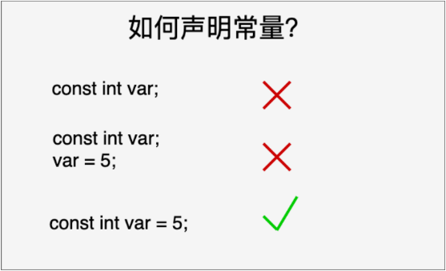
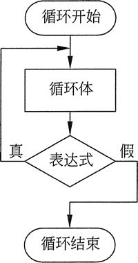

---
> Contributor: datamonday
>
> Repo: https://github.com/datamonday/CPP-TechStack

---
C知识概览
- 初步认识
- 数据类型
- 运算符和表达式
- 流程控制
- 函数
- 数组
- 指针
- 变量的作用域和存储方式
- 扩展数据类型
- 其它：
  - 字符串的处理
  - 进制转换
  - 补码
  - 动态分配内存
  - 链表的使用

---

# 1. C 初步认识

## 1.1 C 简介

C 语言是一种通用的高级语言，最初是由**丹尼斯·里奇**在贝尔实验室为开发 UNIX 操作系统而设计的。C 语言最开始是于 1972 年在 DEC PDP-11 计算机上被首次实现。

在 1978 年，布莱恩·柯林汉（Brian Kernighan）和丹尼斯·里奇（Dennis Ritchie）制作了 C 的第一个公开可用的描述，现在被称为 K&R 标准。

UNIX 操作系统，C编译器，和几乎所有的 UNIX 应用程序都是用 C 语言编写的。由于各种原因，C 语言现在已经成为一种广泛使用的专业语言。

- C 语言是为了编写 UNIX 操作系统而被发明的。
- C 语言是以 B 语言为基础的，B 语言大概是在 1970 年被引进的。
- 目前，C 语言是最广泛使用的系统程序设计语言。
- 当今最流行的 Linux 操作系统和 RDBMS（Relational Database Management System：关系数据库管理系统） MySQL 都是使用 C 语言编写的。

C 语言最初是用于系统开发工作，特别是组成操作系统的程序。由于 C 语言所产生的代码运行速度与汇编语言编写的代码运行速度几乎一样，所以采用 C 语言作为系统开发语言。

C语言程序写在一个或多个扩展名为 **".c"** 的文本文件中，例如，*hello.c*。可以使用 **"vi"**、**"vim"** 或任何其他文本编辑器来编写C 语言程序。

**C11**（也被称为C1X）指ISO标准ISO/IEC 9899:2011，是当前最新的C语言标准。在它之前的C语言标准为C99。

---
**C 编译器**

写在源文件中的源代码是人类可读的源。它需要"编译"，转为机器语言，这样 CPU 可以按给定指令执行程序。

C 语言编译器用于把源代码编译成最终的可执行程序。最常用的免费可用的编译器是 GNU 的 C/C++ 编译器， GNU 的 gcc 编译器适合于 C 和 C++ 编程语言。(*GNU*是一个自由的操作系统，其内容软件完全以GPL(通用公共许可证)方式发布。)

检查系统上是否安装了 GCC：

```shell
$ gcc -v
```

---

## 1.2 C 程序结构

C 程序主要包括以下部分：

- 预处理器指令
- 函数
- 变量
- 语句 & 表达式
- 注释

```c
#include <stdio.h>
 
int main()
{
    printf("Hello, World! \n");
 
    return 0;
}
```

- int main() 是主函数，所有的 C 语言程序都需要包含 **main()** 函数。 代码从 **main()** 函数开始执行。
- **printf()** 用于格式化输出到屏幕。**printf()** 函数在 **"stdio.h"** 头文件中声明。
- **stdio.h** 是一个头文件 (标准输入输出头文件) , **#include** 是一个预处理命令，告诉 C 编译器在实际编译之前要包含 stdio.h 文件。 当编译器遇到 **printf()** 函数时，如果没有找到 **stdio.h** 头文件，会发生编译错误。
- **return 0;** 语句用于表示退出程序。终止 main() 函数，并返回值 0。

把源代码保存在一个文件中，编译并运行它：

1. 打开一个文本编辑器，添加上述代码。

2. 保存文件为 `hello.c`。

3. 打开命令提示符，进入到保存文件所在的目录。

4. 键入 `gcc hello.c`，输入回车，编译代码。

5. 如果代码中没有错误，命令提示符会跳到下一行，并生成 `a.out` 可执行文件。

6. 现在，键入 `a.out` 来执行程序。

7. 可以看到屏幕上显示 `"Hello World"`。

   ```shell
   $ gcc hello.c
   $ ./a.out
   Hello, World!
   ```

   如果是多个 c 代码的源码文件，编译方法如下：

   ```shell
   $ gcc test1.c test2.c -o main.out
   $ ./main.out
   ```

   test1.c 与 test2.c 是两个源代码文件。

---

## 1.3 C 基本语法

C 程序由各种令牌组成，令牌可以是**关键字、标识符、常量、字符串值**，或者是**一个符号**。例如，下面的 C 语句包括五个令牌：

```c
printf("Hello, World! \n");
```

这五个令牌分别是：

```c
printf
(
"Hello, World! \n"
)
;
```

**分号**：在 C 程序中，分号是语句结束符。也就是说，每个语句必须以分号结束。它表明一个逻辑实体的结束。

**C 语言的注释：**

```
// 单行注释
```

以 **//** 开始的单行注释，这种注释可以单独占一行。

```
/* 单行注释 */
/* 
 多行注释
 多行注释
 多行注释
 */
```

**标识符**

C 标识符是用来标识变量、函数，或任何其他用户自定义项目的名称。

一个标识符以字母 A-Z 或 a-z 或下划线 _ 开始，后跟零个或多个字母、下划线和数字（0-9）。

C 标识符内不允许出现标点字符，比如 @、$ 和 %。C 是**区分大小写**的编程语言。有效的标识符：

```c
mohd       zara    abc   move_name  a_123
myname50   _temp   j     a23b9      retVal
```

**关键字**

下表列出了 C 中的保留字。这些保留字不能作为常量名、变量名或其他标识符名称。

| 关键字      | 说明                                                         |
| :---------- | :----------------------------------------------------------- |
| auto        | 声明自动变量                                                 |
| break       | 跳出当前循环                                                 |
| case        | 开关语句分支                                                 |
| **char**    | 声明字符型变量或函数返回值类型                               |
| **const**   | 定义常量，如果一个变量被 const 修饰，那么它的值就不能再被改变 |
| continue    | 结束当前循环，开始下一轮循环                                 |
| default     | 开关语句中的"其它"分支                                       |
| do          | 循环语句的循环体                                             |
| **double**  | 声明双精度浮点型变量或函数返回值类型                         |
| else        | 条件语句否定分支（与 if 连用）                               |
| enum        | 声明枚举类型                                                 |
| extern      | 声明变量或函数是在其它文件或本文件的其他位置定义             |
| **float**   | 声明浮点型变量或函数返回值类型                               |
| for         | 一种循环语句                                                 |
| goto        | 无条件跳转语句                                               |
| if          | 条件语句                                                     |
| int         | 声明整型变量或函数                                           |
| **long**    | 声明长整型变量或函数返回值类型                               |
| register    | 声明寄存器变量                                               |
| return      | 子程序返回语句（可以带参数，也可不带参数）                   |
| short       | 声明短整型变量或函数                                         |
| signed      | 声明有符号类型变量或函数                                     |
| **sizeof**  | 计算数据类型或变量长度（即所占字节数）                       |
| static      | 声明静态变量                                                 |
| struct      | 声明结构体类型                                               |
| switch      | 用于开关语句                                                 |
| **typedef** | 用以给数据类型取别名                                         |
| unsigned    | 声明无符号类型变量或函数                                     |
| union       | 声明共用体类型                                               |
| **void**    | 声明函数无返回值或无参数，声明无类型指针                     |
| volatile    | 说明变量在程序执行中可被隐含地改变                           |
| while       | 循环语句的循环条件                                           |

**C中的空格**

只包含空格的行，被称为空白行，可能带有注释，C 编译器会完全忽略它。

在 C 中，空格用于描述空白符、制表符、换行符和注释。

为了增强可读性，可以根据需要适当增加一些空格。

---

## 1.4 格式控制符

格式占位符(%)是在C/C++语言中格式输入函数，如 scanf、printf 等函数中使用。其意义就是起到格式占位的意思，表示在该位置有输入或者输出。

-  **%d, %i** 代表整数
-  **%f** 浮点
-  **%s** 字符串
-  **%c** char
-  **%p** 指针
-  **%fL** 长log
-  **%e** 科学计数
-  **%g** 小数或科学计数。
-  **%a,%A** 读入一个浮点值(仅C99有效)。
-  **%c** 读入一个字符。
-  **%d** 读入十进制整数。
-  **%i** 读入十进制，八进制，十六进制整数。
-  **%o** 读入八进制整数。
-  **%x,%X** 读入十六进制整数。
-  **%s** 读入一个字符串，遇空格、制表符或换行符结束。
-  **%f,%F,%e,%E,%g,%G** 用来输入实数，可以用小数形式或指数形式输入。
-  **%p** 读入一个指针。
-  **%u** 读入一个无符号十进制整数。
-  **%n** 至此已读入值的等价字符数。
-  **%[]** 扫描字符集合。
-  **%%** 读 % 符号

```c
scanf("%d,%d,%d",&a,&b,&c); // 从键盘输入三个整数，用逗号分隔
scanf("%c", &s);   // 从键盘输入一个字符 　
scanf("%f", &f);   // 从键盘输入一个浮点型数据 　

printf("%d\n",a);  // 输出一个整数 　
printf("%f\n",b);  // 输出一个浮点数 　
printf("%s\n",c);  // 输出一个字符, 其中\n表示换行
```

---

- `%d`：输出一个 整型。d 是 decimal 的简写；
- `%c`：输出一个字符。c 是 character 的简写。
- `%s`：输出一个字符串。s 是 string 的简写。
- `%f`：输出一个小数。f 是 float 的简写。
- `%lf` ：以十进制形式输出 double 类型。

---

- `%hd`：输出 short int 类型，hd 是 short decimal 的简写；
- `%ld`：输出 long int 类型，ld 是 long decimal 的简写。

---

- `%f` 以十进制形式输出 float 类型；
- `%lf` 以十进制形式输出 double 类型；
- `%e` 以指数形式输出 float 类型，输出结果中的 e 小写；
- `%E` 以指数形式输出 float 类型，输出结果中的 E 大写；
- `%le` 以指数形式输出 double 类型，输出结果中的 e 小写；
- `%lE` 以指数形式输出 double 类型，输出结果中的 E 大写。

---

严格来说，格式控制符和整数的符号是紧密相关的，具体就是：

- `%d` 以十进制形式输出**有符号数**；
- `%u` 以十进制形式输出无符号数；
- `%o` 以八进制形式输出无符号数；
- `%x` 以十六进制形式输出无符号数。

下表全面地总结了不同类型的整数，以不同进制的形式输出时对应的格式控制符（`--`表示没有对应的格式控制符）。

|          | short | int  | long | unsigned short | unsigned int | unsigned long |
| -------- | ----- | ---- | ---- | -------------- | ------------ | ------------- |
| 八进制   | --    | --   | --   | %ho            | %o           | %lo           |
| 十进制   | %hd   | %d   | %ld  | %hu            | %u           | %lu           |
| 十六进制 | --    | --   | --   | %hx 或者 %hX   | %x 或者 %X   | %lx 或者 %lX  |

- 当以有符号数的形式输出时，printf 会读取数字所占用的内存，并把最高位作为符号位，把剩下的内存作为数值位；
- 当以无符号数的形式输出时，printf 也会读取数字所占用的内存，并把所有的内存都作为数值位对待。

如果对一个有符号的负数使用 `%o` 或者 `%x` 输出，结果会大相径庭。

```c
#include <stdio.h>
int main()
{
    short a = 0100;  //八进制
    int b = -0x1;  //十六进制
    long c = 720;  //十进制
   
    unsigned short m = 0xffff;  //十六进制
    unsigned int n = 0x80000000;  //十六进制
    unsigned long p = 100;  //十进制
   
    //以无符号的形式输出有符号数
    printf("a=%#ho, b=%#x, c=%ld\n", a, b, c);
    //以有符号数的形式输出无符号类型（只能以十进制形式输出）
    printf("m=%hd, n=%d, p=%ld\n", m, n, p);

    return 0;
}
```

运行结果：

```c
a=0100, b=0xffffffff, c=720
m=-1, n=-2147483648, p=100
```

---

# 2. C 数据类型

<font color=red>**字节（Byte，B）是存储数据的单位，并且是硬件所能访问的最小单位。**</font>

- 1B = 8 bit；
- 1K = 1024B；（1024 = 2^10）
- 1M = 1024K；

**硬盘容量的计算方式以1000为单位，计算机内部以1024为单位，所以硬盘容量实际显示的容量小于标称容量**。

**网速指的是bit per seconds，100M宽带（100M bit/s）的下载速度大概维持在12MB/s（100M / 8）**。

---

在C语言中，数据类型指的是用于声明不同类型的变量或函数的一个广泛的系统。变量的类型决定了变量存储占用的空间，以及如何解释存储的位模式。

C语言中的类型可以分为：

| 序号 | 类型与描述                                                   |
| :--- | :----------------------------------------------------------- |
| 1    | **基本类型**：它们是算术类型，包括两种类型：【整数类型】和【浮点类型】。 |
| 2    | 【**枚举类型**】：它们也是算术类型，被用来定义在程序中只能赋予其一定的离散整数值的变量。 |
| 3    | 【**void 类型**】： 类型说明符 *void* 表明没有可用的值。     |
| 4    | **派生类型**：它们包括：【指针类型】、【数组类型】、【结构类型】、【共用体类型】和【函数类型】。 |

数组类型和结构类型统称为聚合类型。函数的类型指的是函数返回值的类型。

---

## 2.1 整型 (int,char,short,long)

| 类型           | 存储大小    | 值范围                                               |
| :------------- | :---------- | :--------------------------------------------------- |
| **char**       | 1 字节      | -128 到 127 或 0 到 255                              |
| unsigned char  | 1 字节      | 0 到 255                                             |
| signed char    | 1 字节      | -128 到 127                                          |
| **int**        | 2 或 4 字节 | -32,768 到 32,767 或 -2,147,483,648 到 2,147,483,647 |
| unsigned int   | 2 或 4 字节 | 0 到 65,535 或 0 到 4,294,967,295                    |
| **short**      | 2 字节      | -32,768 到 32,767                                    |
| unsigned short | 2 字节      | 0 到 65,535                                          |
| **long**       | 4 字节      | -2,147,483,648 到 2,147,483,647                      |
| unsigned long  | 4 字节      | 0 到 4,294,967,295                                   |

可以使用 `sizeof(type)` 运算符查看对象或类型的存储字节大小。

```c
#include <stdio.h>
#include <limits.h>
 
int main()
{  // %lu 为 32 位无符号整数
   printf("int 存储大小 : %lu \n", sizeof(int));
   
   return 0;
}
```

---

## 2.2 浮点 (float,double)

| 类型        | 存储大小 | 值范围                 | 精度      |
| :---------- | :------- | :--------------------- | :-------- |
| float       | 4 字节   | 1.2E-38 到 3.4E+38     | 6 位小数  |
| double      | 8 字节   | 2.3E-308 到 1.7E+308   | 15 位小数 |
| long double | 16 字节  | 3.4E-4932 到 1.1E+4932 | 19 位小数 |

**头文件 float.h 定义了宏，在程序中可以使用这些值和其他有关实数二进制表示的细节**。

```c
#include <stdio.h>
#include <float.h>
 
int main()
{
   printf("float 存储最大字节数 : %lu \n", sizeof(float));
   printf("float 最小值: %E\n", FLT_MIN );
   printf("float 最大值: %E\n", FLT_MAX );
   printf("精度值: %d\n", FLT_DIG );
   
   return 0;
}
```

**%E** 为以指数形式输出单、双精度实数。

## 2.3 void

void 类型指定没有可用的值。它通常用于以下三种情况下：

| 序号 | 类型与描述                                                   |
| :--- | :----------------------------------------------------------- |
| 1    | **函数返回为空** <br>C 中有各种函数都不返回值，或者您可以说它们返回空。不返回值的函数的返回类型为空。例如 **void exit (int status);** |
| 2    | **函数参数为空**<br/> C 中有各种函数不接受任何参数。不带参数的函数可以接受一个 void。例如 **int rand(void);** |
| 3    | **指针指向 void**<br/> 类型为 `void *` 的指针代表对象的地址，而不是类型。例如，内存分配函数 `void *malloc( size_t size )`; 返回指向 void 的指针，可以转换为任何数据类型。 |

## 2.4 枚举 (类似Python集合)

枚举是 C 语言中的一种基本数据类型，它可以让数据更简洁，更易读。

枚举语法定义格式为：

```c
enum　枚举名　{枚举元素1,枚举元素2,...};
```

例如：一星期有 7 天，如果不用枚举，需要使用 #define 来为每个整数定义一个别名：

```c
#define MON  1 
#define TUE  2 
#define WED  3 
#define THU  4 
#define FRI  5 
#define SAT  6 
#define SUN  7
```

使用枚举的方式：

```c
enum DAY
{
      MON=1, TUE, WED, THU, FRI, SAT, SUN
};
```

**注**：第一个枚举成员的默认值为整型的 0，后续枚举成员的值在前一个成员上加 1。这个实例中把第一个枚举成员的值定义为 1，第二个为 2，以此类推。

可以在定义枚举类型时改变枚举元素的值：
```c
enum season {spring, summer=3, autumn, winter};
```
**没有指定值的枚举元素，其值为前一元素加 1**。也就说 spring 的值为 0，summer 的值为 3，autumn 的值为 4，winter 的值为 5。

---

前面只是声明了枚举类型，接下来看看如何定义枚举变量。

**有三种方式来定义枚举变量**：

**1. 先定义枚举类型，再定义枚举变量**

```c
enum DAY
{
    MON=1, TUE, WED, THU, FRI, SAT, SUN
};
enum DAY day;
```

**2. 定义枚举类型的同时定义枚举变量**

```c
enum DAY
{
    MON=1, TUE, WED, THU, FRI, SAT, SUN
} day;
```

**3. 省略枚举名称，直接定义枚举变量**

```c
enum
{
    MON=1, TUE, WED, THU, FRI, SAT, SUN
} day;
```

在C 语言中，枚举类型是被当做 int 或者 unsigned int 类型来处理的，所以按照 C 语言规范是没有办法遍历枚举类型的。不过在一些特殊的情况下，枚举类型必须连续是可以实现有条件的遍历。如果枚举类型不连续，则枚举无法遍历。

在 case 语句中使用枚举类型：

```c
# include "stdio.h"
# include "stdlib.h"

//enum DAY {
//	MON = 1, TUE, WED, THU, FRI, SAT, SUN
//} day;
//
//int main() {
//	for (day = MON; day <= SUN; ++day) {
//		printf("枚举元素：%d\n", day);
//	}
//}

int main()
{
    enum color { red=1, green, blue };
 
    enum  color favorite_color;
 
    /* 用户输入数字来选择颜色 */
    printf("请输入你喜欢的颜色: (1. red, 2. green, 3. blue): ");
    scanf("%u", &favorite_color);
 
    /* 输出结果 */
    switch (favorite_color)
    {
    	case red:
    		printf("你喜欢的颜色是红色");
    		break;
    	case green:
        	printf("你喜欢的颜色是绿色");
        	break;
    	case blue:
        	printf("你喜欢的颜色是蓝色");
        	break;
    	default:
        	printf("你没有选择你喜欢的颜色");
    }

    return 0;
}
```

---

# 3. C 变量

<font color=red>**变量是程序可操作的存储区的名称（内存中的一段存储空间）**</font>。C 语言中每个变量都有特定的类型，类型决定了变量存储的大小和布局，该范围内的值都可以存储在内存中，运算符可应用于变量上。

| 类型   | 描述                                                         |
| :----- | :----------------------------------------------------------- |
| char   | 通常是一个字节（八位）, 这是一个整数类型。                   |
| int    | 整型，4 个字节，取值范围 -2147483648 到 2147483647。         |
| float  | 单精度浮点值。单精度是这样的格式，1位符号，8位指数，23位小数。 |
| double | 双精度浮点值。双精度是1位符号，11位指数，52位小数。 |
| void   | 表示类型的缺失。                                             |

## 3.1 变量初始化

**一个变量一定要先初始化才可以使用，因为 c 语言中默认一个没有初始化的变量值是一个不可知的很大值**。

如果变量未初始化，则会使用存放在内存中的垃圾值（上次使用，残留在内存中的值，不确定的值），某些IDE会用填充字代替垃圾值！

初始化相当于给对应的内存空间赋值，变量指向该内存空间，也就被初始化了。 

**程序运行完之后，操作系统回收内存空间，但并不会清空内存空间中遗留下来的数据**。

---

**初始化局部变量和全局变量**：当局部变量被定义时，系统不会对其初始化，必须自行对其初始化。**定义全局变量时，系统会自动对其初始化**：

| 数据类型 | 初始化默认值 |
| :------- | :----------- |
| int      | 0            |
| char     | '\0'         |
| float    | 0            |
| double   | 0            |
| pointer  | NULL         |

正确地初始化变量是一个良好的编程习惯，否则有时候程序可能会产生意想不到的结果，因为未初始化的变量会导致一些在内存位置中已经可用的垃圾值。

---

## 3.2 变量的定义

1. 变量定义：

   ```c
   type variable_list;
   ```

   **`type`** 必须是一个有效的 C 数据类型，可以是 char、w_char、int、float、double 或任何用户自定义的对象，**`variable_list`** 可以由一个或多个标识符名称组成，多个标识符之间用逗号分隔。

2. 一次可以定义多个变量，使用逗号分隔：

   ```c
   int    i, j, k;
   char   c, ch;
   float  f, salary;
   double d;
   ```

3. 变量可以在声明时被初始化：

   ```c
   type variable_name = value;
   ```

   ```c
   extern int d = 3, f = 5;    // d 和 f 的声明与初始化
   int d = 3, f = 5;           // 定义并初始化 d 和 f
   byte z = 22;                // 定义并初始化 z
   char x = 'x';               // 变量 x 的值为 'x'
   ```

---

## 3.3 变量的声明

<font color=red>**变量声明向编译器保证变量以指定的类型和名称存在，这样编译器在不需要知道变量完整细节的情况下也能继续进一步的编译。**</font>变量声明只在编译时有意义，在程序连接时编译器需要实际的变量声明。变量声明的两种情况：

1. 需要建立存储空间。例如：`int a` 在声明时已经建立了存储空间。

2. 不需要建立存储空间。使用 `extern` 关键字声明变量名而不定义它。 例如：`extern int a`， 其中变量 a 可以在别的文件中定义。

3. <font color=blue>**除非有extern关键字，否则都是变量的定义**。</font>

   ```c
   extern int i; //声明，不是定义
   int i; //声明，也是定义
   ```

实例1：

变量在头部就已经被声明，但是定义与初始化在主函数内：

```c
# include "stdio.h"

// 函数外定义变量 x 和 y
int x, y;

int add_num(){
	// 函数内声明变量 x 和 y 为外部变量
	extern int x;
	extern int y;
	
	// 给外部变量（全局变量）x 和 y 赋值
	x = 1;
	y = 2;
	
	return x + y; 
} 

int main() {
	int result;
	
	result = add_num();
	
	printf("result = %d", result);
	
	return 0;
}
```

<font color=blue>**如需在一个源文件中引用另外一个源文件中定义的变量，只需在引用的文件中将变量加上 `extern` 关键字声明即可**。</font>

---

## 3.4 左值和右值

1. 左值（Lvalues）：指向内存位置的表达式称为左值表达式。左值可以出现在赋值号的左边或右边。
2. 右值（Rvalues）：存储在内存中某些地址的数值。<font color=red> **右值是不能对其进行赋值的表达式，即右值可以在赋值号的右边，但不能在赋值号的左边**。</font>

变量是左值，因此可以出现在赋值号的左边。数值型的字面值是右值，不能被赋值，不能出现在赋值号的左边，如：

```c
int g = 20;

// 无效，导致编译错误
10 = 20
```

---

## 3.5 变量的内存寻址

**内存寻址由大到小，优先分配内存地址比较大的字节给变量，所以说变量越先定义，内存地址就越大**。 如下面代码，先定义变量 a，再定义变量 b。a 的地址比 b 的地址大 4 字节。

```c
# include "stdio.h"

int main() {
	int a;
	int b;
	// 000000000062FE1C 
	printf("int类型变量 a 的内存地址为：%p \n", &a); 
    // 000000000062FE18
	printf("int类型变量 b 的内存地址为：%p \n", &b);  
} 
```

---

## 3.6 不同变量的相互赋值问题

补码相关。溢出。

```c
# include "stdio.h"

int main() {
	int i = 408;
	long j = 9090145145;
	i = j;
	
	// 输出：500210553, 500210553 
	printf("%ld, %d \n", i, j);
	
	float x = 3.14;
	double y = 6.28;
	
	// 输出：3.140000, 6.280000 
	printf("%f, %lf \n", x, y);
}
```

---

# 4. C 常量（字面量）

常量是固定值，在程序执行期间不会改变，又称为字面量。常量可以使任何的基本数据类型。

- 整数是以补码的形式转化为二进制码存储在计算机中；
- 实数是以IEEE754为标准转化为二进制码存储在计算机中；
- 字符的本质实际上与整数的存储方式相同。

## 4.1 整数常量

整数常量可以是十进制、八进制和十进制的常量。前缀指定基数：`0x` 或 `0X` 表示**十六进制**，`0` 表示**八进制**，不带前缀则默认表示**十进制**。

整数常量也可以带一个后缀，后缀是 U 和 L 的组合，`U` 表示无符号整数（unsigned），`L` 表示长整数（long）。后缀可以是大写，也可以是小写，U 和 L 的顺序任意。

```c
85         /* 十进制 */
0213       /* 八进制 */
0x4b       /* 十六进制 */
30         /* 整数 */
30u        /* 无符号整数 */
30l        /* 长整数 */
30ul       /* 无符号长整数 */
```

---

## 4.2 浮点常量

浮点常量由整数部分、小数点、小数部分和指数部分组成。可以使用**小数形式**或者**指数形式**来表示浮点常量。

- 当使用**小数**形式表示时，必须包含整数部分、小数部分，或同时包含两者。
- 当使用**指数**形式表示时， 必须包含小数点、指数，或同时包含两者。
- 带符号的指数是用 `e` 或 `E` 引入的。

```c
3.14159       /* 合法的 */
314159E-5L    /* 合法的 */
510E          /* 非法的：不完整的指数 */
210f          /* 非法的：没有小数或指数 */
.e55          /* 非法的：缺少整数或分数 */
```

---

## 4.3 转义字符

字符集（Character Set）为每个字符分配了**唯一的编号**，称为**编码值**。在C语言中，一个字符除了可以用它的实体（也就是真正的字符）表示，还可以用编码值表示。这种使**用编码值来间接地表示字符的方式**称为**转义字符（Escape Character）**。

转义字符以 `\` 或者 `\x` 开头，以 `\` 开头表示后跟**八进制**形式的编码值，以 `\x` 开头表示后跟**十六进制**形式的编码值。**对于转义字符来说，只能使用八进制或者十六进制**。

**转义字符既可以用于单个字符，也可以用于字符串，并且一个字符串中可以同时使用八进制形式和十六进制形式**。

---

## 4.4 字符常量（''）

<font color=red>**单引号中的内容是一个 char 类型，是一个字符，这个字符对应的是 ASCII 表中的序列值**。</font> 例如：`char x = 'a';printf("%d", x)` 输出 `97(a 的 ASCII 码)` 。**ASCII码不是一个值，而是一种规定。规定了不同的字符使用哪个整数值表示**。

字符常量是括在**单引号**中，例如：`char x = 'a'`。下标列出了常用的转义序列码：

| 转义序列   | 含义                       |
| :--------- | :------------------------- |
| \\\        | \ 字符                     |
| \\'        | ' 字符                     |
| \\"        | " 字符                     |
| \?         | ? 字符                     |
| \a         | 警报铃声                   |
| \b         | 退格键                     |
| **\f**     | 换页符                     |
| \n         | 换行符                     |
| **\r**     | 回车                       |
| **\t**     | 水平制表符                 |
| \v         | 垂直制表符                 |
| \ooo       | 一到三位的八进制数         |
| \xhh . . . | 一个或多个数字的十六进制数 |

---

## 4.5 字符串常量（""）

字符串常量括在**双引号**中。<font color=red>在C语言中没有专门的字符串类型，只能使用**数组**或者**指针**间接地存储字符串。</font>

```c
char str1[] = "hello world";

char *str2 = "hi C";
```

所有的字符串（双引号""）末尾以 `\0` 为结束符。所以语句 `char ch = "a";` 是错误的，因为 `char` 类型只能存放单个字符。

---

## 4.6 定义常量(#define 和 const)

C语言的两种定义常量的方式：

1. `#define` 预处理器；

   ```c
   #define identifier value
   ```

   ```c
   #include <stdio.h>
    
   #define LENGTH 10   
   #define WIDTH  5
   #define NEWLINE '\n'
    
   int main()
   {
    
      int area;  
     
      area = LENGTH * WIDTH;
      printf("value of area : %d", area);
      printf("%c", NEWLINE);
    
      return 0;
   }
   ```

2. `const` 关键字；

   ```c
   const type variable = value;
   ```

   ```c
   #include <stdio.h>
    
   int main()
   {
      const int  LENGTH = 10;
      const int  WIDTH  = 5;
      const char NEWLINE = '\n';
      int area;  
      
      area = LENGTH * WIDTH;
      printf("value of area : %d", area);
      printf("%c", NEWLINE);
    
      return 0;
   ```





### 1）define与const区别

**宏**：计算机科学里的【宏】是一种抽象（Abstraction），它根据一系列预定义的规则替换一定的文本模式。解释器或编译器在遇到*宏*时会自动进行这一模式替换。

**`#define`** 是宏定义，不能定义常量，但宏定义可以实现在字面意义上和其它定义常量相同的功能。其定义的是不带类型的常数，只进行简单的字符替换。在预编译时起作用，不存在类型检查。

**`const`** 并非常量，而是带类型的变量，只是改变了变量的存储类，**把变量所占的内存变为只读**！在编译运行时起作用，不存在类型检查。

本质的区别在于**`#define`** 不为宏名分配内存，而 **`const`** 也不为常量分配内存。

二者区别：

**(1) 编译器处理方式不同**

- **`#define`** 宏是在预处理阶段展开。
-  **`const`** 常量是编译运行阶段使用。

**(2) 类型和安全检查不同**

-  **`#define`** 宏没有类型，不做任何类型检查，仅仅是展开。
-  **`const`** 常量有具体的类型，在编译阶段会执行类型检查。

**(3) 存储方式不同**

- **`#define`** 宏仅仅是展开，有多少地方使用就展开多少次，不分配内存（**宏定义不分配内存，变量定义分配内存**）。
- **`const`** 常量会在内存中分配（可以是堆中也可以是栈中）。

**(4) `const`可以节省空间，避免不必要的内存分配。**

- 从汇编的角度来看， **`const`** 定义常量只是给出了对应的内存地址，而 **`#define`** 给出的是立即数，所以  **`const`**  定义的常量在程序运行过程中只有一份拷贝（因为是全局的只读变量，存在静态区），而 **`#define`** 定义的常量在内存中有若干个拷贝。

**(5) 提高了效率。**

- 编译器通常不为普通  **`const`**  常量分配存储空间，而是将它们保存在符号表中，这使得它成为一个编译期间的常量，没有了存储与读内存的操作，使得它的效率也很高。

**(6) 宏替换只作替换，不做计算，不做表达式求解。**

- 宏预编译时就替换了，程序运行时，并不分配内存。

---

### 2）define的边缘效应

`#define` 注意“边缘效应”，例：**`#define N 2+3`**，N 的值是 5。

```c
double a;
a = (float)N/(float)2;
```

在编译时我们预想 **a=2.5**，实际打印结果是 **3.5**。原因是在预处理阶段，编译器将 **a=N/2** 处理成 **a=2+3/2**，这就是 **define** 宏的边缘效应，所以应该写成 **`#define N (2+3)`**。

```c
#include <stdio.h>

#define N 2+3
//正确写法 #define N (2+3)

int main(){   
    double a ;
    a = (float)N/(float)2;
    printf("a 的值为 : %.2f", a);   
  
    return 0;
}
```

---

## 4.7 字符串

在 C 语言中，字符串实际上是使用 **null** 字符 **\0** 终止的一维字符数组。因此，一个以 **null** 结尾的字符串，包含了组成字符串的字符。

下面的声明和初始化创建了一个 **RUNOOB** 字符串。由于在数组的末尾存储了空字符，所以字符数组的大小比单词 **RUNOOB** 的字符数多一个。

```
char site[7] = {'R', 'U', 'N', 'O', 'O', 'B', '\0'};
```

依据数组初始化规则，您可以把上面的语句写成以下语句：

```
char site[] = "RUNOOB";
```

以下是 C/C++ 中定义的字符串的内存表示：


其实，不需要把 **null** 字符放在字符串常量的末尾。C 编译器会在初始化数组时，自动把 **\0** 放在字符串的末尾。输出上面的字符串：

```c
#include <stdio.h>
 
int main ()
{
   char site[7] = {'R', 'U', 'N', 'O', 'O', 'B', '\0'};
 
   printf("菜鸟教程: %s\n", site );
 
   return 0;
}
```

当上面的代码被编译和执行时，它会产生下列结果：

```c
菜鸟教程: RUNOOB
```

C 中有大量操作字符串的函数：

| 序号 | 函数 & 目的                                                  |
| :--- | :----------------------------------------------------------- |
| 1    | **strcpy(s1, s2);** 复制字符串 s2 到字符串 s1。              |
| 2    | **strcat(s1, s2);** 连接字符串 s2 到字符串 s1 的末尾。       |
| 3    | **strlen(s1);** 返回字符串 s1 的长度。                       |
| 4    | **strcmp(s1, s2);** 如果 s1 和 s2 是相同的，则返回 0；如果 s1<s2 则返回小于 0；如果 s1>s2 则返回大于 0。 |
| 5    | **strchr(s1, ch);** 返回一个指针，指向字符串 s1 中字符 ch 的第一次出现的位置。 |
| 6    | **strstr(s1, s2);** 返回一个指针，指向字符串 s1 中字符串 s2 的第一次出现的位置。 |

下面的实例使用了上述的一些函数：

```c
#include <stdio.h>
#include <string.h>
 
int main ()
{
   char str1[14] = "runoob";
   char str2[14] = "google";
   char str3[14];
   int  len ;
 
   /* 复制 str1 到 str3 */
   strcpy(str3, str1);
   printf("strcpy( str3, str1) :  %s\n", str3 );
 
   /* 连接 str1 和 str2 */
   strcat( str1, str2);
   printf("strcat( str1, str2):   %s\n", str1 );
 
   /* 连接后，str1 的总长度 */
   len = strlen(str1);
   printf("strlen(str1) :  %d\n", len );
 
   return 0;
}
```

当上面的代码被编译和执行时，它会产生下列结果：

```c
strcpy( str3, str1) :  runoob
strcat( str1, str2):   runoobgoogle
strlen(str1) :  12
```

在 C 标准库中找到更多字符串相关的函数。

字符串在以如下输入进行初始化的时候需要对 **\0** 特别注意：

```c
char greeting[6] = {'H', 'e', 'l', 'l', 'o', '\0'};
```

如果没有在字符数组最后增加 **\0** 的话输出结果有误：

```c
// 初始化字符串
char greeting[5] = { 'H', 'e', 'l', 'l', 'o' };
printf("Greeting message: %s\n", greeting);
```

输出结果：

```c
Greeting message: Hello烫烫烫?侵7(?╔?╚╔╔
```

在使用不定长数组初始化字符串时默认结尾为 **\0**

```c
char greeting[] = "Hello";
printf("Greeting message: %s, greeting[] Length: %d\n", greeting, sizeof(greeting));
```

输出结果：

```c
Greeting message: Hello, greeting[] Length: 6
```

**结论：**需在给定字符数组的大小时在原有的字符串的字符数上加 1。

---

**strlen 与 sizeof的区别：**

- strlen 是函数，sizeof 是运算操作符，二者得到的结果类型为 size_t，即 unsigned int 类型。 
- sizeof 计算的是变量的大小，不受字符 **\0** 影响；
- 而 strlen 计算的是字符串的长度，以 **\0** 作为长度判定依据。

**'a'** 表示是一个字符，**"a"** 表示一个字符串相当于 **'a'+'\0'**;

- **''** 里面只能放一个字符; 

- **""** 里面表示是字符串系统自动会在串末尾补一个 0。 

---

# 5. C 存储类

存储类定义 C 语言程序中变量/函数的范围（可见性）和生命周期。这些说明符放置在它们所修饰的类型之前。C 程序中可用的存储类：

- `auto`：局部变量的默认存储类，限定变量只能在函数内部使用；
- `static`：全局变量的默认存储类，表示变量在程序生命周期内可见；
- `extern`：全局变量，即对程序内所有文件可见，类似于Java中的public关键字；
- `register`：代表了寄存器变量，不在内存中使用。

---

## 5.1 auto（局部，仅在函数内）

**auto** 存储类是所有局部变量默认的存储类。

```c
{
   int mount;
   auto int month;
}
```

上面的实例定义了两个带有相同存储类的变量，auto 只能用在函数内，即 auto 只能修饰局部变量。

---

## 5.2 static（全局，程序生命周期）

**在 C 语言中，`static` 可以用来修饰局部变量，全局变量以及函数。在不同的情况下 `static` 的作用不尽相同**。

**`static`** 存储类指示编译器在程序的生命周期内保持局部变量的存在，而不需要在每次它进入和离开作用域时进行创建和销毁。因此，**使用 static 修饰局部变量可以在函数调用之间保持局部变量的值**。

static 修饰符也可以应用于全局变量。**当 static 修饰全局变量时，会使变量的作用域限制在声明它的文件内**。

**全局声明的一个 static 变量或方法可以被任何函数或方法调用，只要这些方法出现在跟 static 变量或方法同一个文件中**。

---

## 5.3 extern（全局，所有文件中）

**extern** 存储类用于提供一个全局变量的引用，全局变量对所有的程序文件都是可见的。对于无法初始化的变量，**extern** 会把变量名指向一个之前定义过的存储位置。

当有多个文件且定义了一个可以在其他文件中使用的全局变量或函数时，可以在其他文件中使用 **extern** 来得到已定义的变量或函数的引用。可以这么理解，**extern** 是用来在另一个文件中声明一个全局变量或函数。

**extern** 通常用于当有两个或多个文件共享相同的全局变量或函数时。

---

## 5.4 register（寄存器变量）

**register** 存储类用于定义存储在寄存器中而不是 RAM 中的局部变量。这意味着变量的最大尺寸等于寄存器的大小（通常是一个词），且不能对它应用一元的 `&` 运算符（因为它没有内存位置）。

```c
{
   register int  miles;
}
```

**寄存器只用于需要快速访问的变量，比如计数器**。还应注意的是，定义 register 并不意味着变量将被存储在寄存器中，它意味着变量可能存储在寄存器中，这取决于硬件和实现的限制。

---

## 5.5 全局变量、局部变量、静态全局变量、静态局部变量的区别

**从作用域看：**

1、【**全局变量**】具有全局作用域。全局变量只需在一个源文件中定义，就可以作用于所有的源文件。当然，其他不包含全局变量定义的源文件需要用 `extern` 关键字再次声明这个全局变量。

2、【**静态局部变量**】具有局部作用域，它只被初始化一次，自从第一次被初始化直到程序运行结束都一直存在，它和全局变量的区别在于**全局变量对所有的函数都是可见的**，而**静态局部变量只对定义自己的函数体始终可见**。

3、【**局部变量**】也只有局部作用域，它是自动对象 `auto`，它在程序运行期间不是一直存在，而是**只在函数执行期间存在**，**函数的一次调用执行结束后，变量被撤销，其所占用的内存也被收回**。

4、【**静态全局变量**】也具有全局作用域，它与全局变量的区别在于如果程序包含多个文件的话，它作用于定义它的文件里，不能作用到其它文件里，即被 `static` 关键字修饰过的变量具有**文件作用域**。这样**即使两个不同的源文件都定义了相同名字的静态全局变量，它们也是不同的变量**。

**从分配内存空间看：**

1、全局变量，静态局部变量，静态全局变量都在静态存储区分配空间，而局**部变量在栈里分配空间**。

2、全局变量， 静态全局变量是静态存储方式。这两者的区别在于：非静态全局变量的作用域是整个源程序，当一个源程序由多个源文件组成时，非静态的全局变量在各个源文件中都是有效的。而**静态全局变量则限制了其作用域，即只在定义该变量的源文件内有效，在同一源程序的其它源文件中不能使用它**。由于静态全局变量的作用域局限于一个源文件内，只能为该源文件内的函数公用，因此**可以避免在其它源文件中引起错误**。

-  静态变量会被放在程序的静态数据存储区(全局可见)中，这样可以在下一次调用的时候还可以保持原来的赋值。这一点是它与堆栈变量和堆变量的区别。
-  变量用 `static` 告知编译器，仅在变量的作用范围内可见。这一点是它与全局变量的区别。

从以上分析可以看出， **把局部变量改变为静态变量后是改变了它的存储方式即改变了它的生存期。把全局变量改变为静态变量后是改变了它的作用域，限制了它的使用范围**。因此 `static`  在不同的地方起的作用是不同的。

**Tips:**

-  A.若全局变量仅在单个C文件中访问，则可以将这个变量修改为静态全局变量，以降低模块间的耦合度；
-  B.若全局变量仅由单个函数访问，则可以将这个变量改为该函数的静态局部变量，以降低模块间的耦合度；
-  C.设计和使用访问动态全局变量、静态全局变量、静态局部变量的函数时，需要考虑重入问题，因为他们都放在静态数据存储区，全局可见；
-  D.如果我们需要一个可重入的函数，那么，我们一定要避免函数中使用static变量(这样的函数被称为：带"内部存储器"功能的的函数)
-  E.函数中必须要使用static变量情况：比如**当某函数的返回值为指针类型时，则必须是 `static` 的局部变量的地址作为返回值，若为 `auto` 类型，则返回为错指针**。

```c
#include <stdio.h>
#include <time.h>

#define TIME 1000000000
int m, n = TIME; /* 全局变量 */

int main(void)
{   
    time_t start, stop;
    register int a, b = TIME; /* 寄存器变量 */
    int x, y = TIME;          /* 一般变量   */

    time(&start);
    for (a = 0; a < b; a++);
    time(&stop);
    printf("寄存器变量用时: %ld 秒\n", stop - start);
    
    time(&start);
    for (x = 0; x < y; x++);
    time(&stop);
    printf("一般变量用时: %ld 秒\n", stop - start);
    
    time(&start);
    for (m = 0; m < n; m++);
    time(&stop);
    printf("全局变量用时: %ld 秒\n", stop - start);

    return 0;
}

输出结果：

寄存器变量用时: 1 秒
一般变量用时: 8 秒
全局变量用时: 9 秒
```

---
# 6. 运算符

运算符是一种告诉编译器执行特定的数学或逻辑操作的符号。C 语言内置了丰富的运算符，并提供了以下类型的运算符：

- 算术运算符
- 关系运算符
- 逻辑运算符
- 位运算符
- 赋值运算符
- 杂项运算符

---

## 6.1 算术运算符

下表显示了 C 语言支持的所有算术运算符。假设变量 **A** 的值为 10，变量 **B** 的值为 20，则：

| 运算符 | 描述                             | 实例             |
| :----- | :------------------------------- | :--------------- |
| +      | 把两个操作数相加                 | A + B 将得到 30  |
| -      | 从第一个操作数中减去第二个操作数 | A - B 将得到 -10 |
| *      | 把两个操作数相乘                 | A * B 将得到 200 |
| /      | 分子除以分母                     | B / A 将得到 2   |
| %      | 取模运算符，整除后的余数         | B % A 将得到 0   |
| ++     | 自增运算符，整数值增加 1         | A++ 将得到 11    |
| --     | 自减运算符，整数值减少 1         | A-- 将得到 9     |

### a++ 与 ++a 的区别

```c
#include <stdio.h>
 
int main()
{
    int c;
    int a = 10;
    c = a++; 
    printf("先赋值后运算：\n");
    printf("c = %d\n", c ); // c=10
    printf("a = %d\n", a ); // a=11
   
    a = 10;
    c = a--; 
    printf("c = %d\n", c ); // c=10
    printf("a = %d\n", a ); // a=9
 
    
    printf("先运算后赋值：\n");
    a = 10;
    c = ++a; 
    printf("c = %d\n", c ); // c=11
    printf("a = %d\n", a ); // a=11
    
    a = 10;
    c = --a; 
    printf("c = %d\n", c ); // c=9
    printf("a = %d\n", a ); // a=9
}
```

**但在for循环中 `i++` 与 `++i` 是一样的，只是i变量自增1，因为它不进行赋值运算，所以没有先加一再循环之类的说法！**

---

## 6.2 关系运算符

下表显示了 C 语言支持的所有关系运算符。假设变量 **A** 的值为 10，变量 **B** 的值为 20，则：

| 运算符 | 描述                                                         | 实例            |
| :----- | :----------------------------------------------------------- | :-------------- |
| ==     | 检查两个操作数的值是否相等，如果相等则条件为真。             | (A == B) 为假。 |
| !=     | 检查两个操作数的值是否相等，如果不相等则条件为真。           | (A != B) 为真。 |
| >      | 检查左操作数的值是否大于右操作数的值，如果是则条件为真。     | (A > B) 为假。  |
| <      | 检查左操作数的值是否小于右操作数的值，如果是则条件为真。     | (A < B) 为真。  |
| >=     | 检查左操作数的值是否大于或等于右操作数的值，如果是则条件为真。 | (A >= B) 为假。 |
| <=     | 检查左操作数的值是否小于或等于右操作数的值，如果是则条件为真。 | (A <= B) 为真。 |

---

## 6.3 逻辑运算符（&& || !）

下表显示了 C 语言支持的所有关系逻辑运算符<font color=red>**（Python中与之对应的是：and、or、not）**</font>。假设变量 **A** 的值为 1，变量 **B** 的值为 0，则：

| 运算符 | 描述                                                         | 实例              |
| :----- | :----------------------------------------------------------- | :---------------- |
| &&     | **逻辑与**运算符。如果两个操作数都非零，则条件为真。全一为1，有零为0。 | (A && B) 为假。   |
| \|\|   | **逻辑或**运算符。如果两个操作数中有任意一个非零，则条件为真。有一为1，全零为0。 | (A \|\| B) 为真。 |
| !      | **逻辑非**运算符。用来逆转操作数的逻辑状态。如果条件为真，则逻辑非运算符将使其为假。 | !(A && B) 为真。  |

---

## 6.4 位运算符（& | ^）

**位运算符作用于位，并逐位执行操作**。`&`、 `|` 和 `^` 的真值表如下所示：

| p    | q    | p & q | p \| q | p ^ q |
| :--- | :--- | :---- | :----- | :---- |
| 0    | 0    | 0     | 0      | 0     |
| 0    | 1    | 0     | 1      | 1     |
| 1    | 1    | 1     | 1      | 0     |
| 1    | 0    | 0     | 1      | 1     |

假设如果 A = 60，且 B = 13，现在以二进制格式表示，它们如下所示：

```c
A   = 0011 1100
B   = 0000 1101
-----------------
A&B = 0000 1100
A|B = 0011 1101
A^B = 0011 0001
~A  = 1100 0011
```


下表显示了 C 语言支持的位运算符。假设变量 **A** 的值为 60，变量 **B** 的值为 13，则：

| 运算符 | 描述                                                         | 实例                                                         |
| :----- | :----------------------------------------------------------- | :----------------------------------------------------------- |
| &      | 按位与操作，按二进制位进行"与"运算。运算规则：`0&0=0;   0&1=0;     1&0=0;      1&1=1;` | (A & B) 将得到 12，即为 0000 1100                            |
| \|     | 按位或运算符，按二进制位进行"或"运算。运算规则：`0|0=0;    0|1=1;    1|0=1;     1|1=1;` | (A \| B) 将得到 61，即为 0011 1101                           |
| ^      | **异或运算符**，按二进制位进行"异或"运算。运算规则：`0^0=0;    0^1=1;    1^0=1;   1^1=0;` | (A ^ B) 将得到 49，即为 0011 0001                            |
| ~      | **取反运算符**，按二进制位进行"取反"运算。运算规则：`~1=-2;    ~0=1;` | (~A ) 将得到 -61，即为 1100 0011，一个有符号二进制数的补码形式。 |
| <<     | 二进制左移运算符。将一个运算对象的各二进制位全部左移若干位（左边的二进制位丢弃，右边补0）。 | A << 2 将得到 240，即为 1111 0000                            |
| >>     | 二进制右移运算符。将一个数的各二进制位全部右移若干位，正数左补0，负数左补1，右边丢弃。 | A >> 2 将得到 15，即为 0000 1111                             |

```c
#include <stdio.h>
 
int main()
{
   unsigned int a = 60;    /* 60 = 0011 1100 */  
   unsigned int b = 13;    /* 13 = 0000 1101 */
   int c = 0;           
 
   c = a & b;       /* 12 = 0000 1100 */ 
   printf("Line 1 - c 的值是 %d\n", c );
 
   c = a | b;       /* 61 = 0011 1101 */
   printf("Line 2 - c 的值是 %d\n", c );
 
   c = a ^ b;       /* 49 = 0011 0001 */
   printf("Line 3 - c 的值是 %d\n", c );
 
   c = ~a;          /*-61 = 1100 0011 */
   printf("Line 4 - c 的值是 %d\n", c );
 
   c = a << 2;     /* 240 = 1111 0000 */
   printf("Line 5 - c 的值是 %d\n", c );
 
   c = a >> 2;     /* 15 = 0000 1111 */
   printf("Line 6 - c 的值是 %d\n", c );
}
```

---

## 6.5 赋值运算符

下表列出了 C 语言支持的赋值运算符：

| 运算符 | 描述                                                         | 实例                            |
| :----- | :----------------------------------------------------------- | :------------------------------ |
| =      | 简单的赋值运算符，把右边操作数的值赋给左边操作数             | C = A + B 将把 A + B 的值赋给 C |
| +=     | 加且赋值运算符，把右边操作数加上左边操作数的结果赋值给左边操作数 | C += A 相当于 C = C + A         |
| -=     | 减且赋值运算符，把左边操作数减去右边操作数的结果赋值给左边操作数 | C -= A 相当于 C = C - A         |
| *=     | 乘且赋值运算符，把右边操作数乘以左边操作数的结果赋值给左边操作数 | C *= A 相当于 C = C * A         |
| /=     | 除且赋值运算符，把左边操作数除以右边操作数的结果赋值给左边操作数 | C /= A 相当于 C = C / A         |
| %=     | 求模且赋值运算符，求两个操作数的模赋值给左边操作数           | C %= A 相当于 C = C % A         |
| <<=    | 左移且赋值运算符                                             | C <<= 2 等同于 C = C << 2       |
| >>=    | 右移且赋值运算符                                             | C >>= 2 等同于 C = C >> 2       |
| &=     | 按位与且赋值运算符                                           | C &= 2 等同于 C = C & 2         |
| ^=     | 按位异或且赋值运算符                                         | C ^= 2 等同于 C = C ^ 2         |
| \|=    | 按位或且赋值运算符                                           | C \|= 2 等同于 C = C \| 2       |

---

## 6.6 杂项运算符（sizeof & 三元）

下表列出了 C 语言支持的其他一些重要的运算符，包括 **`sizeof`** 和 **`? :`**。

| 运算符   | 描述             | 实例                                                      |
| :------- | :--------------- | :-------------------------------------------------------- |
| sizeof() | 返回变量的大小。 | sizeof(a) 将返回 4，其中 a 是整数。                       |
| &        | 返回变量的地址。 | <font color=blue>**`&a; ` 将给出变量的实际地址**。</font> |
| *        | 指向一个变量。   | <font color=red>**`*a; ` 将指向一个变量**。</font>        |
| ? :      | 条件表达式       | 如果条件为真 ? 则值为 X : 否则值为 Y                      |

```c
#include <stdio.h>
 
int main()
{
   int a = 4;
   short b;
   double c;
   int* ptr;
 
   /* sizeof 运算符实例 */
   printf("Line 1 - 变量 a 的大小 = %lu\n", sizeof(a) );
   printf("Line 2 - 变量 b 的大小 = %lu\n", sizeof(b) );
   printf("Line 3 - 变量 c 的大小 = %lu\n", sizeof(c) );
 
   /* & 和 * 运算符实例 */
   ptr = &a;    /* 'ptr' 现在包含 'a' 的地址 */
   printf("a 的值是 %d\n", a);
   printf("*ptr 是 %d\n", *ptr);
 
   /* 三元运算符实例 */
   a = 10;
   b = (a == 1) ? 20: 30;
   printf( "b 的值是 %d\n", b );
 
   b = (a == 10) ? 20: 30;
   printf( "b 的值是 %d\n", b );
}
```

---

## 6.7 运算符优先级（简记口诀）

```c
括号成员是老大;      // 括号运算符 []() 成员运算符.  ->

全体单目排老二;      // 所有的单目运算符比如++、 --、 +(正)、 -(负) 、指针运算*、&

乘除余三,加减四;    // 这个"余"是指取余运算即%

移位五，关系六;     // 移位运算符：<< >> ，关系：> < >= <= 等

等与不等排行七;     // 即 == 和 !=

位与异或和位或;     // 这几个都是位运算: 位与(&)异或(^)位或(|)    

"三分天下"八九十;  

逻辑与，逻辑或;    // 逻辑运算符: || 和 &&

十一十二紧挨着;    // 注意顺序: 优先级(||)  低于 优先级(&&) 

条件只比赋值高,    // 三目运算符优先级排到 13 位只比赋值运算符和 "," 高

逗号运算最低级!    //逗号运算符优先级最低 
```

| 类别       | 运算符                            | 结合性   |
| :--------- | :-------------------------------- | :------- |
| 后缀       | () [] -> . ++ - -                 | 从左到右 |
| 一元       | + - ! ~ ++ - - (type)* & sizeof   | 从右到左 |
| 乘除       | * / %                             | 从左到右 |
| 加减       | + -                               | 从左到右 |
| 移位       | << >>                             | 从左到右 |
| 关系       | < <= > >=                         | 从左到右 |
| 相等       | == !=                             | 从左到右 |
| 位与 AND   | &                                 | 从左到右 |
| 位异或 XOR | ^                                 | 从左到右 |
| 位或 OR    | \|                                | 从左到右 |
| 逻辑与 AND | &&                                | 从左到右 |
| 逻辑或 OR  | \|\|                              | 从左到右 |
| 条件       | ?:                                | 从右到左 |
| 赋值       | = += -= *= /= %=>>= <<= &= ^= \|= | 从右到左 |
| 逗号       | ,                                 | 从左到右 |

---

## 6.8 利用位与 **&** 运算，判断一个整数是否是2的整数次幂。

二进制数的位权是以2为底的幂，如果一个整数 m 是 2 的 n 次幂，那么转换为二进制之后只有最高位为 1，其余位置为 0，再观察 m-1 转换为二进制后的形式以及 m&(m-1) 的结果，例如：

```c
2 --> 0000 0010        1 --> 0000 0001        2&1 --> 0000 0010 & 0000 0001 = 0
4 --> 0000 0100        3 --> 0000 0011        4&3 --> 0000 0100 & 0000 0011 = 0
8 --> 0000 1000        7 --> 0000 0111        8&7 --> 0000 1000 & 0000 0111 = 0
```

可以看出所有的 1 完美的错过了，根据位与的特点可知 m&(m-1) 的结果为 0。

如果整数 m 不是 2 的 n 次幂，结果会怎样呢？例如 m=9 时：

```c
9 --> 0000 1001        8 --> 0000 1000        9&8 --> 0000 1001 & 0000 1000 != 0
```

利用这一特点，即可判断一个整数是否是2的整数次幂。

示例：

```
int func(int num)
{	//2的n次幂大于0
    return ((num > 0) && ((num & (num - 1)) == 0));
}
```

返回值为 1，则输入的正整数为 2 的整数次幂，返回值为 0 则不是。

---

## 6.9 不同长度数据的位运算

如果**两个不同长度的数据进行位运算**时，系统会**将二者按右端对齐，然后进行位运算**。

以“与”运算为例说明如下：

在 C 语言中， long 型占 4 个字节，int 型占 2 个字节，如果一个 long 型数据与一个 int 型数据进行“与”运算，右端对齐后，左边不足的位依下面三种情况补足:

-  1）如果整型数据为正数，左边补 16 个 0。
-  2）如果整型数据为负数，左边补 16 个 1。
-  3）如果整形数据为无符号数，左边也补 16 个 0。

如：**long a=123;int b=1;** 计算 **a & b**。

如：**long a=123;int b=-1;** 计算 **a & b**。

如：**long a=123; unsigned int b=1;** 计算 **a & b**。

---

## 6.10 除法与取模运算

除法 `/` 的运算结果和运算对象的数据类型有关。如果两个数都是int，则商为int；若商有小数，则去掉小数部分；被除数和除数中只要有一个或两个都是浮点型数据，则商也是浮点型。例如：

```c
	16/5 = 3
	16/5.0 = 3.20000
    -13/4 = -4
    -13/-3 = 4
```

**取余 `%` 运算对象必须是整数，结果是整除后的余数，其余数的符号与被除数相同。**

```c
	13%3 = 1
    13%-3 = 1
    -13%3 = -1
    -13%23 = -13
```

---

# 7. 流程控制语句

C 语言把任何**非零**和**非空**的值假定为 **true**，把**零**或 **null** 假定为 **false**。

下面是大多数编程语言中典型的判断结构的一般形式：


---

## 7.1 判断语句

C 语言提供了以下类型的判断语句。点击链接查看每个语句的细节。

| 语句                                                         | 描述                                                         |
| :----------------------------------------------------------- | :----------------------------------------------------------- |
| [if 语句](https://www.runoob.com/cprogramming/c-if.html)     | 一个 **if 语句** 由一个布尔表达式后跟一个或多个语句组成。    |
| [if...else 语句](https://www.runoob.com/cprogramming/c-if-else.html) | 一个 **if 语句** 后可跟一个可选的 **else 语句**，else 语句在布尔表达式为假时执行。 |
| [嵌套 if 语句](https://www.runoob.com/cprogramming/c-nested-if.html) | 可以在一个 **if** 或 **else if** 语句内使用另一个 **if** 或 **else if** 语句。 |
| [switch 语句](https://www.runoob.com/cprogramming/c-switch.html) | 一个 **switch** 语句允许测试一个变量等于多个值时的情况。     |
| [嵌套 switch 语句](https://www.runoob.com/cprogramming/c-nested-switch.html) | 可以在一个 **switch** 语句内使用另一个 **switch** 语句。     |

---

## 7.2 switch 语句

```c
switch(表达式)
{
    case 常量表达式1:语句1;
    case 常量表达式2:语句2;
    ...
    default:语句n+1;
}
```

**先计算表达式的值，再逐个和 case 后的常量表达式比较，若不等，则继续往下比较；若一直不等，则执行 default 后的语句。若等于某一个常量表达式，则从这个表达式后的语句开始执行，并执行后面所有 case 后的语句。**

**与 if 语句的不同**：if 语句中若判断为真则只执行这个判断后的语句，执行完就跳出 if 语句，不会执行其他 if 语句；而 switch 语句不会在执行判断为真后的语句之后跳出循环，而是继续执行后面所有 case 语句。在每一 case 语句之后增加 break 语句，使每一次执行之后均可跳出 switch 语句，从而避免输出不应有的结果。

```c
#include <stdio.h>

int main()
{
    int a;
    printf("input integer number: ");
    scanf("%d",&a);
    switch(a)
    {
        case 1:printf("Monday\n");
        break;
        case 2:printf("Tuesday\n");
        break;
        case 3:printf("Wednesday\n");
        break;
        case 4:printf("Thursday\n");
        break;
        case 5:printf("Friday\n");
        break;
        case 6:printf("Saturday\n");
        break;
        case 7:printf("Sunday\n");
        break;
        default:printf("error\n");
    }
}
```


---

## 7.3 `? :` 运算符

我们已经在前面的章节中讲解了 **条件运算符 `? :`**，可以用来替代 **if...else** 语句。它的一般形式如下：

```
Exp1 ? Exp2 : Exp3;
```

其中，Exp1、Exp2 和 Exp3 是表达式。请注意，冒号的使用和位置。

`? ` 表达式的值是由 Exp1 决定的。

- 如果 Exp1 为真，则计算 Exp2 的值，结果即为整个表达式的值。
- 如果 Exp1 为假，则计算 Exp3 的值，结果即为整个表达式的值。


```c
#include<stdio.h>
 
int main()
{
    int num;
 
    printf("输入一个数字 : ");
    scanf("%d",&num);
 
    (num%2==0) ? printf("偶数") : printf("奇数");
}
```

---

## 7.4 循环类型

C 语言提供了以下几种循环类型。点击链接查看每个类型的细节。

| 循环类型                                                     | 描述                                                         |
| :----------------------------------------------------------- | :----------------------------------------------------------- |
| [while 循环](https://www.runoob.com/cprogramming/c-while-loop.html) | 当给定条件为真时，重复语句或语句组。它会在执行循环主体之前测试条件。 |
| [for 循环](https://www.runoob.com/cprogramming/c-for-loop.html) | 多次执行一个语句序列，简化管理循环变量的代码。               |
| [do...while 循环](https://www.runoob.com/cprogramming/c-do-while-loop.html) | 除了它是在循环主体结尾测试条件外，其他与 while 语句类似。    |
| [嵌套循环](https://www.runoob.com/cprogramming/c-nested-loops.html) | 您可以在 while、for 或 do..while 循环内使用一个或多个循环。  |

### 1）for循环

```c
for(表达式1; 表达式2; 表达式3){
    语句块
}
```

它的运行过程为：

- 1) 先执行“表达式1”。
- 2) 再执行“表达式2”，如果它的值为真（非0），则执行循环体，否则结束循环。
- 3) 执行完循环体后再执行“表达式3”。
- 4) 重复执行步骤 2) 和 3)，直到“表达式2”的值为假，就结束循环。

上面的步骤中，2) 和 3) 是一次循环，会重复执行，for 语句的主要作用就是不断执行步骤 2) 和 3)。

for循环语句中，首先初始化循环变量的值，然后判断条件，之后运行循环体，最后进行++或--操作。第二轮循环，首先判断条件，如果不满足则跳出循环；如果满足，则继续执行循环体。


### 2）while循环

```c
while(Exp_cntrl)
{
    Statement_1;
    Statement_2;
}
```


### 3）do...while循环

```c
do{
    Statement _1;
    Statement _2;
}while(Exp_cntrl);//分号不可丢
```




---

## 7.5 循环控制语句

循环控制语句改变你代码的执行顺序。通过它你可以实现代码的跳转。

C 提供了下列的循环控制语句。点击链接查看每个语句的细节。

| 控制语句                                                     | 描述                                                         |
| :----------------------------------------------------------- | :----------------------------------------------------------- |
| [break 语句](https://www.runoob.com/cprogramming/c-break-statement.html) | 终止**循环**或 **switch** 语句，程序流将继续执行紧接着循环或 switch 的下一条语句。 |
| [continue 语句](https://www.runoob.com/cprogramming/c-continue-statement.html) | 告诉一个循环体立刻停止本次循环迭代，重新开始下次循环迭代。   |
| [goto 语句](https://www.runoob.com/cprogramming/c-goto-statement.html) | 将控制转移到被标记的语句。但是不建议在程序中使用 goto 语句。 |

## 7.6 无限循环

如果条件永远不为假，则循环将变成无限循环。**for** 循环在传统意义上可用于实现无限循环。**由于构成循环的三个表达式中任何一个都不是必需的，可以将某些条件表达式留空来构成一个无限循环**。

```c
#include <stdio.h>
 
int main ()
{
   for( ; ; )
   {
      printf("该循环会永远执行下去！\n");
   }
   return 0;
}
```

当条件表达式不存在时，它被假设为真。也可以设置一个初始值和增量表达式，但是一般情况下，C 程序员偏向于使用 `for( ; ; )`  结构来表示一个无限循环。

**注意：**可以按 **Ctrl + C** 键终止一个无限循环。

---

# 8. 函数

函数是一组一起执行一个任务的语句。每个 C 程序都至少有一个函数，即主函数 **main()** 。

函数**声明**告诉编译器函数的名称、返回类型和参数。函数**定义**提供了函数的实际主体。

## 8.1 定义函数

C 语言中的函数定义的一般形式如下：

```c
return_type function_name( parameter list )
{
   body of the function
}
```

在 C 语言中，函数由一个函数头和一个函数主体组成。下面列出一个函数的所有组成部分：

- **返回类型：**一个函数可以返回一个值。**return_type** 是函数返回的值的数据类型。有些函数执行所需的操作而不返回值，在这种情况下，return_type 是关键字 **void**。
- **函数名称：**这是函数的实际名称。函数名和参数列表一起构成了函数签名。
- **参数：**参数就像是占位符。当函数被调用时，向参数传递一个值，这个值被称为实际参数。参数列表包括函数参数的类型、顺序、数量。参数是可选的，也就是说，函数可能不包含参数。
- **函数主体：**函数主体包含一组定义函数执行任务的语句。

以下是 **max()** 函数的源代码。该函数有两个参数 num1 和 num2，会返回这两个数中较大的那个数：

```c
/* 函数返回两个数中较大的那个数 */
int max(int num1, int num2) 
{
   /* 局部变量声明 */
   int result;
 
   if (num1 > num2)
      result = num1;
   else
      result = num2;
 
   return result; 
}
```

---

## 8.2 函数声明

函数**声明**会告诉编译器函数名称及如何调用函数。函数的实际主体可以单独定义。

函数声明包括以下几个部分：

```c
return_type function_name( parameter list );
```

针对上面定义的函数 max()，以下是函数声明：

```c
int max(int num1, int num2);
```

**在函数声明中，只有参数的类型是必需的**，因此下面也是有效的声明：

```c
int max(int, int);
```

**当在一个源文件中定义函数且在另一个文件中调用函数时，函数声明是必需的**。在这种情况下，应该**在调用函数的文件顶部声明函数**。

### 1）内部函数（静态函数）

如果一个函数只能被本文件中其他函数所调用，它称为内部函数。在定义内部函数时，在函数名和函数类型的前面加 `static`，即

```c
static 类型名 函数名 （形参表）
```

例如，函数的首行：

```c
static int max(int a,int b)
```

内部函数又称静态函数。使用内部函数，可以使函数的作用域只局限于所在文件。即使在不同的文件中有同名的内部函数，也互不干扰。提高了程序的可靠性。

---

### 2）外部函数

如果在定义函数时，在函数的首部的最左端加关键字 extern，则此函数是外部函数，可供其它文件调用。

如函数首部可以为

```c
extern int max (int a,int b)
```

C 语言规定，如果在定义函数时省略 `extern`，则默认为外部函数。

## 8.3 调用函数

当程序调用函数时，程序控制权会转移给被调用的函数。被调用的函数执行已定义的任务，当函数的返回语句被执行时，或到达函数的结束括号时，会把程序控制权交还给主程序。

调用函数时，传递所需参数，如果函数返回一个值，则可以存储返回值。例如：

```c
#include <stdio.h>
 
/* 函数声明 */
int max(int num1, int num2);
 
int main ()
{
   /* 局部变量定义 */
   int a = 100;
   int b = 200;
   int ret;
 
   /* 调用函数来获取最大值 */
   ret = max(a, b);
 
   printf( "Max value is : %d\n", ret );
 
   return 0;
}
 
/* 函数返回两个数中较大的那个数 */
int max(int num1, int num2) 
{
   /* 局部变量声明 */
   int result;
 
   if (num1 > num2)
      result = num1;
   else
      result = num2;
 
   return result; 
}
```

## 8.4 函数传参

如果函数要使用参数，则必须声明接受参数值的变量。这些变量称为函数的**形式参数**。

**形式参数就像函数内的其他局部变量，在进入函数时被创建，退出函数时被销毁**。

当调用函数时，有两种向函数传递参数的方式：

| 调用类型                                                     | 描述                                                         |
| :----------------------------------------------------------- | :----------------------------------------------------------- |
| [传值调用](https://www.runoob.com/cprogramming/c-function-call-by-value.html) | 该方法把参数的实际值复制给函数的形式参数。在这种情况下，修改函数内的形式参数不会影响实际参数。 |
| [引用调用](https://www.runoob.com/cprogramming/c-function-call-by-pointer.html) | 通过指针传递方式，形参为指向实参地址的指针，当对形参的指向操作时，就相当于对实参本身进行的操作。 |

<font color=red>默认情况下，C 使用**传值调用**来传递参数。这意味着函数内的代码不能改变用于调用函数的实际参数。</font>

### 1）值传参

示例程序均以交换两个整数为例。

```c
#include <stdio.h>

void swap(int x, int y);

void swap(int x, int y)
{
    int temp;
    temp = x;
    x = y;
    y = temp;
}

int main( int argc, char *argv[] )
{
    int a = 5;
    int b = 10;
    swap(a, b); //调用交换函数
    printf("交换结果为 a = %d, b = %d\n", a, b);
    return 0;
}
```

由于值传递是单向传递，传递过程中只是改变了形参的数值，并未改变实参的数值，因此并不会改变a和b原有的值。

### 2）指针传参

```c
#include <stdio.h>

void swap(int *x, int *y);

void swap(int *x, int *y)
{
    int temp;
    temp = *x;
    *x = *y;
    *y = temp;
}

int main( int argc, char *argv[] )
{
    int a = 5;
    int b = 10;
    swap(&a, &b); //调用交换函数
    printf("交换结果为 a = %d, b = %d\n",a,b);
    return 0;
}
```

指针传递过程中，将a和b的地址分别传递给了x和y，在函数体内部改变了a、b所在地址的值，即交换了a、b的数值。

本质上说，C 里面所有的函数参数传递，都是值传递。

**指针传递之所以能改变传递参数变量的值，是因为 swap 函数交换的不是传递进来的指针本身，而是指针指向的值**。

### 3）引用传参（C++）

```c
#include <stdio.h>

void swap(int &x, int &y);
void swap(int &x, int &y)
{
    int temp;
    temp = x;
    x = y;
    y = temp;
}

int main( int argc, char *argv[] )
{
    int a = 5;
    int b = 10;
    swap(a, b); //调用交换函数
    printf("交换结果为 a = %d, b = %d\n",a,b);
    return 0;
}
```

引用传递中，在调用swap(a, b);时函数会用a、b分别代替x、y，即x、y分别引用了a、b变量，这样函数体中实际参与运算的其实就是实参a、b本身，因此也能达到交换数值的目的。

**注：**严格来说，C语言中是没有引用传递，这是C++中语言特性，因此在.c文件中使用引用传递会导致程序编译出错。

---

### 4）main函数的参数

在有些很专业的书会看到如下代码：

```c
int main( int argc, char *argv[] )
```

上面的代码中 main 函数带了参数。

但是有时又会看见main函数没有参数，如下：

```c
int main()
```

**那么 main 函数到底有没有参数，有没有参数会不会有什么影响？**

main 函数其实与我们写的函数没有什么区别，它也会有自己的参数。

argc 和 argv 是 main 函数的形式参数。

这两个形式参数的类型是系统规定的。如果 main 函数要带参数，就是这两个类型的参数；否则main函数就没有参数。

变量名称argc和argv是常规的名称，当然也可以换成其他名称。在传入参数后main函数收到参数后就会做自己的事。那么，实际参数是如何传递给main函数的argc和argv的呢？C程序在编译和链接后，都生成一个exe文件，执行该exe文件时，可以直接执行；也可以在命令行下带参数执行，命令行执行的形式为：`可执行文件名称 参数1 参数2 ... ... 参数n`。可执行文件名称和参数、参数之间均使用空格隔开。

如果按照这种方法执行，命令行字符串将作为实际参数传递给main函数。具体为：

-  1) 可执行文件名称和所有参数的个数之和传递给 argc；
-  2) 可执行文件名称（包括路径名称）作为一个字符串，首地址被赋给 argv[0]，参数1也作为一个字符串，首地址被赋给 argv[1]，... ...以此类推。

---

## 8.5 函数实例（待补充）

### 1）求三个数中的最大值

```c
# include "stdio.h"

int max_of_three(int a, int b, int c); 

int main() {
	int x, y, z, result;
	
	printf("请输入三个数字（以空格分隔）：\n");
	scanf("%d%d%d", &x, &y, &z);
	
	result = max_of_three(x, y, z);
	printf("最大值为：%d \n", result);
	
	return 0;
} 


int max_of_three(int a, int b, int c) {
	int max = a;
	
	if (b > max) {
		max = b;
		if (c > max) {
			max = c;
		}
	}
	else {
		if (c > max) {
			max = c;
		}
	}
	return max;
}
```

### 2）判断一个数是否为素数

```c
# include "stdio.h"
# include "math.h"

int is_prime(int x);

int main() {
	int x;
	
	printf("请输入要判断的数：\n");
	scanf("%d", &x);
	is_prime(x);
}

int is_prime(int x) {
	int sqrt_x; 
	int i; // 循环次数 
	
	if (x <= 1) {
		return 0;
	}
	else if (x == 2) {
		return 1;
	}
	else {
		// sqrt()的参数为 double 类型，这里要强制转换m的类型
		sqrt_x = (int)sqrt((double)x);
		
		printf("sqrt_x = %d\n", sqrt_x);
		
		for (i=2; i<=sqrt_x; i++) {
			printf("i = %d \n", i);
			if (x % i == 0) {
				break;
			} 
		} 
		// 如果完成循环则为复数
		// 最后一次循环，会执行 i++, 此时 i = k+1, 所以 i>k 
		if (i > sqrt_x) {
			printf("%d 是素数！\n", x);
		} 
		else {
			printf("%d 不是素数！", x);
		}
	}
} 
```

### 3）判断一个数字是否为回文数

```c
# include "stdio.h"
# include "string.h"

int main() {
	char a[100];
	int n, i, j; 
	printf("请输入字符(<100位)：%s \n", a);
	scanf("%s", &a); 
	
	// 字符串长度
	n = strlen(a);
	
	for (i=0, j=n-1; i < j; i++, j--) {
		if (a[i] != a[j]){
			break;
		}
	} 
	
	// i - j == 1 是判断为偶数对称的情况，如 1221 ，i=1，j=2时会继续加减，i=2，j=1 
	if (i == j || i-j==1) {
		printf("%s 是回文数！", a);
	}
	else {
		printf("%s 不是回文数！", a);
	} 
}
```

### 4）打印输出一百以内的素数

```c
#include<stdio.h>
#include<math.h>

int main(){
    int i,j;
    for(i=2;i<100;i++){
        for(j=2;j<sqrt(i);j++){
            if(i%j==0){
                break;
                }
            }
            if(j>sqrt(i)){
                printf("%d,\t",i);
            }
        }
    }

/* -------------------- 法2 ---------------------*/
# include "stdio.h"
# include "math.h"

int is_prime(int x);

int main() {
	int i, rst;
	int sum = 0;
	
	for (i=2; i <= 100; i++){
//		printf("%d \n", i);
		rst = is_prime(i);
//		printf("%d \n", rst);
		if (rst == 1){
			sum += i;
		}
		
		else {
			continue;
		}
	}
	
	printf("100以内的素数和为：%d", sum);
} 

int is_prime(int x) {
	
	int j;
	int k;
	
	if (x <= 1) {
		return 0;
	}
	
	else if (x == 2){
		return 1;
	}
	
	else {
		k = (int)sqrt((double)x);
		
		for (j=2; j <= k; j++){
			if (x % j == 0){
				break;
			}
		}
		if (j > k) {
			return 1;
		}
		else {
			return 0;
		}
	}
}
```

第一个循环：i遍历从2到100以内的所有数字；第二个循环：判断在2到sqrt(n)是否可以整除i，可以整除则不是素数，反之是素数。

### 5）求一个十进制数的二进制


### 6）求一个数字倒过来的数字


### 7）求一个数的奇数位组成的新数


---

### 8） 求一百以内的奇数偶数和


---

# 9. 数组

> update：2021-5-12

**位序比数组索引多1**。

**数组（Array）**就是**一系列具有相同类型的数据的集合**，这些数据在内存中依次挨着存放，彼此之间没有缝隙。即**所有的数组元素都是由连续的内存位置组成**。最低的地址对应第一个元素，最高的地址对应最后一个元素。数组中的特定元素可以通过索引访问，第一个索引值为 0。下图是一个长度为 **10** 的数组：


C语言数组属于**构造数据类型**。一个数组可以分解为多个数组元素，这些数组元素可以是基本数据类型或是构造类型。按数组元素的类型，数组又可分为数值数组、字符数组、指针数组、结构数组等。

## 9.1 数组声明

C 中声明数组，需要指定元素的类型和元素的数量：

```c
type arrayName [ arraySize ];
```

这叫做一维数组。**arraySize** 必须是一个大于零的整数常量，**type** 可以是任意有效的 C 数据类型。例如，声明一个类型为 double 的包含 10 个元素的数组 **balance**：

```c
double balance[10];
```

现在，balance 是一个可用的数组，可以容纳 10 个类型为 double 的数字。

## 9.2 数组初始化

```c
// 1.完全初始化
int a[5] = {1, 2, 3, 4, 5};

// 2.不完全初始化，未被初始化的元素自动为零
int a[5] = {1, 2, 3};

// 3.不初始化，所有元素是垃圾值
int a[5];

// 4.清零
int a[5] = {0};
```

```c
// 5.[错误写法]
int a[5];
a[5] = {1, 2, 3, 4, 5}; // 此处的a[5]表示数组的第6个元素

// 6.[错误写法]
int a[5] = {1, 2, 3, 4, 5};
int b[5];
// 若想将a数组中的值全部复制给b数组
// 错误写法！因为变量a和b分别存储的是数组a和b的首地址
b = a; 
// 正确写法
for (i=0; i<5; ++i){
    b[i] = a[i];
}
```

注意：

- <font color=red>**只有在定义数组的同时才可以整体赋值，其它情况下整体赋值都是错误的**</font>。例如上例5是错误的。
- **数组之间的赋值操作，需要用for循环，逐个赋值**！而不能像例6一样！

C 语言中，数组可以逐个元素初始化，也可以使用一个初始化语句：

```c
double balance[5] = {1.0, 200.0, 333.0, 700.0, 1000.0}
```

大括号 { } 中元素的数目 <= 方括号 [ ] 中指定的元素数目。**如果省略数组的大小，数组的大小则为初始化时元素的个数**。

为数组中某个元素赋值：

```c
// 把数组中第五个元素的值赋为 50.0
balance[4] = 50.0;
```

## 9.3 访问数组元素

数组元素可以通过数组名称加索引访问：

```c
// 把数组中第 10 个元素的值赋给 salary 变量
double salary = balance[9];
```

下面的实例使用声明数组、数组赋值、访问数组：

```c
# include "stdio.h"

int main() {
    // 1. n是一个包含10个整数的数组
	int a[5]; 
	int i, j;
	
	// 2. 初始化数组元素 
	for (i = 1; i <= 5; i++) {
		n[i] = i + 100; 
	} 
	
	// 3. 输出数组中的元素
	for (j = 0; j < 10; j++) {
		printf("a[%d] = %d\n", j, n[j]);
	} 
	return 0;
} 
```

```c
a[0] = 101
a[1] = 102
a[2] = 103
a[3] = 104
a[4] = 105
```

## 9.4 多维数组

**一个二维数组，本质上是一个一维数组的列表**。声明一个 x 行 y 列的二维整型数组：

```c
type arrayName [ x ][ y ];
```

其中，**type** 可以是任意有效的 C 数据类型，**arrayName** 是一个有效的 C 标识符。一个二维数组可以被认为是一个带有 x 行和 y 列的表格。下面是一个二维数组，包含 3 行和 4 列：

```c
int x[3][4];
```


```c
// 三维整型数组
int threedim[5][10][4];
```

### 1）初始化二维数组

多维数组可以通过在括号内为每行指定值来进行初始化。下面是一个带有 3 行 4 列的数组。

```c
int a[3][4] = {  
 {0, 1, 2, 3} ,   /*  初始化索引号为 0 的行 */
 {4, 5, 6, 7} ,   /*  初始化索引号为 1 的行 */
 {8, 9, 10, 11}   /*  初始化索引号为 2 的行 */
};
```

**内部嵌套的括号是可选的，下面的初始化与上面是等同的**：

```c
int a[3][4] = {0,1,2,3,4,5,6,7,8,9,10,11};
```

### 2）访问二维数组元素

二维数组中的元素通过下标访问：

```c
// 获取数组第 3行第 4列的元素
int val = a[2][3];
```

使用嵌套循环处理二维数组：

```c
# include "stdio.h"

int main() {
	int a[3][2] = { {1,2}, {4,5}, {7,8}	};
	int i, j;
	
	for (i = 0; i < 3; i++) {
		for (j = 0; j < 2; j++) {
			printf("a[%d][%d] = %d\n", i, j, a[i][j]);
		}
	}
    for (i = 0; i < 3; i++) {
		for (j = 0; j < 2; j++) {
            // 另一种格式化输出方式
            // - 表示左对齐
            printf("%-5d  ", a[i][j]);
		}
        printf("\n");
	}
	return 0; 
} 
```

输出：

```c
a[0][0] = 1
a[0][1] = 2
a[1][0] = 4
a[1][1] = 5
a[2][0] = 7
a[2][1] = 8
1      2
4      5
7      8
```

## 9.5 传递数组给函数

将数组作为参数传递给函数，有三种方式用来声明函数形参，这三种声明的方式结果是一样的，因为每种方式都会告诉编译器要接收一个整形指针。

**方式1：形参是一个指针**。

```c
void myfunc(int *param){
    
}
```

**方式2：形参是一个已经定义大小的数组**。

```c
void myfunc(int param[10]){
    
}
```

**方式3：形参是一个未定义大小的数组**。

```c
void myfunc(int param[]){
    
}
```

实例：

```c
# include <stdio.h>
double get_average(int arr[], int size);

int main() {
	int balance[5] = {500, 100, 100, 150, 150};
	double avg;
	
	avg = get_average(balance, 5);
	printf("平均值为：%.4f", avg);
	
	return 0;
} 

double get_average(int arr[], int size) {
	int i;
	double avg;
	double sum = 0;
	
	for (i=0; i < size; ++i) {
		sum += arr[i];
	}
	avg = sum / size;
	return avg;
}
```

## 9.6 从函数返回数组

**C 语言不允许返回一个完整的数组作为函数的参数，但是可以指定不带索引的函数名来返回一个指向数组的指针**。

如果想要从函数返回一个一维数组，必须声明一个返回指针的函数：

```c
int *myfunc(){

}
```

**C 不支持在函数外返回局部变量的地址，除非定义局部变量为 static 变量**。

下面的函数，它会生成 10 个随机数，并使用数组来返回它们：

```c
# include "stdio.h"
# include "stdlib.h"
# include "time.h"

int *get_random(){
	static int r[10];
	int i;
	
	// 设置随机种子 
	srand( (unsigned) time (NULL) );
	for (i = 0; i < 10; ++i){
		r[i] = rand();
		printf("r[%d] = %d \n", i, r[i]);
	}
	
	return r;
}

int main(){
	
	// 一个指向整数的指针
	int *p;
	int i;
	
	p = get_random();
	
	for (i = 0; i < 10; i++){
		printf("*(p + %d) : %d\n", i, *(p + i));
	} 
	return 0;
}
```

`srand((unsigned)time(NULL))` 是初始化随机函数种子：

-  其将当前系统时间作为种子，由于时间是变化的，种子变化，可以产生不相同的随机数。计算机中的随机数实际上都不是真正的随机数，如果两次给的种子一样，是会生成同样的随机序列。所以，一般都会以当前的时间作为种子来生成随机数，这样更加的随机。
-  使用时，参数可以是unsigned型的任意数据，比如 `srand(10)`。

## 9.7 指向数组的指针

**数组名是一个指向数组中第一个元素的常量指针**：

```c
double balance[10];
```

**balance** 是一个指向 `&balance[0]` 的指针，即数组 balance 的第一个元素的地址。因此，**下面的程序片段把 p 赋值为 balance 的第一个元素的地址**：

```c
double *p;
double balance[10];

p = balance;
```

<font color=blue>**使用数组名作为常量指针是合法的，反之亦然**。因此，**`*(balance + 4)` 是一种访问 balance[4] 数据的合法方式**。</font>

一旦把第一个元素的地址存储在 p 中，就可以使用 `*p、*(p+1)、*(p+2)` 等来访问数组元素。下面的实例演示了上面讨论到的这些概念：

```c
#include <stdio.h>
 
int main ()
{
   /* 带有 5 个元素的整型数组 */
   double balance[5] = {1000.0, 2.0, 3.4, 17.0, 50.0};
   double *p;
   int i;
 
   p = balance;
 
   /* 输出数组中每个元素的值 */
   printf( "使用指针的数组值\n");
   for ( i = 0; i < 5; i++ )
   {
       printf("*(p + %d) : %f\n",  i, *(p + i) );
   }
 
   printf( "使用 balance 作为地址的数组值\n");
   for ( i = 0; i < 5; i++ )
   {
       printf("*(balance + %d) : %f\n",  i, *(balance + i) );
   }
 
   return 0;
}
```

当上面的代码被编译和执行时，它会产生下列结果：

```c
使用指针的数组值
*(p + 0) : 1000.000000
*(p + 1) : 2.000000
*(p + 2) : 3.400000
*(p + 3) : 17.000000
*(p + 4) : 50.000000
使用 balance 作为地址的数组值
*(balance + 0) : 1000.000000
*(balance + 1) : 2.000000
*(balance + 2) : 3.400000
*(balance + 3) : 17.000000
*(balance + 4) : 50.000000
```

---

## 9.8 数组相关算法（待补充）

### 1）逆置

```c
# include <stdio.h>

int main(){
	int a[7] = {1, 2, 3, 4, 5, 6, 7};
	int i=0; 
	int j=6;
	int t;
	
	while(i < j){
		t = a[i];
		a[i] = a[j];
		a[j] = t;
		
		i++;
		j--;
	}
	
	int k;
	printf("After Reverse array: \n");
	for (k=0; k<7; ++k){
		printf("%d ", a[k]);
	}
	
	return 0;
} 
```

```c
After Reverse array:
7 6 5 4 3 2 1
```

核心思想是：第一个元素与最后一个元素互换，第二个元素与倒数第二个元素互换，以此类推。

---

### 2）排序


---

### 3）最值


---

### 4）查找


---

### 5）插入


---

### 6）删除


---

# 10. 指针 (内存地址)

通过指针，可以简化一些 C 编程任务的执行，还有一些任务，如动态内存分配，没有指针是无法执行的。

要理解指针就要先理解计算机的内存。**计算机内存会被划分为按顺序编号的内存单元**。每个变量都是存储在内存单元中的，称之为地址。内存以字节（Byte）为单位，即计算机最小访问存储单位为字节。

**每一个变量都有一个内存位置，每一个内存位置都定义了可使用 `&` 运算符访问的地址，它表示在内存中的一个地址**。

下例将输出定义的变量地址：

```c
# include <stdio.h>

int main(){
	int var_runoob = 10;
	int *p;
	
	p = &var_x;
	
	printf("var_runoob 变量的地址为：%p\n", p);
	// var_runoob 变量的地址为：000000000062FE14
    
	return 0;
}
```


通过上面的实例，我们了解了什么是内存地址以及如何访问它。接下来让我们看看什么是指针。

## 10.1 什么是指针？

<font color=red>**指针就是内存地址，指针变量是用来存放内存地址的变量**</font>。像其他变量或常量一样，在使用指针存储其他变量地址之前，对其进行声明。指针变量声明的一般形式：

```c
type *var-name;
```

在这里，**type** 是指针的基类型，它必须是一个有效的 C 数据类型，**var-name** 是指针变量的名称。用来声明指针的星号 ***** 与乘法中使用的星号是相同的。**星号用来指定一个变量是指针**。以下是有效的指针声明：

```c
int 	*ip;  /* 一个整型的指针 */
double  *dp;  /* 一个 double 型的指针 */
float 	*fp;  /* 一个浮点型的指针 */
char 	*ch;  /* 一个字符型的指针 */
```

**所有实际数据类型，不管是整型、浮点型、字符型，还是其他的数据类型，对应指针的值的类型都是一样的，都是一个代表内存地址的长的十六进制数**。不同数据类型的指针之间唯一的不同是，**指针所指向的变量或常量的数据类型不同**。

## 10.2 如何使用指针？

<font color=blue>**使用指针的步骤**</font>：

- 定义一个指针变量；

- 把变量地址赋值给指针；

- 访问指针变量中可用地址的值。

这些是**通过使用一元运算符 * 来返回位于操作数所指定地址的变量的值**。下面的实例涉及到了这些操作：

```c
int main(){
	/* 实际变量的声明
	   此时 VAR 变量存储了某个地址，该地址对应某个内存单元，这个单元中存储了数据10 
	*/ 
	int var = 10;
	
	/* 指针变量的声明
	   定义一个指针，即一个内存单元的地址变量 
	*/
	int *ip;
	
	/* 在指针变量中存储 var 的地址
	   将地址的值 赋值给指针变量 var 
	*/ 
	ip = &var;
	
	/* 在指针变量中存储的地址
	   &var 输出了 var 变量所存储的数据的内存单元的地址 
	*/
	printf("Address of var variable: %p\n", &var);
	
	/* ip 表示赋值变量的地址的值 */ 
	printf("Address stored in ip variable: %p\n", ip);
	
	/* 使用指针访问值 
	   *ip 表示定义内存单元后，内存单元中所存储的数据的值，本例中即为 10  
	*/ 
	printf("Value of *ip variable: %d\n", *ip);
	
	return 0;
} 
```

输出：

```c
Address of var variable: 000000000062FE14
Address stored in ip variable: 000000000062FE14
Value of *ip variable: 10
```

## 10.3 C中的NULL指针

**在变量声明时，如果没有确切的地址可以赋值，为指针变量赋一个 NULL 值是一个良好的编程习惯**。赋为 NULL 值的指针被称为**空指针**。

**NULL 指针是一个定义在标准库中的值为零的常量**。

```c
#include <stdio.h>
 
int main ()
{
   int  *ptr = NULL;
 
   printf("ptr 的地址是 %p\n", ptr  );
 
   return 0;
}
```

输出：

```c
ptr 的地址是 0x0
```

**在大多数操作系统上，程序不允许访问地址为 0 的内存，因为该内存是操作系统保留的**。然而，**内存地址 0 表明该指针不指向一个可访问的内存位置**。但按照惯例，如果指针包含空值（零值），则假定它不指向任何东西。

如需检查一个空指针，可以使用 if 语句：

```c
if (ptr){}

if (!ptr){}
```

## 10.4 C指针的算术运算

<font color=red>**C指针是一个数值表示的地址**</font>。可以对指针进行四种算术运算：`++、--、+、-`。

假设 **ptr** 是一个指向地址 1000 的整型指针，是一个 32 位的整数，对该指针执行下列的算术运算：

```c
ptr++
```

在执行完上述的运算之后，**ptr** 将指向位置 1004，因为 **ptr 每增加一次，它都将指向下一个整数位置**，即当前位置往后移 4 字节。这个运算会在不影响内存位置中实际值的情况下，移动指针到下一个内存位置。

如果 **ptr** 指向一个地址为 1000 的字符，上面的运算会导致指针指向位置 1001，因为下一个字符位置是在 1001。

总结如下：

- 指针的每一次递增，都会指向下一个元素的存储单元；
- 指针的每一次递减，都会指向上一个元素的存储单元；
- 指针在递增和递减时，<font color=red>**跳跃的字节数取决于指针所指向变量数据类型的长度**</font>，比如int为4个字节。

### 1）指针的增减

**一般在程序中使用指针代替数组，因为变量指针可以递增，而数组不能递增，数组可以看做一个指针常量**。下面的程序递增变量指针，以便顺序访问数组中的每一个元素：

```c
# include <stdio.h>

const int MAX = 3;

int main() {
	int var[] = {10, 100, 200};
	int i, j, *ptr1, *ptr2;
	
	// 指针中的数组地址
	ptr1 = var;
    // 递增一个指针
	for(i=0; i<MAX; i++){
		printf("存储地址： var[%d] = %p\n", i, ptr1);
		printf("存储值  ： var[%d] = %d\n", i, *ptr1);
		
		// 指向下一个位置
		ptr1++; 
	}
	
    // 递减一个指针
    // ptr2 = var; 做修改
	// 指针中最后一个元素的地址
	ptr2 = &var[MAX-1];
    
    for(j=MAX; j>0; j--){
        printf("存储地址：var[%d] = %p\n", j-1, ptr2);
        printf("存储值  ：var[%d] = %d\n", j-1, *ptr2);
        
        // 指向下一个位置
        ptr2--;
    }
	
	return 0;
} 
```

输出：

```c
存储地址： var[0] = 000000000062FDF0
存储值  ： var[0] = 10
存储地址： var[1] = 000000000062FDF4
存储值  ： var[1] = 100
存储地址： var[2] = 000000000062FDF8
存储值  ： var[2] = 200
存储地址：var[2] = 000000000062FDF8
存储值  ：var[2] = 200
存储地址：var[1] = 000000000062FDF4
存储值  ：var[1] = 100
存储地址：var[0] = 000000000062FDF0
存储值  ：var[0] = 10
```

### 2）指针的比较

指针可以用关系运算符进行比较，如 ==、< 和 >。如果 p1 和 p2 指向两个相关的变量，比如同一个数组中的不同元素，则可对 p1 和 p2 的大小进行比较。

```c
# include <stdio.h>

const int MAX = 3;

int main() {
	int var[] = {10, 100, 200};
	int i, j, *ptr;
	
	ptr = var;
	i = 0;
	while(ptr <= &var[MAX - 1]) {
		printf("存储地址： var[%d] = %p\n", i, ptr);
		printf("存储值  ： var[%d] = %d\n", i, *ptr);
		
		// 指向下一个位置 
		ptr ++;
		i ++;
	} 
	return 0;
}
```

## 10.5 指针数组与数组指针

先看一个实例，它用到了一个由 3 个整数组成的数组：

```c
# include <stdio.h>

const int MAX = 3;

int main() {
	int var[] = {10, 100, 200};
	int i;
	
	for (i=0; i<MAX; i++){
		printf("Value of var[%d] = %d\n", i, var[i]);
	} 
	
	return 0;
}
```

有时需要使用数组存储指向 int 或 char 或其他数据类型的指针。

```c
int *ptr[MAX];
```

**此处，把 ptr 声明为一个数组，由 MAX 个整数指针组成**。因此，**ptr 中的每个元素，都是一个指向 int 值的指针**。下面的实例用到了三个整数，它们将存储在一个**指针数组**中：

```c
# include <stdio.h>

const int MAX = 5;

int main() {
	int var[] = {1,2,3,4,5};
	
	// 1.声明 【指针数组】
	int i, *ptr[MAX];
	
	// 2.为数组ptr中的元素赋值 
	for(i=0; i<MAX; i++){
		// 赋值为整数的地址 
		ptr[i] = &var[i]; 
	} 
	
	// 3.遍历打印 数组中的指针对应的值 
	for(i=0; i<MAX; i++){
		printf("Value of var[%d] = %d\n", i, *ptr[i]);
	}
	return 0;
}
```

**数组指针**实现方式：

```c
# include <stdio.h>

const int MAX = 5;

int main() {
	int var[MAX] = {1,2,3,4,5};
	
	// 1.声明 【数组指针】
	int i, (*ptr)[MAX];
	
	// 2.将数组names的首地址赋值给指针ptr 
	ptr = &var;
	
	// 3. 遍历打印 
	for(i=0; i<MAX; i++){
		printf("Value of var[%d] = %d\n", i, var[i]);
	}
	return 0;
}
```

也可以用一个指向字符的**指针数组**来存储一个字符串列表：

```c
# include <stdio.h>

const int MAX = 4;

int main(){
    // 定义指针数组
	const char *names[] = {
		"Zara Ali",
        "Hina Ali",
        "Nuha Ali",
        "Sara Ali",
	};
	
	int i=0;
	
	for(i=0; i<MAX; i++){
		printf("Value of names[%d] = %s\n", i, names[i]);
	}
	return 0;
} 
```

辅助理解：

- 指针数组：一个邮箱里很多封地址不同的邮件。

- 数组指针：一封地址明确的邮件里很多张信纸。

**指针数组**：指针的数组，首先这个变量是一个数组，长度由数组本身决定。其次，指针修饰这个数组，即**这个数组的所有元素都是指针类型**，存放的都是地址。在 32 位系统中，指针占四个字节。例如：

```c
const int MAX = 4;

int *a[MAX];
```

`[]` 的优先级高于 `*`，所以这是一个数组，而 `*` 修饰数组，所以是**指针数组**。数组的元素是 `int` 型的指针。

**数组指针**：数组的指针，首先这个变量是一个指针，**长度固定(32 位系统下，指针占 4 个字节)**。其次，数组修饰这个指针，即**这个指针存放着一个数组的首地址**，或者说这个指针指向一个数组的首地址，但指向的数组占多少个字节不确定。

```c
int (*a)[MAX];
```

首先，括号的优先级最高，所以 `*a` 是指针；`[]` 修饰 `*a`，所以是 **数组指针**，`int (*a)[MAX]` 表示一个指向 `MAX` 个元素的一维数组指针，每个元素都是 `int` 类型。

```c
const int MAX = 5;

int a[MAX] = {2021,4,28,10,30};  // 定义一个包含MAX个元素的一维数组 a
int (*ptr)[MAX];  // 定义包数组指针，即ptr指向的数组包含MAX元素

ptr = &a;  // 将数组a的首地址赋值给ptr，而*ptr表示数组a本身 (数组的值)
 ptr[0];  // 数组中首个元素的地址
*ptr[0];  // 数组中首个元素的值，即2021
**ptr;    // 数组中首个元素的值，即2021

*ptr[1]   // 指向数组下一行的首个元素的值；但此例中a为一维数组，只有一行，所以指向的地址中的值不确定。
```

<font color=red>注意：**数组指针加 1**，步长为所指向数组的列数，即**指向下一行的首地址**，只**在二维及以上维度的数组中有意义，一维数组只有一行，无意义**。</font>

---

## 10.6 指向指针的指针

**指向指针的指针**是一种**多级间接寻址**的形式，或者说是一个**指针链**。通常，一个指针包含一个变量的地址。指向指针的指针：**第一个指针包含了第二个指针的地址，第二个指针指向包含实际值的位置**。


一个指向指针的指针变量必须如下声明，即在变量名前放置两个星号运算符：

```c
int **var;
```

图解：


实例：

```c
# include <stdio.h>

int main(){
	int var = 408;
	int *ptr1;
	int **ptr2;
	
	// 获取 var 的地址
	ptr1 = &var;
	 
	ptr2 = &ptr1;
	
	printf("var = %d\n", var);
	printf("(  ptr1) address of ptr1 = %p\n",   ptr1);
	printf("( *ptr1) value   of ptr1 = %d\n",  *ptr1);
	
	printf("(  ptr2) address of ptr2 = %p\n",   ptr2);
	printf("(**ptr2) value   of ptr2 = %d\n", **ptr2);
	
	
	return 0;
}
```

输出：

```c
var = 408
(  ptr1) address of ptr1 = 000000000062FE14
( *ptr1) value   of ptr1 = 408
(  ptr2) address of ptr2 = 000000000062FE08
(**ptr2) value   of ptr2 = 408
```

---

## 10.7 传递指针给函数

只需要声明函数参数为指针类型即可。

下面的实例，传递一个无符号的 long 型指针给函数，并在函数内改变这个值：

```c
# include <stdio.h>
# include <time.h>

void get_seconds(unsigned long *sec); 

int main(){
	unsigned long sec;
	
	get_seconds( &sec );
	
	printf("number of seconds: %ld\n", sec);
} 


void get_seconds(unsigned long *param){
	
	// 获取当前的秒数
	*param = time( NULL );
	
	return; 
}
```

上例直接直接修改了sec 的值。<font color=blue>**通过传递指针给函数，可以直接修改原参数（实参），而不是引用实参到形参**</font>。

<font color=red>**能接受指针作为参数的函数，也能接受数组作为参数**</font>：

```c
# include <stdio.h>

double get_average(int *arr, int size);

int main(){
	int balance[5] = {2021, 4, 28, 11, 35};
	double avg;
	
	avg = get_average(balance, 5);
	
	printf("Average value is: %f\n", avg);
	
	return 0;
}

double get_average(int *arr, int size){
	int i, sum = 0;
	double avg;
	
	for(i=0; i<size; ++i){
		sum += arr[i];
	}
	avg = (double) sum/size;
	
	return avg;
}
```

## 10.8 从函数返回指针

C 语言支持从函数返回数组，类似地，C 允许从函数返回指针。为了做到这点，必须声明一个返回指针的函数：

```c
int *myFunc(){
    
}
```

<font color=green>另外，C 语言不支持在调用函数时返回局部变量的地址，除非定义局部变量为 **`static`** 变量</font>。<font color=skyblue>因为**局部变量存储在内存的栈区内**，函数调用结束后，局部变量所占的内存地址被释放，因此函数执行完毕后，函数内的变量便不再拥有那个内存地址，所以不能返回其指针。**static 变量的值存放在内存中的静态数据区**，不会随着函数执行的结束而被清除，故能返回其地址</font>。

下面的函数会生成 10 个随机数，并使用表示指针的数组名（即第一个数组元素的地址）来返回它们：

```c
# include <stdio.h>
# include <time.h>
# include <stdlib.h>

// 注意星号运算符 
int * get_random(){
	static int r[10];
	int i;
	
	// 设置种子
	srand( (unsigned) time ( NULL) );
	for(i=0; i<10; ++i){
		r[i] = rand();
		printf("r[%d] = %d\n", i, r[i]);
	} 
	return r;
}

int main(){
	// 定义一个指向整数的指针
	int *p;
	int i;
	
	p = get_random();
	for (i=0; i<10; i++)
	{
		printf("*(p + [%d]) : %d\n", i, *(p + i) );
	} 
	return 0;
} 
```

输出：

```c
r[0] = 29700
r[1] = 2402
r[2] = 9987
r[3] = 3422
r[4] = 21316
r[5] = 12961
r[6] = 28050
r[7] = 11542
r[8] = 27441
r[9] = 4566
*(p + [0]) : 29700
*(p + [1]) : 2402
*(p + [2]) : 9987
*(p + [3]) : 3422
*(p + [4]) : 21316
*(p + [5]) : 12961
*(p + [6]) : 28050
*(p + [7]) : 11542
*(p + [8]) : 27441
*(p + [9]) : 4566
```

## 10.9 指针与函数的关系

### 1）函数指针

<font color=red>**一个函数在编译之后，会占据一部分内存，其函数名为该函数的首地址**</font>。可以把一个指针声明成为一个指向函数的指针。

<font color=dark>**C 语言规定函数名会被转换为指向这个函数的指针**，除非这个函数名作为 `&` 操作符或 `sizeof` 操作符的操作数（注：函数名用于 sizeof 的操作数是非法的）。也就是说 `f = test;` 中 test 被自动转换为 `&test`，而 `f = &test;` 中已经显式使用了 `&test`，所以 `test` 不会再发生转换。因此，**直接引用函数名等效于在函数名上应用 `&` 运算符**，**两种方法都会得到指向该函数的指针**。</font>

**指向函数的指针必须初始化，或者具有 0 值，才能在函数调用中使用**。

与数组一样：

- 1）禁止对指向函数的指针进行自增运算 `++`
- 2）禁止对函数名赋值，函数名也不能用于进行算术运算

实例1：

```c
#include <stdio.h>
#include <stdlib.h>

void test( ){
    printf(" func test called!\n");
}

int max_of_three(int x, int y, int z){
	int max;
	
	max = z;
	
	if (x > y){
		max = x;
	}
	else{
		if (y > z){
			max = y;
		}
	}
	return max;
} 

int main() {
    /* ---------------------------测试1-------------------------*/
    void (*f) ();
    f = test;
    
    f ();    // 函数调用方式 1
    (*f)();  // 函数调用方式 2
    
    printf("  test = %p\n",  test);
    printf(" &test = %p\n", &test);
    printf(" *test = %p\n", *test);
	
	printf("-------------------------------\n");
    /* ---------------------------测试2-------------------------*/
	// 定义一个函数指针
	int (*p)(int, int, int);
	int a, b, c, result;
	
	// 把函数max_of_three赋值给变量p, 使p指向函数
	p = max_of_three;
	
	// 非法操作： 
	// max_of_three ++;   // 禁止对指向函数的指针进行自增运算 
	// max_of_three += 1; // 不能对函数名赋值，函数名也不能进行算术运算 
	// p ++;
	// p += 1;
	
	printf("please enter three variable:");
	scanf("%d %d %d", &a, &b, &c);
	printf("you entered: a = %d, b = %d, c = %d\n", a, b, c);
	result = (*p)(a, b, c);
	printf("the maximum is: %d\n", result);
	
	system("pause");
	
	return 0;
}
```

函数名 `test` 是一个符号，用来标识一个函数的入口地址。**使用中，函数名会被转换为指向这个函数的指针，指针的值就是函数的入口地址**。`&test` 显式获取函数的地址。由于 `test` 已经被转换成了函数指针，指向这个函数，所以 `*test` 可以认为是取这个指针所指向的函数名；而根据函数名又会被转换为指向该函数的指针，这个函数也转变成了一个指针，所以 **`*test` 也是一个指向函数 `test` 的指针**。也就是说：**`*test --> *(&test) --> test --> &test`**。

实例2：

```c
#include <stdio.h>


int func(int x, int y){
    return x + y;
} 

int main(){
	int (*pfunc) (int, int);
	
	pfunc = func;
	// pfunc = &func;
	// &func 与 func 的值和类型都一样，二者均可 
	
	/* 以下几种调用方式的结果均相同*/ 
	// 通过 函数指针 调用函数 
	int a = (*pfunc) (5, 7);	
	int b = pfunc(5, 7);
	int c = (&func) (5, 7);
	int d = (*func) (5, 7);
	int e = func(5, 7);
	
	printf("results of different ways: %d, %d, %d, %d, %d", a, b, c, d, e);
	
	return 0;
}
```

输出：

```c
results of different ways: 12, 12, 12, 12, 12
```

---

### 2）指针函数 (返回值为指针的函数)

所谓指针函数，就是返回指针的函数。

C 语言的库函数中有很多都是指针函数，比如字符串处理函数，下面给出一些函数原型：

```c
char *strcat( char *dest, const char *src );
char *strcpy( char *dest, const char *src );
char *strchr( const char *s, int c );
char *strstr( const char *src, const char *sub );
```

## 10.10 指针详解

### 1）复杂指针说明

有关指针的运算原则：**从变量名处起，根据运算符优先级结合，一步步分析**。

-  **`int p;`** -- 普通的整型变量。
-  **`int *p;`** -- 从 p 开始，先与 `*` 结合，说明 p 是一个指针；然后与 int 结合，说明指针所指向的内容的类型为 int 型。所以 **p 是一个返回整型数据的指针**。
-  **`int p[3];`** -- 从 p 开始，先与 `[]` 结合，说明 p 是一个数组，然后与 int 结合，说明数组中的元素类型是整型，所以 **p 是一个由整型数据组成的数组**。
-  **`int *p[3];`** -- 从 p 开始，先与 `[]` 结合，因为其优先级比 `*` 高，所以 p 是一个数组；然后再与 `*` 结合，说明数组里的元素是指针类型，然后再与 int 结合，说明指针所指向的内容的类型是整型的，所以 **p 是一个由返回整型数据的指针所组成的数组**。
-  **`int (*p)[3];`** -- 从 p 开始，先与 `*` 结合，说明 p 是一个指针；然后与 `[]` 结合 (与 `()` 结合只是为了改变优先级，可以忽略)，说明指针所指向的内容是一个数组，然后再与 int 结合，说明数组中的元素类型是整型。**所以 p 是一个指向由整型数据组成的数组的指针**。
-  **`int **p;`** -- 从 p 开始，先与 `*` 结合，说明 p 是一个指针；然后再与 `*` 结合，说明**指针所指向的元素是指针**；然后再与 int 结合，说明该指针所指向的元素是整型数据。
-  **`int p(int);`** -- 从 p 开始，先与 `()` 结合，说明 p 是一个函数；然后进入 `()` 里分析，说明该函数有一个整型变量的参数，然后再与外面的 int 结合，说明函数的返回值是一个整型数据。
-  **`int (*p)(int);`** -- 从 p 处开始，先与 `*` 结合，说明 p 是一个指针；然后与()结合，说明指针指向的是一个函数，然后再与()里的 int 结合，说明函数有一个int 型的参数，再与最外层的 int 结合，说明函数的返回类型是整型，所以 **p 是一个指向有一个整型参数且返回类型为整型的函数的指针**。
-  **`int *(*p(int))[3];`** -- 从 p 开始，先与 `()` 结合，说明 p 是一个函数；然后进入 () 里面，与 int 结合，说明函数有一个整型变量参数；然后再与外面的 `*` 结合，说明函数返回的是一个指针；然后到最外面一层，先与 `[]` 结合，说明返回的指针指向的是一个数组；然后再与 `*` 结合，说明数组里的元素是指针；然后再与 int 结合，说明指针指向的内容是整型数据。所以 **p 是一个参数为一个整数据且返回一个指向由整型指针变量组成的数组的指针变量的函数。**

---

### 2）细说指针

**指针是一个特殊的变量，其存储的数值被解释成为内存中的一个地址**。要搞清一个指针需要搞清四方面的内容：

- 指针的类型
- 指针所指向的类型
- 指针的值或者指针所指向的内存区
- 指针本身所占据的内存区

实例1，先声明几个指针：

```c
int  *ptr;
char *ptr;
int **ptr;
int *ptr[2];    // 由指针组成的数组
int (*ptr)[3];  // 指向数组的指针
int *(*ptr)[4]; // 
```

#### [1] 指针的类型

从语法角度看，**将指针声明语句中的指针变量名去掉，剩下的部分就是指针的类型**。也就是指针本身所具有的类型。上例中：

- **`int *ptr;`** : 指针的类型是 **`int *`**
- **`char *ptr;`** : 指针的类型是 **`char *`**
- **`int **ptr;`** : 指针的类型是 **`int **`**
- **`int (*ptr)[3];`** : 指针的类型是 **`int(*)[3]`**
- **`int *(*ptr)[4];`** : 指针的类型是 **`int *(*)[4]`**

#### [2] 指针指向的类型

**当通过指针访问指针所指向的内存区时，指针所指向的类型决定了编译器将把那片内存区里的内容当做什么来看待**。从语法上看，**只须把指针声明语句中的指针变量名和其指针声明符*去掉，剩下的就是指针所指向的类型**。上例中：

- **`int *ptr;`** : 指针所指向的类型是 **`int`**
- **`char *ptr;`** : 指针所指向的的类型是 **`char`**
- **`int **ptr;`** : 指针所指向的的类型是 **`int`***
- **`int( *ptr)[3];`** : 指针所指向的的类型是 **`int()[3]`**
- **`int *(*ptr)[4];`** : 指针所指向的的类型是 **`int *()[4]`**

在指针的算术运算中，指针所指向的类型有很大的作用。指针的类型(即指针本身的类型)和指针所指向的类型是两个概念。


#### [3] 指针的值 (指针所指向的内存或地址) 

指针的值是指针本身存储的数值，这个值将被编译器当作一个地址，而不是一个一般的数值。在32 位程序里，所有类型的指针的值都是一个32 位整数，因为32位程序里内存地址全都是32 位长。

**指针所指向的内存区**就是**从指针的值所代表的那个内存地址开始，长度为 `si zeof(指针所指向的类型)` 的一片内存区**。

**一个指针的值是XX，表示该指针指向了以 XX 为首地址的一片内存区域；一个指针指向了某块内存区域，表示该指针的值是这块内存区域的首地址**。

指针所指向的内存区和指针所指向的类型是两个完全不同的概念。在实例1中，指针所指向的类型已经有了，但由于指针还未初始化，所以它所指向的内存区是不存在的，或者说是无意义的。

#### [4] 指针本身所占据的内存区

函数 `sizeof(指针的类型)` 可以得到指针本身所占用的内存。在 32 位平台里，指针本身占据了 4 个字节的长度。

指针本身占据的内存这个概念在**判断一个指针表达式是否是左值**时很有用。

---

### 3）指针的算术运算

指针可以加上或减去一个整数。指针的这种运算的意义和通常的数值的加减运算的意义是不一样的，以单元为单位。

```c
char a[20];
int *ptr = (int *)a;// 强制类型转换并不会改变 a 的类型
ptr ++;
```

上例中，指针 ptr 的类型是 `int*`，它指向的类型是 int，它被初始化为指向整型变量 a。<font color=red>`ptr ++;` 在编译器中是这样处理的：**它把指针 ptr 的值加上了 `sizeof(int)`，在 32 位程序中，是被加上了 4，因为在 32 位程序中，`int` 占 4 个字节**。</font>

<font color=blue>一个指针 `*ptrold` 加/减一个整数 `n` 后，结果是一个新的指针 `*ptrnew`，二者类型相同，所指向的类型也相同。`*ptrnew` 的值将比 `*ptrold` 的值增加/减少了 `n × sizeof(ptrold 所指向的类型)` 个字节。即 `*ptrnew` 所指向的内存区将比 `*ptrold` 所指向的内存区向高/低地址方向移动了 `n × sizeof(ptrold 所指向的类型)`  个字节。</font>

**两个指针不能进行加法运算**，这是非法操作，因为进行加法后，得到的结果指向一个不知所向的地方，而且毫无意义。**两个指针可以进行减法操作**，但必须类型相同，一般用在数组方面。

---

### 4）运算符 `&` 和 `*`

**`&`** 是取地址运算符，**`*`** 是间接运算符。

**`&a`** 的运算结果是一个指针，指针的类型是 a 的类型加个 *，指针所指向的类型是 a 的类型，指针所指向的地址是 a 的地址。

**`*p`** 的运算结果是 p 所指向的东西：它的类型是 p 指向的类型，它所占用的地址是 p 所指向的地址。

```c
int a=12; 
int b; 
int *p; 
int **ptr;

p = &a; /* &a 的结果是一个指针，类型是int*，指向的类型是int，指向的地址是 a的地址。*/

*p = 24; /* *p的类型是int，占用的地址是 p所指向的地址，显然，*p就是变量a。*/

ptr = &p; /* &p 的结果是个指针，类型是int **。该指针所指向的类型是 p的类型，这里是int*。该指针所指向的地址就是指针 p 的地址。*/

*ptr = &b; /* *ptr 是个指针，&b 的结果也是个指针，且这两个指针的类型和所指向的类型相同，所以用&b 来给*ptr 赋值。*/

**ptr = 34; /* *ptr 的结果是 ptr 所指向的东西，在这里是一个指针，对这个指针再做一次*运算，结果是一个int 类型的变量。*/
```

---

### 5）指针表达式

由于指针表达式的结果是一个指针，所以指针表达式也具有指针所具有的四个要素：指针的类型，指针所指向的类型，指针指向的内存区，指针自身占据的内存。

```c
int a,b;
int array[10];
int *pa;

pa=&a; // &a 是一个指针表达式。
Int **ptr=&pa; // &pa 也是一个指针表达式。
*ptr=&b; // *ptr 和&b 都是指针表达式。
pa=array;
pa++; // 这也是指针表达式。

char *arr[20];
char **parr=arr; //如果把arr 看作指针的话，arr 也是指针表达式
char *str;

str=*parr; //*parr 是指针表达式
str=*(parr+1); //*(parr+1)是指针表达式
str=*(parr+2); //*(parr+2)是指针表达式
```

### 6）数组合指针的关系

```c
int array[10]={0,1,2,3,4,5,6,7,8,9}, value;

value=array[0]; //也可写成：value=*array;
value=array[3]; //也可写成：value=*(array+3);
value=array[4]; //也可写成：value=*(array+4);
```

一般而言数组名 array 代表数组本身，类型是 int[10]，但如果把 array 看做指针的话，它指向数组的第 0 个单元，类型为 int* 所指向的类型，其是数组单元的类型，即 int。因此 *array 等于 0 就不奇怪了。同理，array+3 是一个指向数组第 3 个单元的指针，所以 ***(array+3)** 等于 3。其它依此类推。

```c
char *str[3]={
    "Hello,thisisasample!",
    "Hi,goodmorning.",
    "Helloworld"
};
char s[80]；
strcpy(s,str[0]); //也可写成strcpy(s,*str);
strcpy(s,str[1]); //也可写成strcpy(s,*(str+1));
strcpy(s,str[2]); //也可写成strcpy(s,*(str+2));
```

上例中，str 是一个三单元的数组，该数组的每个单元都是一个指针，这些指针各指向一个字符串。把指针数组名 str 当作一个指针的话，它指向数组的第 0 号单元，它的类型是 char **，它指向的类型是 char *。

*str 也是一个指针，它的类型是 char *，它所指向的类型是 char，它指向的地址是字符串 "Hello,thisisasample!" 的第一个字符的地址，即 'H' 的地址。注意:字符串相当于是一个数组, 在内存中以数组的形式储存, 只不过字符串是一个数组常量, 内容不可改变,且只能是右值.如果看成指针的话, 他即是常量指针, 也是指针常量。

str+1 也是一个指针，它指向数组的第 1 号单元，它的类型是 char**，它指向的类型是 char*。

*(str+1) 也是一个指针，它的类型是 char*，它所指向的类型是 char，它指向 "Hi,goodmorning." 的第一个字符 'H'。

**下面总结一下数组的数组名(数组中储存的也是数组)的问题:**

声明了一个数组 **TYPE array[n]**，则数组名称 array 就有了两重含义：

- 第一，它代表整个数组，它的类型是 **TYPE[n]**；
- 第二，它是一个常量指针，该指针的类型是 **TYPE\***，该指针指向的类型是 **TYPE**，也就是数组单元的类型，该指针指向的内存区就是数组第 0 号单元，该指针自己占有单独的内存区，注意它和数组第 0 号单元占据的内存区是不同的。该指针的值是不能修改的，即类似 array++ 的表达式是错误的。在不同的表达式中数组名 array 可以扮演不同的角色。在表达式 sizeof(array) 中，数组名 array 代表数组本身，故这时 sizeof 函数测出的是整个数组的大小。

在表达式 *array 中，array 扮演的是指针，因此这个表达式的结果就是数组第 0 号单元的值。**sizeof(\*array)** 测出的是数组单元的大小。

表达式 array+n（其中n=0，1，2，.....）中，array 扮演的是指针，故array+n 的结果是一个指针，它的类型是 **TYPE \***，它指向的类型是 TYPE，它指向数组第 n 号单元。故sizeof(array+n)测出的是指针类型的大小。在 32 位程序中结果是 4。

实例：

```c
int array[10];
int (*ptr)[10];
ptr = &array;：
```

**上例中 ptr 是一个指针，它的类型是 int(\*)[10]，他指向的类型是 int[10] ，用整个数组的首地址来初始化它**。在语句 ptr=&array中，array 代表数组本身。

则在 32 位程序中，有：

```c
sizeof(int(*)[10])==4
sizeof(int[10])==40
sizeof(ptr)==4
```

<font color=red>**实际上，`sizeof(对象)` 测出的都是对象自身的类型的大小**。</font>

---

### 7）指针和结构类型的关系

可以声明一个指向结构类型对象的指针。

```c
struct MyStruct
{
    int a;
    int b;
    int c;
};
// 声明了结构对象ss，并把 ss 的成员初始化为20，30 和40。
struct MyStruct ss = {20,30,40};

// 声明了一个指向结构对象ss的指针。它的类型是 MyStruct *,它指向的类型是MyStruct。
struct MyStruct *ptr = &ss;

// 声明了一个指向结构对象ss的指针。但是pstr和它被指向的类型ptr是不同的。
int *pstr = (int*)&ss;
```

请问怎样通过指针 ptr 来访问 ss 的三个成员变量？

答案：

```c
ptr->a; //指向运算符，或者可以这们(*ptr).a,建议使用前者
ptr->b;
ptr->c;
```

又请问怎样通过指针 pstr 来访问 ss 的三个成员变量？

答案：

```c
*pstr； //访问了ss 的成员a。
*(pstr+1); //访问了ss 的成员b。
*(pstr+2) //访问了ss 的成员c。
```

---

### 8）指针和函数的关系

可以把一个指针声明成为一个指向函数的指针。

```c
int fun1(char *,int);

int (*pfun1)(char *,int);

pfun1 = fun1;
int a = (*pfun1)("abcdefg",7); //通过函数指针调用函数。
```

---

### 9）指针类型转换

当我们初始化一个指针或给一个指针赋值时，赋值号的左边是一个指针，赋值号的右边是一个指针表达式。绝大多数情况下，指针的类型和指针表达式的类型是一样的，指针所指向的类型和指针表达式所指向的类型是一样的。

```c
float f = 12.3;
float *fptr = &f;
int *p;
```

假如想让指针 p 指向实数 f，应该怎么办？下面的语句对吗？

```c
p = &f;
```

不对。因为指针 p 的类型是 int *，它指向的类型是 int。表达式 &f 的结果是一个指针，指针的类型是 float *，它指向的类型是 float。

两者不一致，直接赋值的方法是不行的。对指针的赋值语句要求赋值号两边的类型一致，所指向的类型也一致。为了实现目的，需要进行强制类型转换：

```c
p = (int*)&f;
```

如果有一个指针 p，我们需要把它的类型和所指向的类型改为 **`TYEP *TYPE`**， 那么语法格式是：**`(TYPE *)p`**。这样强制类型转换的结果是一个新指针，该新指针的类型是 **`TYPE *`**，它指向的类型是 **`TYPE`**，它指向的地址就是原指针指向的地址。而原来的指针p 的一切属性都没有被修改。

**一个函数如果使用了指针作为形参，那么在函数调用语句的实参和形参的结合过程中，必须保证类型一致，否则需要强制转换**：

```c
void fun(char*);
int a=125,b;

// 强制类型转换
fun((char*)&a);

void fun(char*s)
{
    char c;
    c=*(s+3);*(s+3)=*(s+0);*(s+0)=c;
    c=*(s+2);*(s+2)=*(s+1);*(s+1)=c;
}
```

**这是一个 32 位程序，故 int 类型占了四个字节，char 类型占一个字节**。函数 fun 的作用是把一个整数的四个字节的顺序来个颠倒。在函数调用语句中，实参 &a 的结果是一个指针，它的类型是 int *，它指向的类型是 int。形参的指针类型是 char *，它指向的类型是 char。所以在实参和形参的结合过程中，必须进行一次从 int * 类型到 char * 类型的转换。

想象编译器进行转换的过程：编译器先构造一个临时指针 char *temp，然后执行 temp=(char *)&a，最后再把 temp 的值传递给 s。所以最后的结果是：s 的类型是 char *，它指向的类型是 char，它指向的地址就是 a 的首地址。

**指针的值就是指针指向的地址，在 32 位程序中，指针的值其实是一个 32 位整数**。

那可不可以把一个整数当作指针的值直接赋给指针呢？像下面的语句：

```c
unsigned int a;
TYPE *ptr; // TYPE 是int，char 或结构类型等等类型
a = 20345686;

ptr = 20345686; // 我们的目的是要使指针ptr指向地址20345686
ptr = a; // 我们的目的是要使指针ptr指向地址20345686
// 编译一下发现后面两条语句全是错的

unsigned int a;

// TYPE 是int，char 或结构类型等等类型。
TYPE *ptr; 

a = N; //N 必须代表一个合法的地址；
ptr = (TYPE*)a; // 将无符号整数 a 视为地址
```

严格说来这里的 `(TYPE *)` 和指针类型转换中的 `(TYPE *)` 还不一样。这里的 `(TYPE*)` 的意思是把无符号整数 a 的值当作一个地址来看待。能不能反过来，把指针指向的地址即指针的值当作一个整数取出来？完全可以。下面的例子演示了把一个指针的值当作一个整数取出来，然后再把这个整数当作一个地址赋给一个指针：

```c
int a=123, b;
int *ptr = &a;
char *str;

b = (int)ptr; //把指针ptr的值当作一个整数取出来。
str = (char*)b; //把这个整数的值当作一个地址赋给指针str。
```

<font color=red>**可以把指针的值当作一个整数取出来，也可以把一个整数值当作地址赋给一个指针**。</font>

---

### 10）指针的安全问题

看下面的例子：

```c
char s='a';
int *ptr;

ptr = (int *)&s;

*ptr = 1298;
```

指针 ptr 是一个 int * 类型的指针，它指向的类型是 int。它指向的地址是 s 的首地址。在 32 位程序中，s 占一个字节，int 类型占四个字节。最后一条语句不但改变了 s 所占的一个字节，还把和 s 相临的高地址方向的三个字节也改变了。这会造成崩溃性的错误。

再来看一例：

```c
char a;
int *ptr=&a;

ptr++;
*ptr=115;
```

第 3 句对指针 ptr 进行自加1 运算后，ptr 指向了和整形变量a 相邻的高地址方向的一块存储区。

第 4 句往这片存储区里写入一个数据！这是严重的错误。所以在使用指针时，程序员心里必须非常清楚：<font color=blue>**指针究竟指向了哪里。在用指针访问数组的时候，也要注意不要超出数组的上下界**，否则也会造成类似的错误</font>。

在指针的强制类型转换：**`ptr1=(TYPE *)ptr2`** ，如果 `sizeof(ptr2的类型)` 大于  `sizeof(ptr1 的类型)`，那么在使用指针 ptr1 来访问 ptr2 所指向的存储区时是安全的。如果 `sizeof(ptr2 的类型)` 小于`sizeof(ptr1 的类型)`，那么在使用指针ptr1 来访问ptr2 所指向的存储区时是不安全的。


---
# 11. 结构体 (类似Python字典)

C 数组允许定义可存储相同类型数据项的变量，**结构** 是 C 编程中另一种**用户自定义的可用的数据类型**，它允许存储不同类型的数据项。

结构用于表示一条记录，假设想要跟踪图书馆中书本的动态，可能需要跟踪每本书的下列属性：

- Title
- Author
- Subject
- Book ID

## 11.1 定义结构体

使用 **struct** 语句定义结构体：

```c
struct tag {
    member-list
    member-list
    ...
}variable_list;
```

- tag：结构体标签；

- member-list：标准的变量定义，比如 int i 或者 float f；

- variable-list：结构变量，定义在结构的末尾，最后一个分号之前，可以指定一个或多个结构体变量。下面是声明 Book 结构体的方式：

  ```c
  struct Books {
      char title[50];
      char author[50];
      char subject[100];
      int book_id;
  }book;
  ```

一般情况下，**tag、member-list、variable-list** 至少要出现 2 个：

```c
//此声明声明了拥有3个成员的结构体，分别为整型的a，字符型的b和双精度的c
//同时又声明了结构体变量s1
//这个结构体并没有标明其标签
struct 
{
    int a;
    char b;
    double c;
} s1;
 
//此声明声明了拥有3个成员的结构体，分别为整型的a，字符型的b和双精度的c
//结构体的标签被命名为SIMPLE,没有声明变量
struct SIMPLE
{
    int a;
    char b;
    double c;
};
//用SIMPLE标签的结构体，另外声明了变量t1、t2、t3
struct SIMPLE t1, t2[20], *t3;
 
//也可以用typedef创建新类型
typedef struct
{
    int a;
    char b;
    double c; 
} Simple2;
//现在可以用Simple2作为类型声明新的结构体变量
Simple2 u1, u2[20], *u3;
```

在上面的声明中，第一个和第二声明被编译器当作两个完全不同的类型，即使他们的成员列表是一样的，如果令 t3=&s1，则是非法的。

**结构体的成员可以包含其他结构体，也可以包含指向自己结构体类型的指针，而通常这种指针的应用是为了实现一些更高级的数据结构如链表和树等**。

```c
//此结构体的声明包含了其他的结构体
struct COMPLEX
{
    char string[100];
    struct SIMPLE a;
};
 
//此结构体的声明包含了指向自己类型的指针
struct NODE
{
    char string[100];
    struct NODE *next_node;
};
```

**如果两个结构体互相包含，则需要对其中一个结构体进行不完整声明**：

```c
struct B;    //对结构体B进行不完整声明
 
//结构体A中包含指向结构体B的指针
struct A
{
    struct B *partner;
    //other members;
};
 
//结构体B中包含指向结构体A的指针，在A声明完后，B也随之进行声明
struct B
{
    struct A *partner;
    //other members;
};
```

## 11.2 结构体变量的初始化

```c
#include <stdio.h>
 
struct Books
{
   char  title[50];
   char  author[50];
   char  subject[100];
   int   book_id;
} book = {"C 语言", "RUNOOB", "编程语言", 123456};
 
int main()
{
    printf("title : %s\nauthor: %s\nsubject: %s\nbook_id: %d\n", book.title, book.author, book.subject, book.book_id);
}
```

## 11.3 访问结构成员

为了访问结构的成员，使用**成员访问运算符（.）**。

```c
#include <stdio.h>
#include <string.h>
 
struct Books
{
   char  title[50];
   char  author[50];
   char  subject[100];
   int   book_id;
};
 
int main( )
{
   struct Books Book1;        /* 声明 Book1，类型为 Books */
   struct Books Book2;        /* 声明 Book2，类型为 Books */
 
   /* Book1 详述 */
   strcpy( Book1.title, "C Programming");
   strcpy( Book1.author, "Nuha Ali"); 
   strcpy( Book1.subject, "C Programming Tutorial");
   Book1.book_id = 6495407;
 
   /* Book2 详述 */
   strcpy( Book2.title, "Telecom Billing");
   strcpy( Book2.author, "Zara Ali");
   strcpy( Book2.subject, "Telecom Billing Tutorial");
   Book2.book_id = 6495700;
 
   /* 输出 Book1 信息 */
   printf( "Book 1 title : %s\n", Book1.title);
   printf( "Book 1 author : %s\n", Book1.author);
   printf( "Book 1 subject : %s\n", Book1.subject);
   printf( "Book 1 book_id : %d\n", Book1.book_id);
 
   /* 输出 Book2 信息 */
   printf( "Book 2 title : %s\n", Book2.title);
   printf( "Book 2 author : %s\n", Book2.author);
   printf( "Book 2 subject : %s\n", Book2.subject);
   printf( "Book 2 book_id : %d\n", Book2.book_id);
 
   return 0;
}
```

## 11.4 结构作为函数参数

可以把结构作为函数参数，传参方式与其他类型的变量或指针类似。

```c
#include <stdio.h>
#include <string.h>
 
struct Books
{
   char  title[50];
   char  author[50];
   char  subject[100];
   int   book_id;
};
 
/* 函数声明 */
void printBook( struct Books book );
int main( )
{
   struct Books Book1;        /* 声明 Book1，类型为 Books */
   struct Books Book2;        /* 声明 Book2，类型为 Books */
 
   /* Book1 详述 */
   strcpy( Book1.title, "C Programming");
   strcpy( Book1.author, "Nuha Ali"); 
   strcpy( Book1.subject, "C Programming Tutorial");
   Book1.book_id = 6495407;
 
   /* Book2 详述 */
   strcpy( Book2.title, "Telecom Billing");
   strcpy( Book2.author, "Zara Ali");
   strcpy( Book2.subject, "Telecom Billing Tutorial");
   Book2.book_id = 6495700;
 
   /* 输出 Book1 信息 */
   printBook( Book1 );
 
   /* 输出 Book2 信息 */
   printBook( Book2 );
 
   return 0;
}
void printBook( struct Books book )
{
   printf( "Book title : %s\n", book.title);
   printf( "Book author : %s\n", book.author);
   printf( "Book subject : %s\n", book.subject);
   printf( "Book book_id : %d\n", book.book_id);
}
```

---

## 11.5 指向结构体的指针

可以定义指向结构体的指针，方式与定义指向其他类型变量的指针相似：

```c
struct Books *struct_pointer;
```

现在，可以在上述定义的指针变量中存储结构体变量的地址。为了查找结构变量的地址，需把 `&` 运算符放在结构体名称前：

```c
struct_pointer = &Book1;
```

为了**使用指向该结构的指针访问结构的成员，必须使用 `->` 运算符**：

```c
struct_pointer -> title;
```

使用结构指针来重写上面的实例，以便理解结构体指针的概念：

```c
#include <stdio.h>
#include <string.h>
 
struct Books
{
    char  title[50];
    char  author[50];
    char  subject[100];
    int   book_id;
};
 
/* 函数声明 */
void printBook( struct Books *book );
int main( )
{
    struct Books Book1;        /* 声明 Book1，类型为 Books */
    struct Books Book2;        /* 声明 Book2，类型为 Books */
    
    /* Book1 详述 */
    strcpy( Book1.title, "C Programming");
    strcpy( Book1.author, "Nuha Ali"); 
    strcpy( Book1.subject, "C Programming Tutorial");
    Book1.book_id = 6495407;
 
    /* Book2 详述 */
    strcpy( Book2.title, "Telecom Billing");
    strcpy( Book2.author, "Zara Ali");
    strcpy( Book2.subject, "Telecom Billing Tutorial");
    Book2.book_id = 6495700;
 
    /* 通过传 Book1 的地址来输出 Book1 信息 */
    printBook( &Book1 );
 
    /* 通过传 Book2 的地址来输出 Book2 信息 */
    printBook( &Book2 );
 
    return 0;
}
void printBook( struct Books *book )
{
    printf( "Book title : %s\n", book->title);
    printf( "Book author : %s\n", book->author);
    printf( "Book subject : %s\n", book->subject);
    printf( "Book book_id : %d\n", book->book_id);
}
```

---

# 12. 共用体（union）

<font color=red>**共用体是一种特殊的数据类型，允许在相同的内存位置存储不同的数据类型。可以定义一个带有多成员的共用体，但是任何时候只能有一个成员带有值**</font>。共用体提供了一种使用相同的内存位置的有效方式。

## 12.1 定义共用体

使用 **union** 语句定义共用体，方式与定义结构类似。union 语句定义了一个新的数据类型，带有多个成员。union 语句的格式如下：

```c
union [union tag]
{
   member definition;
   member definition;
   ...
   member definition;
} [one or more union variables];
```

**union tag** 是可选的，每个 member definition 是标准的变量定义，比如 int i，float f或者其他有效的变量定义。在共用体定义的末尾，可以指定一个或多个共用体变量，这是可选的。下面定义一个名为 Data 的共用体类型，有三个成员 i、f 和 str：

```c
union Data
{
    int i;
    float f;
    char str[20];
} data;
```

**共用体占用的内存应足够存储共用体中最大的成员**。例如，在上面的实例中，Data 将占用 20 个字节的内存空间，因为在各个成员中，字符串所占用的空间是最大的。下面的实例将显示上面的共用体占用的总内存大小：

```c
#include <stdio.h>
#include <string.h>
 
union Data
{
   int i;
   float f;
   char  str[20];
};
 
int main( )
{
   union Data data;        
 
   printf( "Memory size occupied by data : %d\n", sizeof(data));
 
   return 0;
}
```

## 12.2 与结构体的区别

**结构体变量所占内存长度是其中最大字段大小的整数倍**（参考：[结构体大小的计算](https://www.runoob.com/w3cnote/struct-size.html)）。

**共用体变量所占的内存长度等于最长的成员变量的长度**。例如，教程中定义的共用体Data各占20个字节（因为char str[20]变量占20个字节），而不是各占4+4+20=28个字节。

```c
union Data
{
   int i;
   float f;
   char  str[20];
} data;  
```

**节省内存**，有两个很长的数据结构，不会同时使用，比如一个表示老师，一个表示学生，如果要统计教师和学生的情况用结构体的话就有点浪费了！用共用体的话，只占用最长的那个数据结构所占用的空间，就足够了！

**共用体应用场景**：通信中的数据包会用到共用体，因为不知道对方会发一个什么包过来，用共用体的话就很简单了，定义几种格式的包，收到包之后就可以直接根据包的格式取出数据。

## 12.3 访问共用体成员

使用**成员访问运算符 (.)** 访问共用体的成员。

```c
#include <stdio.h>
#include <string.h>
 
union Data
{
   int i;
   float f;
   char  str[20];
};
 
int main( )
{
   union Data data;        
 
   data.i = 10;
   data.f = 220.5;
   strcpy( data.str, "C Programming");
 
   printf( "data.i : %d\n", data.i);
   printf( "data.f : %f\n", data.f);
   printf( "data.str : %s\n", data.str);
 
   return 0;
}
```

**在同一时间只使用一个变量，这也演示了使用共用体的主要目的**：

```c
#include <stdio.h>
#include <string.h>
 
union Data
{
   int i;
   float f;
   char  str[20];
};
 
int main( )
{
   union Data data;        
 
   data.i = 10;
   printf( "data.i : %d\n", data.i);
   
   data.f = 220.5;
   printf( "data.f : %f\n", data.f);
   
   strcpy( data.str, "C Programming");
   printf( "data.str : %s\n", data.str);
 
   return 0;
}
```

输出：

```c
data.i : 10
data.f : 220.500000
data.str : C Programming
```

---

# 13. 输入输出

C 语言提供了一系列内置的函数来输出数据到计算机屏幕上和保存数据到文本文件或二进制文件中。

## 13.1 标准文件

C 语言把所有的设备都当作文件。所以设备（比如显示器）被处理的方式与文件相同。以下三个文件会在程序执行时自动打开，以便访问键盘和屏幕。

| 标准文件 | 文件指针 | 设备 |
| :------- | :------- | :--- |
| 标准输入 | stdin    | 键盘 |
| 标准输出 | stdout   | 屏幕 |
| 标准错误 | stderr   | 屏幕 |

---

C 语言中的 I/O (输入/输出) 通常使用 `printf()` 和 `scanf()` 两个函数。

`scanf()` 函数用于从标准输入（键盘）读取并格式化， `printf()` 函数发送格式化输出到标准输出（屏幕）。

```c
#include <stdio.h>
int main()
{
    float f;
    printf("Enter a number: ");
    // %f 匹配浮点型数据
    scanf("%f",&f);
    printf("Value = %f", f);
    return 0;
}
```

---

## 13.2 getchar() & putchar()

**`int getchar(void)`** 函数从屏幕读取下一个可用的字符，并把它返回为一个整数。这个函数在**同一个时间内只会读取一个单一的字符**。可以在循环内使用这个方法，以便从屏幕上读取多个字符。

**`int putchar(int c)`** 函数把字符输出到屏幕上，并返回相同的字符。这个函数在**同一个时间内只会输出一个单一的字符**。可以在循环内使用这个方法，以便在屏幕上输出多个字符。

```c
# include "stdio.h"
int main() {
	int c;
	
	printf("Enter a value:");
	c = getchar();
	
	printf("\nYou entered:");
	putchar(c);
	printf("\n");
	return 0;
} 
```

## 13.3 gets() & puts()

**`char \*gets(char \*s)`** 函数从 **stdin** 读取一行到 **s** 所指向的缓冲区，直到一个终止符或 EOF。

**`int puts(const char \*s)`** 函数把字符串 s 和一个尾随的换行符写入到 **stdout**。

```c
# include <stdio.h>
 
int main( )
{
   char str[100];
 
   printf( "Enter a value :");
   gets( str );
 
   printf( "\nYou entered: ");
   puts( str );
   return 0;
}
```

---

## 13.4 fgets() & fputs()

fgets函数原型及用例：

```c
char *fgets(char *s, int n, FILE *stream);

fgets(str, sizeof(str), stdin);
```

- str为数组首地址；
- sizeof(str)为数组大小；
- stdin表示我们从键盘输入数据。

fgets函数功能：从文件指针stream中读取字符，存到以s为起始地址的空间里，直到读完N-1个字符，或者读完一行。

**注意：**调用fgets函数时，**最多只能读入n-1个字符**。读入结束后，系统将自动在最后加 `'\0'`，并以str作为函数值返回。

---

## 13.5 scanf() & printf()

**`int scanf(const char \*format, ...)`** 函数从标准输入流 **stdin** 读取输入，并根据提供的 **format** 来浏览输入。

**`int printf(const char \*format, ...)`** 函数把输出写入到标准输出流 **stdout** ，并根据提供的格式产生输出。

**format** 可以是一个简单的常量字符串，可以分别指定 %s、%d、%c、%f 等来输出或读取字符串、整数、字符或浮点数。还有许多其他可用的格式选项，可以根据需要使用。

---

# 14. 文件操作

操作文件的正确流程为：打开文件 --> 读写文件 --> 关闭文件。文件在进行读写操作之前要先打开，使用完毕要关闭。

所谓打开文件，就是获取文件的有关信息，例如文件名、文件状态、当前读写位置等，**这些信息会被保存到一个 `FILE` 类型的结构体变量中**。关闭文件就是断开与文件之间的联系，释放结构体变量，同时禁止再对该文件进行操作。

在C语言中，文件有多种读写方式，可以一个字符一个字符地读取，也可以读取一整行，还可以读取若干个字节。文件的读写位置也非常灵活，可以从文件开头读取，也可以从中间位置读取。

所有的文件（保存在磁盘）都要载入内存才能处理，所有的数据必须写入文件（磁盘）才不会丢失。文件是数据源的一种，除了文件，还有数据库、网络、键盘等；数据传递到内存也就是保存到C语言的变量（例如整数、字符串、数组、缓冲区等）。我们把数据在数据源和程序（内存）之间传递的过程叫做**数据流(Data Stream)**。数据从数据源到程序（内存）的过程叫做**输入流(Input Stream)**，从程序（内存）到数据源的过程叫做**输出流(Output Stream)**。

## 14.1 fopen() 打开文件

 **fopen( )** 函数来创建一个新的文件或者打开一个已有的文件，这个调用会初始化类型 **FILE** 的一个对象，类型 **FILE** 包含了所有用来控制流的必要的信息。

下面是这个函数调用的原型：

```
FILE *fopen( const char * filename, const char * mode );
```

**filename** 是字符串，用来命名文件，访问模式 **mode** 的值可以是下列值中的一个：

| 模式 | 描述                                                         |
| :--- | :----------------------------------------------------------- |
| r    | 打开一个已有的文本文件，允许读取文件。                       |
| w    | 打开一个文本文件，允许写入文件。如果文件不存在，则会创建一个新文件。在这里，您的程序会从文件的开头写入内容。如果文件存在，则该会被截断为零长度，重新写入。 |
| a    | 打开一个文本文件，以追加模式写入文件。如果文件不存在，则会创建一个新文件。 |
| r+   | 打开一个文本文件，允许读写文件。                             |
| w+   | 打开一个文本文件，允许读写文件。如果文件已存在，则文件会被截断为零长度，如果文件不存在，则会创建一个新文件。 |
| a+   | 打开一个文本文件，允许读写文件。如果文件不存在，则会创建一个新文件。读取会从文件的开头开始，写入则只能是追加模式。 |

如果处理的是二进制文件，则需使用下面的访问模式来取代上面的访问模式：

```c
"rb", "wb", "ab", "rb+", "r+b", "wb+", "w+b", "ab+", "a+b"
```

---

## 14.2 fclose() 关闭文件

fclose( ) 函数的原型如下：

```
 int fclose( FILE *fp );
```

如果成功关闭文件，**fclose( )** 函数返回零，如果关闭文件时发生错误，函数返回 **EOF**。这个函数实际上，会清空缓冲区中的数据，关闭文件，并释放用于该文件的所有内存。

EOF 是一个定义在头文件 **stdio.h** 中的常量。

---

## 14.3 fputs() 写入文件

下面是把字符写入到流中的最简单的函数：

```
int fputc( int c, FILE *fp );
```

函数 **fputc()** 把参数 c 的字符值写入到 fp 所指向的输出流中。如果写入成功，它会返回写入的字符，如果发生错误，则会返回 **EOF**。下面的函数把一个以 null 结尾的字符串写入到流中：

```
int fputs( const char *s, FILE *fp );
```

函数 **fputs()** 把字符串 **s** 写入到 fp 所指向的输出流中。如果写入成功，返回一个非负值；如果发生错误，则会返回 **EOF**。

**`int fprintf(FILE \*fp,const char \*format, ...)`** 函数把一个字符串写入到文件中。

> **注意：**确保有可用的 **tmp** 目录，如果不存在该目录，则需要先创建。
>
> **/tmp** 是 Linux 系统上的临时目录，Windows 系统需要修改为本地环境中已存在的目录，例如: **C:\tmp**、**D:\tmp**。

```c
#include <stdio.h>
 
int main()
{
   FILE *fp = NULL;
 
   fp = fopen("/tmp/test.txt", "w+");
   fprintf(fp, "This is testing for fprintf...\n");
   fputs("This is testing for fputs...\n", fp);
   fclose(fp);
}
```

编译和运行上面的代码，会在 /tmp 目录中创建一个新的文件 **test.txt**，并使用两个不同的函数写入两行。接下来读取这个文件。

## 14.4 fgets() 读取文件

从文件**读取单个字符**：

```
int fgetc( FILE * fp );
```

fp 为文件指针。**fgetc()** 函数从 fp 所指向的输入文件中读取一个字符。返回值是读取的字符，如果发生错误则返回 **EOF**。

EOF 本来表示文件末尾，意味着读取结束，但是很多函数在读取出错时也返回 EOF，那么当返回 EOF 时，到底是文件读取完毕了还是读取出错了？

可以借助 stdio.h 中的两个函数来判断，分别是 feof() 和 ferror()。

**feof() 函数用来判断文件内部指针是否指向了文件末尾**：

```
int feof ( FILE * fp );
```

当指向文件末尾时返回非零值，否则返回零值。

**ferror() 函数用来判断文件操作是否出错**：

```
int ferror ( FILE *fp );
```

出错时返回非零值，否则返回零值。

在文件内部有一个位置指针，用来指向当前读写到的位置，也就是读写到第几个字节。在文件打开时，该指针总是指向文件的第一个字节。使用 fgetc() 函数后，该指针会向后移动一个字节，所以可以连续多次使用 fgetc() 读取多个字符。

从流中**读取一个字符串**：

```
char *fgets( char *buf, int n, FILE *fp );
```

函数 **fgets()** 从 fp 所指向的输入流中读取 n - 1 个字符。它会把读取的字符串复制到缓冲区 **buf**，并在最后追加一个 **null** 字符来终止字符串。

如果这个函数在读取最后一个字符之前就遇到一个换行符 '\n' 或文件的末尾 EOF，则只会返回读取到的字符，包括换行符。

**`int fscanf(FILE \*fp, const char \*format, ...)`** 函数从文件中读取字符串，但是在遇到第一个空格和换行符时，它会停止读取。

```c
#include <stdio.h>
 
int main()
{
   FILE *fp = NULL;
   char buff[255];
 
   fp = fopen("/tmp/test.txt", "r");
   fscanf(fp, "%s", buff);
   printf("1: %s\n", buff );
 
   fgets(buff, 255, (FILE*)fp);
   printf("2: %s\n", buff );
   
   fgets(buff, 255, (FILE*)fp);
   printf("3: %s\n", buff );
   fclose(fp);
}
```

编译运行上面的代码被，它会读取上一部分创建的文件，产生下列结果：

```
1: This
2: is testing for fprintf...

3: This is testing for fputs...
```

首先，**fscanf()** 方法只读取了 **This**，因为它在后边遇到了一个空格。其次，调用 **fgets()** 读取剩余的部分，直到行尾。最后，调用 **fgets()** 完整地读取第二行。

## 14.5 fread()/fwrite() 二进制 I/O

下面两个函数用于二进制输入和输出：

```c
size_t fread(void *ptr, size_t size_of_elements, 
             size_t number_of_elements, FILE *a_file);
              
size_t fwrite(const void *ptr, size_t size, 
             size_t count, FILE *a_file);
```

这两个函数都是用于存储块的读写 - 通常是数组或结构体。

fread() 函数用来从指定文件中读取块数据。fwrite() 函数用来向文件中写入块数据。所谓块数据，也就是若干个字节的数据，可以是一个字符，可以是一个字符串，可以是多行数据，并没有什么限制。

对参数的说明：

- ptr：内存区块的[指针](http://c.biancheng.net/c/80/)，可以是数组、变量、结构体等。fread() 中的 ptr 用来存放读取到的数据，fwrite() 中的 ptr 用来存放要写入的数据。
- size：每个数据块的字节数。
- count：要读写的数据块的块数。
- fp：文件指针。
- 理论上，每次读写 size*count 个字节的数据。

`size_t` 是在 stdio.h 和 stdlib.h 头文件中使用 typedef 定义的数据类型，表示无符号整数，也即非负数，常用来表示数量。

返回值：返回成功读写的块数，也即 count。如果返回值小于 count：

- 对于 fwrite() 来说，肯定发生了写入错误，可以用 ferror() 函数检测。
- 对于 fread() 来说，可能读到了文件末尾，可能发生了错误，可以用 ferror() 或 feof() 检测。

```c
#include<stdio.h>
#define N 5
int main(){
    //从键盘输入的数据放入a，从文件读取的数据放入b
    int a[N], b[N];
    int i, size = sizeof(int);
    FILE *fp;
    if( (fp=fopen("D:\\demo.txt", "rb+")) == NULL ){  //以二进制方式打开
        puts("Fail to open file!");
        exit(0);
    }
    //从键盘输入数据 并保存到数组a
    for(i=0; i<N; i++){
        scanf("%d", &a[i]);
    }
    //将数组a的内容写入到文件
    fwrite(a, size, N, fp);
    //将文件中的位置指针重新定位到文件开头
    rewind(fp);
    //从文件读取内容并保存到数组b
    fread(b, size, N, fp);
    //在屏幕上显示数组b的内容
    for(i=0; i<N; i++){
        printf("%d ", b[i]);
    }
    printf("\n");

    fclose(fp);
    return 0;
}
```

数据写入完毕后，位置指针在文件的末尾，要想读取数据，必须将文件指针移动到文件开头，这就是`rewind(fp);`的作用。

rewind()函数用于将文件指针重新指向文件的开头，同时清除和文件流相关的错误和eof标记，相当于调用fseek(stream, 0, SEEK_SET)，其原型如下：

```c
  void rewind(FILE * stream);
```

参数 stream：打开文件的指针。

注意：这里的指针不是文件指针stream，而是文件内部的位置指针，随着对文件的读写文件的位置指针（指向当前读写字节）向后移动。而文件指针是指向整个文件，如果不重新赋值文件指针不会改变。

---

# 15. 内存管理

C 语言为内存的分配和管理提供了几个函数。这些函数可以在 **<stdlib.h>** 头文件中找到。

| 序号 | 函数和描述                                                   |
| :--- | :----------------------------------------------------------- |
| 1    | **void \*calloc(int num, int size);** 在内存中动态地分配 num 个长度为 size 的连续空间，并将每一个字节都初始化为 0。所以它的结果是分配了 num*size 个字节长度的内存空间，并且每个字节的值都是0。 |
| 2    | **void free(void \*address);** 该函数释放 address 所指向的内存块,释放的是动态分配的内存空间。 |
| 3    | **void \*malloc(int num);** **在堆区分配一块指定大小的内存空间，用来存放数据**。这块内存空间在函数执行完成后不会被初始化，它们的值是未知的。 |
| 4    | **void \*realloc(void \*address, int newsize);** 该函数重新分配内存，把内存扩展到 **newsize**。 |

**注意：**void * 类型表示未确定类型的指针。C、C++ 规定 void * 类型可以通过类型转换强制转换为任何其它类型的指针。

## 15.1 动态分配内存

编程时，如果预先知道数组的大小，那么定义数组时就比较容易。例如，一个存储人名的数组，它最多容纳 100 个字符，所以可以定义数组：

```
char name[100];
```

但是，如果预先不知道需要存储的文本长度，例如想存储有关一个主题的详细描述。在这里，需要定义一个指针，该指针指向未定义所需内存大小的字符，后续再根据需求来分配内存：

```c
#include <stdio.h>
#include <stdlib.h>
#include <string.h>
 
int main()
{
   char name[100];
   char *description;
 
   strcpy(name, "Zara Ali");
 
   /* 动态分配内存 */
   description = (char *)malloc( 200 * sizeof(char) );
   if( description == NULL )
   {
      fprintf(stderr, "Error - unable to allocate required memory\n");
   }
   else
   {
      strcpy( description, "Zara ali a DPS student in class 10th");
   }
   printf("Name = %s\n", name );
   printf("Description: %s\n", description );
}
```

当上面的代码被编译和执行时，它会产生下列结果：

```c
Name = Zara Ali
Description: Zara ali a DPS student in class 10th
```

上面的程序也可以使用 **calloc()** 来编写，只需要把 malloc 替换为 calloc 即可，如下所示：

```c
calloc(200, sizeof(char));
```

当动态分配内存时，您有完全控制权，可以传递任何大小的值。而那些预先定义了大小的数组，一旦定义则无法改变大小。

## 15.2 重新调整内存的大小和释放内存

<font color=skygreen>当程序退出时，操作系统会自动释放所有分配给程序的内存。**但是建议在不需要内存时，都应该调用函数 `free()` 来释放内存。或者通过调用函数 `realloc()` 来增加或减少已分配的内存块的大小**。</font>

```c
#include <stdio.h>
#include <stdlib.h>
#include <string.h>
 
int main()
{
   char name[100];
   char *description;
 
   strcpy(name, "Zara Ali");
 
   /* 动态分配内存 */
   description = (char *)malloc( 30 * sizeof(char) );
   if( description == NULL )
   {
      fprintf(stderr, "Error - unable to allocate required memory\n");
   }
   else
   {
      strcpy( description, "Zara ali a DPS student.");
   }
    
   /* 假设要存储更大的描述信息 */
   description = (char *) realloc( description, 100 * sizeof(char) );
   if( description == NULL )
   {
      fprintf(stderr, "Error - unable to allocate required memory\n");
   }
   else
   {
      strcat( description, "She is in class 10th");
   }
   
   printf("Name = %s\n", name );
   printf("Description: %s\n", description );
 
   /* 使用 free() 函数释放内存 */
   free(description);
}
```

输出：

```c
Name = Zara Ali
Description: Zara ali a DPS student.She is in class 10th
```


---

# 16. typedef 与 预处理命令

## 16.1 typedef

**typedef 关键字用来为类型取一个新的名字**。下例为单字节数字定义术语 **BYTE**：

```c
typedef unsigned char BYTE;
typedef unsigned char byte;
```

按照惯例，定义时会大写字母，以便提醒用户类型名称是一个象征性的缩写，但也可以使用小写字母。

类型定义后，标识符 BYTE 可作为类型 **unsigned char** 的缩写：

```c
BYTE  b1, b2;
```

可以对结构体使用 typedef 来定义一个新的数据类型名字，然后使用这个新的数据类型来直接定义结构变量：

```c
#include <stdio.h>
#include <string.h>
 
typedef struct Books
{
   char  title[50];
   char  author[50];
   char  subject[100];
   int   book_id;
} Book;
 
int main( )
{
   Book book;
 
   strcpy( book.title, "C 教程");
   strcpy( book.author, "Runoob"); 
   strcpy( book.subject, "编程语言");
   book.book_id = 12345;
 
   printf( "书标题 : %s\n", book.title);
   printf( "书作者 : %s\n", book.author);
   printf( "书类目 : %s\n", book.subject);
   printf( "书 ID : %d\n", book.book_id);
 
   return 0;
}
```

## 16.2 typedef vs #define

**#define** 是 C 指令，用于为各种数据类型定义别名，与 **typedef** 类似，但是它们有以下几点不同：

- **typedef** 仅限于为类型定义符号名称，**#define** 不仅可以为类型定义别名，也能为数值定义别名，比如您可以定义 1 为 ONE。
- <font color=red>**typedef** 是由编译器执行解释的，**#define** 语句是由预编译器进行处理的。</font>

下面是 #define 的最简单的用法：

```c
#include <stdio.h>

#define TRUE  1
#define FALSE 0

int main( )
{
    printf( "TRUE 的值: %d\n", TRUE);
    printf( "FALSE 的值: %d\n", FALSE);
    
    return 0;
}
```

---

## 16.3 预处理器

**C 预处理器**不是编译器的组成部分，但是它是编译过程中一个单独的步骤。简言之，**C 预处理器只不过是一个文本替换工具而已，它们会指示编译器在实际编译之前完成所需的预处理**。把 C 预处理器（C Preprocessor）简写为 CPP。

所有的预处理器命令都是以井号（#）开头。它必须是第一个非空字符，为了增强可读性，预处理器指令应从第一列开始。下面列出了所有重要的预处理器指令：

| 指令     | 描述                                                        |
| :------- | :---------------------------------------------------------- |
| #define  | 定义宏                                                      |
| #include | 包含一个源代码文件                                          |
| #undef   | 取消已定义的宏                                              |
| #ifdef   | 如果宏已经定义，则返回真                                    |
| #ifndef  | 如果宏没有定义，则返回真                                    |
| #if      | 如果给定条件为真，则编译下面代码                            |
| #else    | #if 的替代方案                                              |
| #elif    | 如果前面的 #if 给定条件不为真，当前条件为真，则编译下面代码 |
| #endif   | 结束一个 #if……#else 条件编译块                              |
| #error   | 当遇到标准错误时，输出错误消息                              |
| #pragma  | 使用标准化方法，向编译器发布特殊的命令到编译器中            |

分析下面的实例来理解不同的指令。

```c
#define MAX_ARRAY_LENGTH 20
```

这个指令告诉 CPP 把所有的 MAX_ARRAY_LENGTH 替换为 20。使用 *#define* 定义常量来增强可读性。

```c
#include <stdio.h>
#include "myheader.h"
```

这些指令告诉 CPP 从**系统库**中获取 stdio.h，并添加文本到当前的源文件中。下一行告诉 CPP 从本地目录中获取 **myheader.h**，并添加内容到当前的源文件中。

```c
#undef  FILE_SIZE
#define FILE_SIZE 42
```

这个指令告诉 CPP 取消已定义的 FILE_SIZE，并定义它为 42。

```c
#ifndef MESSAGE
   #define MESSAGE "You wish!"
#endif
```

这个指令告诉 CPP 只有当 MESSAGE 未定义时，才定义 MESSAGE。

```c
#ifdef DEBUG
   /* Your debugging statements here */
#endif
```

这个指令告诉 CPP 如果定义了 DEBUG，则执行处理语句。在编译时，如果您向 gcc 编译器传递了 *-DDEBUG* 开关量，这个指令就非常有用。它定义了 DEBUG，可以在编译期间随时开启或关闭调试。

## 16.4 预定义宏

在编程中可以使用 ANSI C 定义的宏，但是不能直接修改预定义的宏。

| 宏       | 描述                                                |
| :------- | :-------------------------------------------------- |
| __DATE__ | 当前日期，一个以 "MMM DD YYYY" 格式表示的字符常量。 |
| __TIME__ | 当前时间，一个以 "HH:MM:SS" 格式表示的字符常量。    |
| __FILE__ | 这会包含当前文件名，一个字符串常量。                |
| __LINE__ | 这会包含当前行号，一个十进制常量。                  |
| __STDC__ | 当编译器以 ANSI 标准编译时，则定义为 1。            |

尝试下面的实例：

```c
#include <stdio.h>

main()
{
   printf("File :%s\n", __FILE__ );
   printf("Date :%s\n", __DATE__ );
   printf("Time :%s\n", __TIME__ );
   printf("Line :%d\n", __LINE__ );
   printf("ANSI :%d\n", __STDC__ );

}
```

当上面的代码（在文件 **test.c** 中）被编译和执行时，它会产生下列结果：

```c
File :test.c
Date :Jun 2 2012
Time :03:36:24
Line :8
ANSI :1
```

## 16.5 预处理器运算符

C 预处理器提供了下列的运算符来创建宏：

#### 宏延续运算符（\）

一个宏通常写在一个单行上。但是如果宏太长，一个单行容纳不下，则使用宏延续运算符（\）。例如：

```c
#define  message_for(a, b)  \
    printf(#a " and " #b ": We love you!\n")
```

#### 字符串常量化运算符（#）

在宏定义中，当需要把一个宏的参数转换为字符串常量时，则使用字符串常量化运算符（#）。在宏中使用的该运算符有一个特定的参数或参数列表。例如：

```c
#include <stdio.h>

#define  message_for(a, b)  \
    printf(#a " and " #b ": We love you!\n")

int main(void)
{
   message_for(Carole, Debra);
   return 0;
}
```

当上面的代码被编译和执行时，它会产生下列结果：

```c
Carole and Debra: We love you!
```

#### 标记粘贴运算符（##）

宏定义内的标记粘贴运算符（##）会合并两个参数。它允许在宏定义中两个独立的标记被合并为一个标记。例如：

```c
#include <stdio.h>

#define tokenpaster(n) printf ("token" #n " = %d", token##n)

int main(void)
{
   int token34 = 40;
   
   tokenpaster(34);
   return 0;
}
```

当上面的代码被编译和执行时，它会产生下列结果：

```c
token34 = 40
```

这是怎么发生的，因为这个实例会从编译器产生下列的实际输出：

```c
printf ("token34 = %d", token34);
```

这个实例演示了 token##n 会连接到 token34 中，在这里，使用了**字符串常量化运算符（#）**和**标记粘贴运算符（##）**。

#### defined() 运算符

预处理器 **defined** 运算符是用在常量表达式中的，用来确定一个标识符是否已经使用 #define 定义过。如果指定的标识符已定义，则值为真（非零）。如果指定的标识符未定义，则值为假（零）。下面的实例演示了 defined() 运算符的用法：

```c
#include <stdio.h>

#if !defined (MESSAGE)
   #define MESSAGE "You wish!"
#endif

int main(void)
{
   printf("Here is the message: %s\n", MESSAGE);  
   return 0;
}
```

当上面的代码被编译和执行时，它会产生下列结果：

```c
Here is the message: You wish!
```

## 16.6 参数化的宏

CPP 一个强大的功能是可以使用参数化的宏来模拟函数。例如，下面的代码是计算一个数的平方：

```c
int square(int x) {
   return x * x;
}
```

我们可以使用宏重写上面的代码，如下：

```c
#define square(x) ((x) * (x))
```

在使用带有参数的宏之前，必须使用 **#define** 指令定义。参数列表是括在圆括号内，且必须紧跟在宏名称的后边。宏名称和左圆括号之间不允许有空格。例如：

```c
#include <stdio.h>

#define MAX(x,y) ((x) > (y) ? (x) : (y))

int main(void)
{
   printf("Max between 20 and 10 is %d\n", MAX(10, 20));  
   return 0;
}
```

当上面的代码被编译和执行时，它会产生下列结果：

```c
Max between 20 and 10 is 20
```

---

# 17. 头文件编写

头文件是扩展名为 **.h** 的文件，包含了 C 函数声明和宏定义，被多个源文件中引用共享。有两种类型的头文件：程序员编写的头文件和编译器自带的头文件。

在程序中要使用头文件，需要使用 C 预处理指令 **#include** 来引用它。前面我们已经看过 **stdio.h** 头文件，它是编译器自带的头文件。

引用头文件相当于复制头文件的内容，但是我们不会直接在源文件中复制头文件的内容，因为这么做很容易出错，特别在程序是由多个源文件组成的时候。

A simple practice in C 或 C++ 程序中，建议把所有的常量、宏、系统全局变量和函数原型写在头文件中，在需要的时候随时引用这些头文件。

## 17.1 引用头文件

使用预处理指令 **#include** 可以引用用户和系统头文件。它的形式有以下两种：

```c
#include <file>
```

**这种形式用于引用系统头文件**。它在系统目录的标准列表中搜索名为 file 的文件。在编译源代码时，可以通过 -I 选项把目录前置在该列表前。

```c
#include "file"
```

**这种形式用于引用用户头文件**。它在包含当前文件的目录中搜索名为 file 的文件。在编译源代码时，可以通过 -I 选项把目录前置在该列表前。

## 17.2 引用头文件的操作

**#include** 指令会指示 C 预处理器浏览指定的文件作为输入。预处理器的输出包含了已经生成的输出，被引用文件生成的输出以及 **#include** 指令之后的文本输出。例如，如果有一个头文件 header.h：

```c
char *test (void);
```

和一个使用了头文件的主程序 program.c：

```c
int x;
#include "header.h"

int main (void)
{
   puts (test ());
}
```

编译器会看到如下的代码信息：

```c
int x;
char *test (void);

int main (void)
{
   puts (test ());
}
```

## 17.3 只引用一次头文件

如果一个头文件被引用两次，编译器会处理两次头文件的内容，这将产生错误。为了防止这种情况，标准的做法是把文件的整个内容放在条件编译语句中，如下：

```c
#ifndef HEADER_FILE
#define HEADER_FILE

the entire header file file

#endif
```

这种结构就是通常所说的包装器 **#ifndef**。当再次引用头文件时，条件为假，因为 HEADER_FILE 已定义。此时，预处理器会跳过文件的整个内容，编译器会忽略它。

## 17.4 有条件引用

有时需要从多个不同的头文件中选择一个引用到程序中。例如，需要指定在不同的操作系统上使用的配置参数。可以通过一系列条件来实现这点：

```c
#if SYSTEM_1
   # include "system_1.h"
#elif SYSTEM_2
   # include "system_2.h"
#elif SYSTEM_3
   ...
#endif
```

但是如果头文件比较多，这么做很不妥当，预处理器使用宏来定义头文件的名称。这就是所谓的**有条件引用**。它不是用头文件的名称作为 **#include** 的直接参数，只需要使用宏名称代替即可：

```c
 #define SYSTEM_H "system_1.h"
 ...
 #include SYSTEM_H
```

SYSTEM_H 会扩展，预处理器会查找 system_1.h，就像 **#include** 最初编写的那样。SYSTEM_H 可通过 -D 选项被你的 Makefile 定义。

---

# 18. 其它知识

## 18.1 位域

如果程序的结构中包含多个开关量，只有 **TRUE/FALSE** 变量，如下：

```c
struct
{
  unsigned int widthValidated;
  unsigned int heightValidated;
} status;
```

这种结构需要 8 字节的内存空间，但每个变量只存储 0 或 1。在这种情况下，C 语言提供了一种更好的利用内存空间的方式。如果在结构体内使用这样的变量，可以定义变量的宽度来告诉编译器。例如，上面的结构可以重写成：

```c
struct
{
  unsigned int widthValidated : 1;
  unsigned int heightValidated : 1;
} status;
```

现在，上面的结构中，status 变量将占用 4 个字节的内存空间，但是只有 2 位被用来存储值。如果用了 32 个变量，每一个变量宽度为 1 位，那么 status 结构将使用 4 个字节，但只要再多用一个变量，比如使用33 个变量，那么它将分配内存的下一段来存储第 33 个变量，这个时候就开始使用 8 个字节。

```c
#include <stdio.h>
#include <string.h>
 
/* 定义简单的结构 */
struct
{
  unsigned int widthValidated;
  unsigned int heightValidated;
} status1;
 
/* 定义位域结构 */
struct
{
  unsigned int widthValidated : 1;
  unsigned int heightValidated : 1;
} status2;
 
int main( )
{
   printf( "Memory size occupied by status1 : %d\n", sizeof(status1));
   printf( "Memory size occupied by status2 : %d\n", sizeof(status2));
 
   return 0;
}
```

当上面的代码被编译和执行时，它会产生下列结果：

```c
Memory size occupied by status1 : 8
Memory size occupied by status2 : 4
```

<font color=blue>**有些信息在存储时，并不需要占用一个完整的字节，而只需占几个或一个二进制位**。例如在存放一个开关量时，只有 0 和 1 两种状态，用 1 位二进位即可。**为了节省存储空间，并使处理简便**，C 语言又提供了一种数据结构，称为**位域** 或 **位段**。</font>

<font color=blue>**位域**：把一个字节中的二进位划分为几个不同的区域，并说明每个区域的位数。每个域有一个域名，允许在程序中按域名进行操作。这样就可以把几个不同的对象用一个字节的二进制位域来表示。</font>

典例：

- 用 1 位二进位存放一个开关量时，只有 0 和 1 两种状态。
- 读取外部文件格式——可以读取非标准的文件格式。例如：9 位的整数。

位域定义与结构定义体类似：

```c
struct 位域结构名 
{

 位域列表

};
```

其中位域列表的形式为：

```c
type [member_name] : width ;
```

下面是有关位域中变量元素的描述：

| 元素        | 描述                                                         |
| :---------- | :----------------------------------------------------------- |
| type        | 只能为 int(整型)，unsigned int(无符号整型)，signed int(有符号整型) 三种类型，决定了如何解释位域的值。 |
| member_name | 位域的名称。                                                 |
| width       | 位域中位的数量。宽度必须小于或等于指定类型的位宽度。         |

带有预定义宽度的变量被称为**位域**。位域可以存储多于 1 位的数，例如，需要一个变量来存储从 0 到 7 的值，可以定义一个宽度为 3 位的位域：

```c
struct
{
  unsigned int age : 3;
} Age;
```

上面的结构定义指示 C 编译器，age 变量将只使用 3 位来存储这个值，如果试图使用超过 3 位，则无法完成。

```c
struct bs{
    int a:8;
    int b:2;
    int c:6;
}data;
```

data 为 bs 变量，共占两个字节。其中位域 a 占 8 位，位域 b 占 2 位，位域 c 占 6 位。

```c
struct packed_struct {
  unsigned int f1:1;
  unsigned int f2:1;
  unsigned int f3:1;
  unsigned int f4:1;
  unsigned int type:4;
  unsigned int my_int:9;
} pack;
```

packed_struct 包含了 6 个成员：四个 1 位的标识符 f1..f4、一个 4 位的 type 和一个 9 位的 my_int。

```c
#include <stdio.h>
#include <string.h>
 
struct
{
    unsigned int age : 3;
} Age;
 
int main( )
{
    // age 变量用 3 位来存储这个值，如果超过 3 位，则无法完成
    Age.age = 4;
    printf( "Sizeof( Age ) : %d\n", sizeof(Age) );
    printf( "Age.age : %d\n", Age.age );
   
    // 二进制表示为 111 有三位，达到最大值
    Age.age = 7;
    printf( "Age.age : %d\n", Age.age );
 
    Age.age = 8; // 二进制表示为 1000 有四位, 超出, 直接丢掉, 存不进去

    printf( "Age.age : %d\n", Age.age );
 
    return 0;
}
```

上面的代码被编译时，带有警告，执行上面的代码：

```
Sizeof( Age ) : 4
Age.age : 4
Age.age : 7
Age.age : 0
```

<font color=red>**从以上分析可以看出，位域在本质上就是一种结构类型，不过其成员是按二进位分配的**。</font>

位域的使用和结构成员的使用相同，其一般形式为：

```c
位域变量名.位域名
位域变量名->位域名
```

位域允许用各种格式输出。

```c
int main(){
    struct bs{
        unsigned a:1;
        unsigned b:3;
        unsigned c:4;
    } bit,*pbit;
    
    bit.a=1;   // 给位域赋值（应注意赋值不能超过该位域的允许范围）
    bit.b=7;   // 给位域赋值（应注意赋值不能超过该位域的允许范围）
    bit.c=15;  // 给位域赋值（应注意赋值不能超过该位域的允许范围）
    // 以整型格式输出三个域的内容
    printf("%d,%d,%d\n", bit.a, bit.b, bit.c);
    // 把位域变量 bit 的地址送给指针变量 pbit
    pbit=&bit;
    // 用指针方式给位域 a 重新赋值，赋为 0
    pbit -> a = 0;
    /* 复合位运算符 "&=" 相当于：pbit->b=pbit->b&3，位域 b 中原有值为 7，与 3 作按位与运算的结果为 3（111&011=011，十进制值为 3） */
    pbit -> b &= 3;
    /* 复合位运算符 "|=" 相当于：pbit->c=pbit->c|1，其结果为 15 */
    pbit->c|=1;
    // 用指针方式输出了这三个域的值
    printf("%d,%d,%d\n",pbit->a,pbit->b,pbit->c);
}
```

上例程序中定义了位域结构 bs，三个位域为 a、b、c。说明了 bs 类型的变量 bit 和指向 bs 类型的指针变量 pbit。这表示位域也是可以使用指针的。

## 18.2 强制类型转换（待补充）


## 18.3 错误处理（待补充）


## 18.4 可变参数（待补充）


## 18.5 命令行参数（待补充）


## 18.6 递归（待补充）


---

# 19. 排序算法（待补充）


---

# 20. 经典100例（待补充）


---

> 参考：
>
> 1. 翁凯 《C 语言程序设计》
> 2. [郝斌C语言自学教程（video）](https://www.bilibili.com/video/BV1os411h77o?p=12)
> 3. [C语言程序设计教程（video）](https://www.bilibili.com/video/BV1q54y1q79w?from=search&seid=9645914219204074845)
> 4. [C语言教程（page）](https://www.runoob.com/cprogramming/c-basic-syntax.html)
> 5. [C指针详解](https://www.runoob.com/w3cnote/c-pointer-detail.html)
> 6. [C语言中文网（page）](http://c.biancheng.net/view/1760.html)
> 7. 《C Primer Plus》

