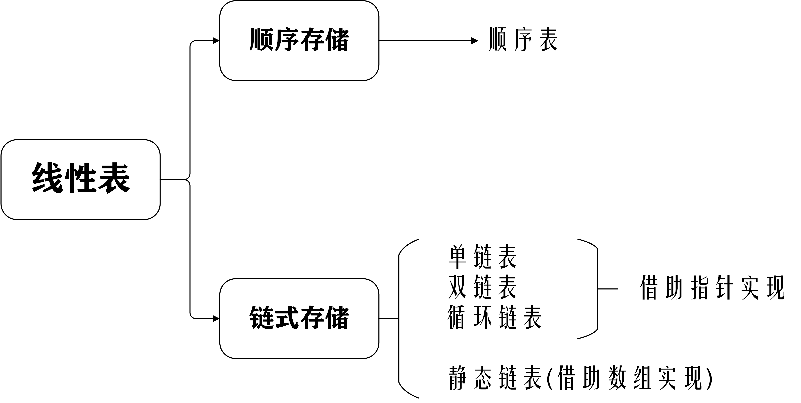
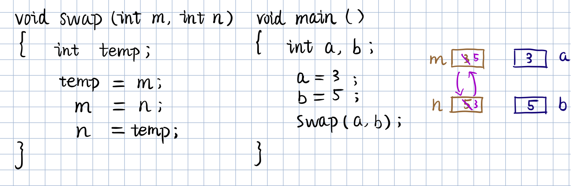
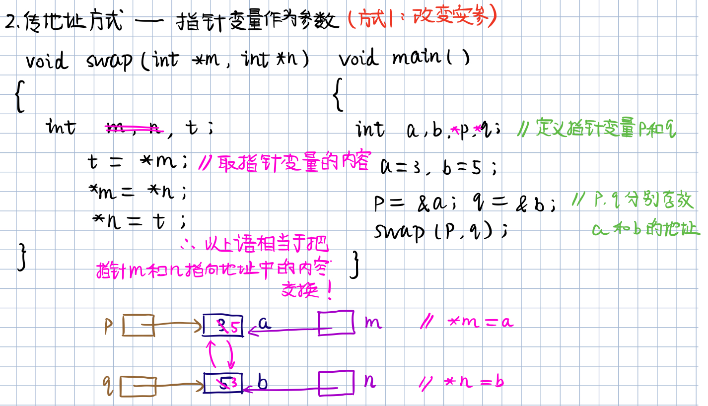
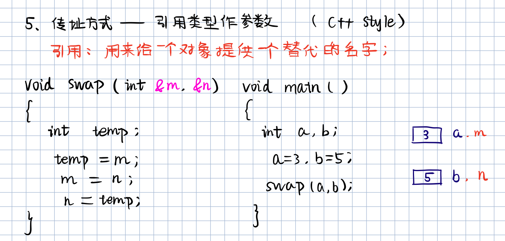

> 
>
> Contributor: datamonday
>
> Repo: https://github.com/datamonday/CPP-TechStack
---
# 2. 线性表

> Update: 2021-5-10


数据的逻辑结构分类



线性表分类

 ## 2.1 线性表的定义和基本操作

线性表是具有相同数据类型的 n 个数据元素的有限序列，其中 n 为表长，当n=0时，线性表示一个空表。

线性表的特点：

- 表中的元素个数有限；
- 表中元素具有逻辑上的顺序性，表中元素有其先后次序；
- 表中数据元素的类型可以为简单类型，也可以为复杂类型；
- 表中元素的数据类型相同，即每个元素占有相同大小的存储空间；
- 除第一个元素外，每个元素有且仅有一个直接前驱；
- 除最后一个元素外，每个元素有且仅有一个直接后继；
- 表中元素具有抽象性，即仅讨论元素间的逻辑关系，而不考虑元素究竟表示什么内容。

---

## 2.2 线性表的顺序表示 (顺序表)

 用一组地址连续的存储单元依次存储线性表中的顺序元素，从而使得逻辑上相邻的两个元素在物理位置上也相邻（顺序表中的元素逻辑顺序与物理顺序相同）。即以元素在计算机内“物理位置相邻”来表示线性表中数据元素之间的逻辑关系。

$i$ 为元素 $a_i$ 在线性表中的位序。注意：线性表中元素的位序是从1开始的，而数组中元素的下标是从0开始的。

顺序表的优点：**任一元素都可以随机存取，即通过首地址和元素序号可以在时间 $O(1)$ 内找到指定的元素**。所以线性表的顺序存储结构是一种随机存取的**存储结构**。

- 顺序表的存储密度高，每个结点只存储数据元素。
- 顺序表逻辑上相邻的元素物理上也相邻，所以插入和删除操作需要移动大量的元素。


----

由于高级语言中的数组类型也具有随机存取的特性，因此，通常**用数组来描述数据结构中的顺序存储结构**。由于线性表的长度可变，且所需最大存储空间随问题不同而不同，则在C语言中可用**动态分配**的一维数组。注意：一维数组可以静态分配，也可以动态分配。

- **静态分配**：数组的大小和空间已经固定，一旦空间占满，就会**产生溢出，导致程序崩溃**。
- **动态分配**：存储数组的空间在程序执行过程中通过动态存储分配语句分配，**一旦数据沾满空间，就另外开辟一块更大的存储空间**，用以替换原来的存储空间，从而达到扩充存储数组空间的目的，**不需要一次性地划分所有空间**。

一维数组定义：

```c
类型说明符 数组名[常量表达式]
```

常量表达式中可以包含常量和符号常量，但不能包含变量。即C语言中不允许动态定义数组的大小。那该怎么办呢？—— 使用结构体，用一变量表示顺序表的长度属性。

假设线性表的元素类型为 ElemType，则线性表的顺序存储类型定义：

```c
#define MaxSize 50 			// 定义线性表的最大长度
typedef struct{
    ElemType data[MaxSize]; // 顺序表的元素(ElemType是泛指, 可以为int,char,float...)
    int length;				// 顺序表的当前长度
}SqList;					// 顺序表的类型定义
```

ElemType的构建方式举例：

```c
[1] typedef char ElemType;
[2] typedef int ElemType;
[3] typedef struct{
    	int id;
    	char *name;
    }ElemType;
```

动态分配的线性表的顺序存储类型定义：

```c
#define InitSize 100		// 定义表的初始长度
typedef struct{
    ElemType *data;			// 指示动态分配数组的指针(存储空间的基地址)
    int MaxSize, length;	// 数组的最大容量和当前个数
}SqList;
```

C语言的初始动态分配语句：

```
<malloc.h>
SqList L;
L.data = (ElemType*)malloc(sizeof(ElemType)*MaxSize);
```

- `malloc(m)函数`：开辟m字节长度的地址空间，并返回这段空间的首地址；
- `sizeof(x)运算`：计算变量x的长度，以字节为单位；
- `(ElemType*)`：强制类型转换，转换为指定类型的指针，因为SqList中的数组是以指针定义的；
- `free(p)函数`：释放指针p所指变量的存储空间，即彻底删除一个变量。

空间划分说明：假设malloc开辟了800个字节，如何划分由 ElemType的类型决定；如果为char类型，则800个字节划分为800个空间；如果为int或float类型，则划分为800/4=200空间，其他类型及自定义类型同理。

C++语言的初始动态分配语句：

```c++
new 类型名T (初值列表)
    功能：申请用于存放T类型对象的内存空间，并依初值列表赋以初值
    结果：
    	成功：T类型的指针，指向新分配的内存
    	失败：0（NULL）
```

```C++
delete 指针P
    功能：释放指针P指向的内存，P必须是new操作的返回值
```

C语言的一些语法：

```c
#include <iostream.h>
cin >> a >> b;	// 表示键盘输入到a和b
cout << a << endl << b << endl;	 // 表示输出a和b的值，endl表示换行
```

## 2.3 C语言的参数传递

1. 传值方式（不改变实参的值）

- 把实参的值传递给函数局部工作区响应的副本中，函数使用这个副本执行必要的功能。函数修改的是副本的值，实参的值不变。

  

2.传地址方式——指针变量作为参数（改变实参的值）



3.传地址方式——指针变量作为参数（不改变实参的值）


4.传地址方式——数组名作为参数（改变实参的值）

- 传递的是数组的首地址

- 对形参数组所做的任何改变都将反映到实参数组中。

  

5.传地址方式——引用类型作为参数（改变实参的值）



**a和m的地址相同，共用同一个空间，是同一个东西。b和n同理**。

---

引用类型作形参的三点说明：

- 传递引用给函数与传递至真的效果是一样的，形参变化实参也发生变化。
- 引用类型作为形参，在内存中没有产生实参的副本，它直接对实参操作；而一般变量作为形参，形参与实参就占用不同的存储单元，所以形参变量的值是实参变量的副本。因此，当参数传递的数据量较大时，用引用比用一般变量传递参数的时间和空间效率都好。
- 指针参数虽然也能达到与使用引用的效果，但在被调用函数中需要重复使用 `*指针变量名` 的形式进行运算，这很容易产生错误且程序的阅读性较差；另一方面，**在主调函数的调用点处，必须用变量的地址作为实参**。

---

## 2.4 顺序表的初始化

```c
# include <stdio.h>
# include <stdlib.h>
# define InitSize 50	// 定义初始分配容量(以sizeof(ElemType)为单位)

typedef struct{
	int id;
	//char *name;
}ElemType;

typedef struct{
	ElemType *elem;  // 存储空间基地址
	int length;		 // 当前长度(个数)
    int MaxSize;     //最大容量
}SeqList; 


int main(){
	SeqList L;
	L.elem = (ElemType*)malloc(InitSize * sizeof(ElemType));
	L.elem -> id = 10;
	L.length = 2;
	
	printf("L.length  = %d\n", L.length);
	printf("L.elem[0] = %d\n", L.elem[0]);
	
	return 0;
}
```

输出：

```c
L.length  = 2
L.elem[0] = 10
```

线性表的基本操作

- `InitList(&L)`：初始化操作，建立一个空的线性表L；
- `DestroyList(&L)`：销毁已存在的线性表L；
- `ClearList(&L)`：清空线性表
- `ListInsert(&L, i, e)`：在线性表L中第i个位置插入新元素e；
- `ListDelete(&L, i, &e)`：删除线性表L中第i个位置元素，用e返回；
- `IsEmpty(L)`：若线性表为空，返回true，否则返回false；
- `ListLength(L)`：返回线性表L的元素个数；
- `LocateElem(L, e)`：L中查找与给定值e相等的元素，若成功返回该元素在表中的序号，否则返回0；
- `GetElem(L, i, &e)`：将线性表L中的第i个位置元素返回给e。

函数结果状态代码

```c
#define TRUE  1
#define False 0
#define OK    1
#define ERROR 0
#define INFEASIBLE -1
#define OVERFLOW   -2

// Status 是函数的类型，其值是函数结果状态代码
typedef int Status;		// 定义别名
typedef char ElemType;  // 定义别名
```

**顺序表的初始化 (参数引用)**

```c
Status InitListSeq(SeqList &L){
	// 构造一个空的线性表L
	L.elem = (ElemType *)malloc(InitSize * sizeof(ElemType)); 
	// 异常情况处理
	if(!L.elem){
		exit(OVERFLOW);	// 存储分配失败 
	} 
	// 空表长度为1
	L.length = 0;
	
	return OK; 
} 

int main(){
	SeqList L;
	InitListSeq(L);
	L.elem[0] = 10;
 	L.length = 2;
	
	printf("L.length  = %d\n", L.length);
	printf("L.elem[0] = %d\n", L.elem[0]);
	
	return 0;
}
```

**销毁线性表**

```c
void DestroyList(SeqList &L){
	if(L.elem) {
		// 释放空间 
		free(L.elem);
	}
} 
```

**清空线性表**

```c
void ClearList(SeqList &L){
	L.length = 0; 
} 
```

**求表的长度**

```c
int GetLength(SeqList &L) {
	return (L.length);
} 
```

**表是否为空**

```c
int IsEmpty(SeqList &L) {
	if(L.length == 0){
		return true;
	}
	else{
		return false;
	}
} 
```

**根据位置获取元素内容**

```c
int GetItem(SeqList L, int i, ElemType &e){
	if(i < 0 || i > L.length){
		return ERROR;
	}
	else{
		// 第i-1的单元存储着第i个数据 
		e = L.elem[i - 1];
		return e;
	}
}
```

### 完整代码

```c
# include <stdio.h>
# include <stdlib.h>
# define InitSize 50	// 定义初始分配容量(以sizeof(ElemType)为单位)

#define TRUE  1
#define False 0
#define OK    1
#define ERROR 0
#define INFEASIBLE -1
#define OVERFLOW   -2

typedef int Status;		// 定义别名 
typedef int ElemType;  // 定义别名 

//typedef struct{
//	int id;
//}ElemType;

typedef struct{
	ElemType *elem;  // 存储空间基地址
	int length;		 // 当前长度(个数)
    int MaxSize;     //最大容量
}SeqList; 


// 1.线性表初始化
// 引用传参，因为要对原表操作。
Status InitListSeq(SeqList &L){
	// 构造一个空的线性表L
	L.elem = (ElemType *)malloc(InitSize * sizeof(ElemType)); 
	// 异常情况处理
	if(!L.elem){
		exit(OVERFLOW);	// 存储分配失败 
	} 
	// 空表长度为1
	L.length = 0;
	
	return OK; 
} 


// 2.销毁线性表
void DestroyList(SeqList &L){
	if(L.elem) {
		// 释放空间 
		free(L.elem);
	}
} 

// 3.清空线性表
void ClearList(SeqList &L){
	L.length = 0; 
} 

// 4. 求表L的长度
int GetLength(SeqList &L) {
	return (L.length);
} 

// 5. 判断线性表L是否为空
int IsEmpty(SeqList &L) {
	if(L.length == 0){
		return true;
	}
	else{
		return false;
	}
} 

// 6. 根据位置i获取元素内容
int GetItem(SeqList L, int i, ElemType &e){
	if(i < 0 || i > L.length){
		return ERROR;
	}
	else{
		// 第i-1的单元存储着第i个数据 
		e = L.elem[i - 1];
		return e;
	}
}

int main(){
	int i;
	SeqList L;
	
	InitListSeq(L);
	L.elem[0] = 10;
	L.elem[1] = 20;
	L.length = 2;
	
	printf("L.length  = %d\n", L.length);
	for(i=0; i < L.length; ++i) {
		printf("L.elem[%d] = %d\n", i, L.elem[i]);
	}
	
	ElemType e;
	e = GetItem(L, 1, e);
	printf("The elem found is %d\n", e);
	
	
	DestroyList(L);
	printf("L.elem after destroied:\n");
	printf("L.length  = %d\n", L.length);
	printf("L.elem[0] = %d\n", L.elem[0]);
	
	ClearList(L);
	printf("L is Empty?");
	if(IsEmpty(L) == true){
		printf("true!\n");
	} 
	else{
		printf("false!\n");
	}
	
	return OK;
}
```

输出：

```c
L.length  = 2
L.elem[0] = 10
L.elem[1] = 20
The elem found is 10
L.elem after destroied:
L.length  = 2
L.elem[0] = 8221184
L is Empty?true!
```

## 2.5 顺序表的查找、插入和删除

### 顺序表的查找

- 在线性表L中查找与指定值e相同的数据元素的位置；

- 从表的一端开始，逐个进行记录的关键字和给定值的比较。若找到，则返回该元素的位置序号；若未找到，返回0。

**平均查找长度（Average Search Length，ASL）**：为了确定记录在表中的位置，需要与给定值进行比较的**关键字的个数的期望值**称为查找算法的平均查找长度。

$$ASL = \sum^{n}_{i=1}P_iC_i$$

- $P_i$ ：第 $i$ 个记录被查找的概率；假设每个记录被查找的概率相等 $P_i = \frac{1}{n}$。
- $C_i$ ：找到第 $i$ 个记录需要比较的次数。

**完整代码**

```c
# include <stdio.h>
# include <stdlib.h>
# define InitSize 50   // 定义初始分配容量(以sizeof(ElemType)为单位)

typedef int Status;	   // 定义别名 
typedef int ElemType;  // 定义别名 

typedef struct{
	ElemType *elem;  // 存储空间基地址
	int length;		 // 当前长度(个数)
    int MaxSize;     //最大容量
}SeqList; 


int LocateItem(SeqList L, ElemType e){
	int i;
    // 逐元素比较
	for (i=0; i < L.length; ++i) {
		if (L.elem[i] == e){
			return i + 1;  // 返回元素的位置(位序) 
		}
	return 0;
	}
} 

int main(){
	SeqList L;
	L.elem = (ElemType*)malloc(InitSize * sizeof(ElemType));
	L.elem[0] = 10;
	L.elem[1] = 20;
	L.length = 2;
	
	int pos;
	// 查找元素 10 
	pos = LocateItem(L, 10);
	
	printf("Item position = %d\n", pos);
	
	return 0;
}
```

输出：

```c
Item position = 1
```

---

### 顺序表的插入


---

## 2.6 线性表的链式存储（单链表）介绍


## 2.7单链表的表示和实现


---

## 2.8 单链表的基本操作


指针的类型由指针域指向的对象的类型决定，例如：

```c
int a = 5; // 定义整型变量a
int *p; // 定义指针p
p = &a; // 取地址运算符&，取出a的地址赋给p
```

### 定义单链表


也可以定义：`Lnode *p;` `*LinkList` 为指向Lnode结构体类型（有两个成员）的指针。


 


### 空的单链表

&L 为引用型变量


### 销毁单链表（删除全部结点）

p=L：即p指向L（将头结点的指针赋值给p），目的是把头结点一块删除


### 清空单链表（只保留头结点）

p=L->next：即p指向L的首元结点，因为是清空链表，是删除除头结点以外的所有节点，所以不需要操作头结点，这点与销毁链表不同，需要注意。

q指向需要清除节点p的下一个节点。


### 求单链表的表长


---

## 2.9 取单链表中第i个元素的内容


`*next` 为同样的指向LNode类型的指针。


status是类c语言的语法。

e需要返回，所以使用引用型变量 `&e`。


## 2.10 单链表的按值查找

### 返回数据的地址


加指针符号`*` 表示这个函数返回的类型是Lnode指针类型

### 返回数据的索引


---

## 2.11 单链表的插入（先连后再接前）

在第i个结点前插入值为e的新结点。


---

## 2.12 单链表的删除（双指针 p 和 q）

删除第i个结点。双指针 p 和 q


---

## 2.13 单链表的算法复杂度分析


## 2.14 单链表的建立

### 头插法


时间复杂度为O(n)。

---

### 尾插法


---


----

> 参考资料：
>
> 1. 严蔚敏《数据结构(C语言描述)》
> 2. 数据结构与算法基础：[bilibili](https://www.bilibili.com/video/BV1nJ411V7bd?p=5&spm_id_from=pageDriver)
> 3. 数据结构复习指导
> 4. 数据结构高分笔记

