> 
>
> Contributor: datamonday
>
> Repo: https://github.com/datamonday/CPP-TechStack
---
# 2. 线性表

> Update: 2021-5-10


数据的逻辑结构分类


线性表分类

 ## 2.1 线性表的定义

线性表是具有相同数据类型的 n 个数据元素的有限序列，其中 n 为表长，当n=0时，线性表示一个空表。

线性表的特点：

- 表中的元素个数有限；
- 表中元素具有逻辑上的顺序性，表中元素有其先后次序；
- 表中数据元素的类型可以为简单类型，也可以为复杂类型；
- 表中元素的数据类型相同，即每个元素占有相同大小的存储空间；
- 除第一个元素外，每个元素有且仅有一个直接前驱；
- 除最后一个元素外，每个元素有且仅有一个直接后继；
- 表中元素具有抽象性，即仅讨论元素间的逻辑关系，而不考虑元素究竟表示什么内容。

---

## 2.2 线性表的顺序表示 (顺序表)

 用一组地址连续的存储单元依次存储线性表中的顺序元素，从而使得逻辑上相邻的两个元素在物理位置上也相邻（顺序表中的元素逻辑顺序与物理顺序相同）。即以元素在计算机内“物理位置相邻”来表示线性表中数据元素之间的逻辑关系。

$i$ 为元素 $a_i$ 在线性表中的位序。注意：线性表中元素的位序是从1开始的，而数组中元素的下标是从0开始的。

顺序表的优点：**任一元素都可以随机存取，即通过首地址和元素序号可以在时间 $O(1)$ 内找到指定的元素**。所以线性表的顺序存储结构是一种随机存取的**存储结构**。

- 顺序表的存储密度高，每个结点只存储数据元素。
- 顺序表逻辑上相邻的元素物理上也相邻，所以插入和删除操作需要移动大量的元素。

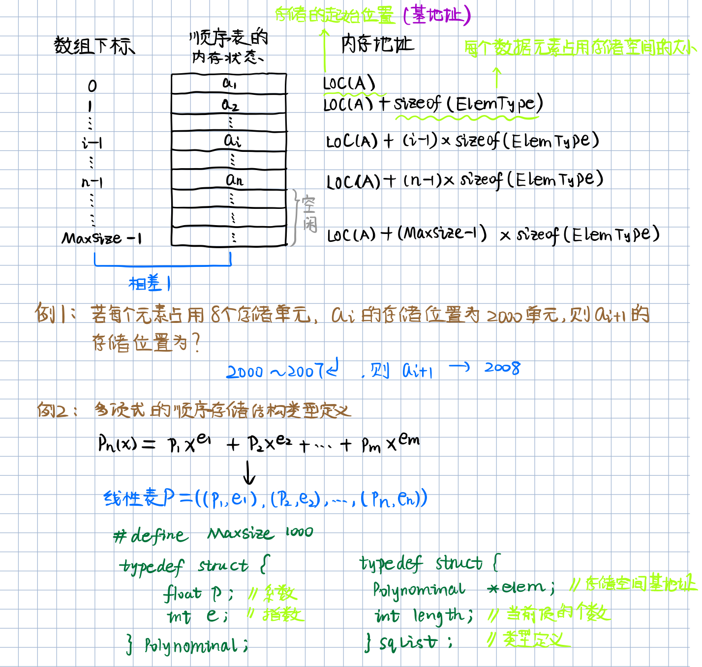

----

由于高级语言中的数组类型也具有随机存取的特性，因此，通常**用数组来描述数据结构中的顺序存储结构**。由于线性表的长度可变，且所需最大存储空间随问题不同而不同，则在C语言中可用**动态分配**的一维数组。注意：一维数组可以静态分配，也可以动态分配。

- **静态分配**：数组的大小和空间已经固定，一旦空间占满，就会**产生溢出，导致程序崩溃**。
- **动态分配**：存储数组的空间在程序执行过程中通过动态存储分配语句分配，**一旦数据沾满空间，就另外开辟一块更大的存储空间**，用以替换原来的存储空间，从而达到扩充存储数组空间的目的，**不需要一次性地划分所有空间**。

一维数组定义：

```c
类型说明符 数组名[常量表达式]
```

常量表达式中可以包含常量和符号常量，但不能包含变量。即C语言中不允许动态定义数组的大小。那该怎么办呢？—— 使用结构体，用一变量表示顺序表的长度属性。

假设线性表的元素类型为 ElemType，则线性表的顺序存储类型定义：

```c
#define MaxSize 50 			// 定义线性表的最大长度
typedef struct{
    ElemType data[MaxSize]; // 顺序表的元素(ElemType是泛指, 可以为int,char,float...)
    int length;				// 顺序表的当前长度
}SqList;					// 顺序表的类型定义
```

ElemType的构建方式举例：

```c
[1] typedef char ElemType;
[2] typedef int ElemType;
[3] typedef struct{
    	int id;
    	char *name;
    }ElemType;
```

动态分配的线性表的顺序存储类型定义：

```c
#define InitSize 100		// 定义表的初始长度
typedef struct{
    ElemType *data;			// 指示动态分配数组的指针(存储空间的基地址)
    int MaxSize, length;	// 数组的最大容量和当前个数
}SqList;
```

C语言的初始动态分配语句：

```
<malloc.h>
SqList L;
L.data = (ElemType*)malloc(sizeof(ElemType)*MaxSize);
```

- `malloc(m)函数`：开辟m字节长度的地址空间，并返回这段空间的首地址；
- `sizeof(x)运算`：计算变量x的长度，以字节为单位；
- `(ElemType*)`：强制类型转换，转换为指定类型的指针，因为SqList中的数组是以指针定义的；
- `free(p)函数`：释放指针p所指变量的存储空间，即彻底删除一个变量。

空间划分说明：假设malloc开辟了800个字节，如何划分由 ElemType的类型决定；如果为char类型，则800个字节划分为800个空间；如果为int或float类型，则划分为800/4=200空间，其他类型及自定义类型同理。

C++语言的初始动态分配语句：

```c++
new 类型名T (初值列表)
    功能：申请用于存放T类型对象的内存空间，并依初值列表赋以初值
    结果：
    	成功：T类型的指针，指向新分配的内存
    	失败：0（NULL）
```

```C++
delete 指针P
    功能：释放指针P指向的内存，P必须是new操作的返回值
```

C语言的一些语法：

```c
#include <iostream.h>
cin >> a >> b;	// 表示键盘输入到a和b
cout << a << endl << b << endl;	 // 表示输出a和b的值，endl表示换行
```

## 2.3 C语言的参数传递

1. 传值方式（不改变实参的值）

- 把实参的值传递给函数局部工作区响应的副本中，函数使用这个副本执行必要的功能。函数修改的是副本的值，实参的值不变。

  

2.传地址方式——指针变量作为参数（改变实参的值）


3.传地址方式——指针变量作为参数（不改变实参的值）

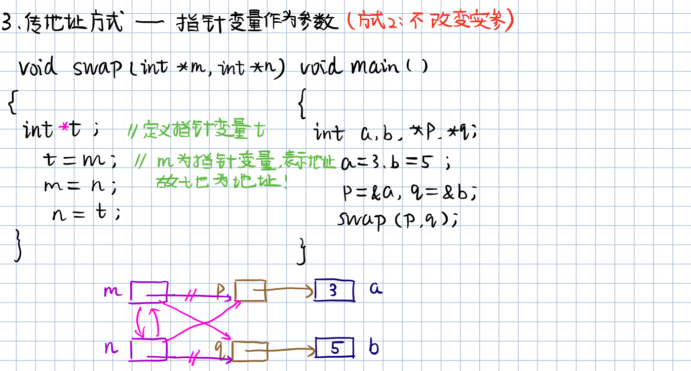

4.传地址方式——数组名作为参数（改变实参的值）

- 传递的是数组的首地址

- 对形参数组所做的任何改变都将反映到实参数组中。

  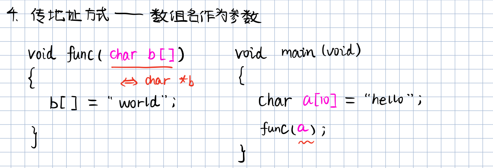

5.传地址方式——引用类型作为参数（改变实参的值）


**a和m的地址相同，共用同一个空间，是同一个东西。b和n同理**。

---

引用类型作形参的三点说明：

- 传递引用给函数与传递至真的效果是一样的，形参变化实参也发生变化。
- 引用类型作为形参，在内存中没有产生实参的副本，它直接对实参操作；而一般变量作为形参，形参与实参就占用不同的存储单元，所以形参变量的值是实参变量的副本。因此，当参数传递的数据量较大时，用引用比用一般变量传递参数的时间和空间效率都好。
- 指针参数虽然也能达到与使用引用的效果，但在被调用函数中需要重复使用 `*指针变量名` 的形式进行运算，这很容易产生错误且程序的阅读性较差；另一方面，**在主调函数的调用点处，必须用变量的地址作为实参**。

---

## 2.4 顺序表的表示和实现

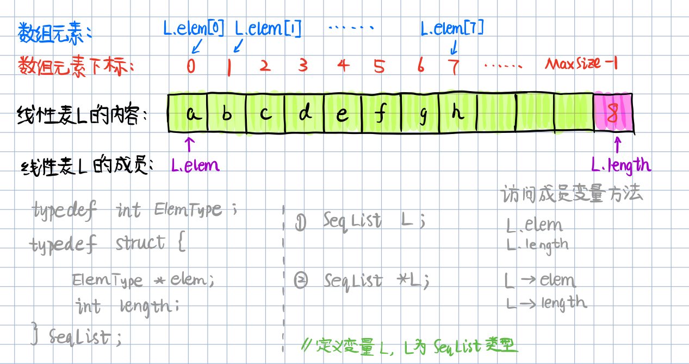

```c
# include <stdio.h>
# include <stdlib.h>
# define InitSize 50	// 定义初始分配容量(以sizeof(ElemType)为单位)

typedef struct{
	int id;
	//char *name;
}ElemType;

typedef struct{
	ElemType *elem;  // 存储空间基地址
	int length;		 // 当前长度(个数)
    int MaxSize;     //最大容量
}SeqList; 


int main(){
	SeqList L;
	L.elem = (ElemType*)malloc(InitSize * sizeof(ElemType));
	L.elem -> id = 10;
	L.length = 2;
	
	printf("L.length  = %d\n", L.length);
	printf("L.elem[0] = %d\n", L.elem[0]);
	
	return 0;
}
```

输出：

```c
L.length  = 2
L.elem[0] = 10
```

线性表的基本操作

- `InitList(&L)`：初始化操作，建立一个空的线性表L；
- `DestroyList(&L)`：销毁已存在的线性表L；
- `ClearList(&L)`：清空线性表
- `ListInsert(&L, i, e)`：在线性表L中第i个位置插入新元素e；
- `ListDelete(&L, i, &e)`：删除线性表L中第i个位置元素，用e返回；
- `IsEmpty(L)`：若线性表为空，返回true，否则返回false；
- `ListLength(L)`：返回线性表L的元素个数；
- `LocateElem(L, e)`：L中查找与给定值e相等的元素，若成功返回该元素在表中的序号，否则返回0；
- `GetElem(L, i, &e)`：将线性表L中的第i个位置元素返回给e。

函数结果状态代码

```c
#define TRUE  1
#define False 0
#define OK    1
#define ERROR 0
#define INFEASIBLE -1
#define OVERFLOW   -2

// Status 是函数的类型，其值是函数结果状态代码
typedef int Status;		// 定义别名
typedef char ElemType;  // 定义别名
```

**顺序表的初始化 (参数引用)**

```c
Status InitListSeq(SeqList &L){
	// 构造一个空的线性表L
	L.elem = (ElemType *)malloc(InitSize * sizeof(ElemType)); 
	// 异常情况处理
	if(!L.elem){
		exit(OVERFLOW);	// 存储分配失败 
	} 
	// 空表长度为1
	L.length = 0;
	
	return OK; 
} 

int main(){
	SeqList L;
	InitListSeq(L);
	L.elem[0] = 10;
 	L.length = 2;
	
	printf("L.length  = %d\n", L.length);
	printf("L.elem[0] = %d\n", L.elem[0]);
	
	return 0;
}
```

**销毁线性表**

```c
void DestroyList(SeqList &L){
	if(L.elem) {
		// 释放空间 
		free(L.elem);
	}
} 
```

**清空线性表**

```c
void ClearList(SeqList &L){
	L.length = 0; 
} 
```

**求表的长度**

```c
int GetLength(SeqList &L) {
	return (L.length);
} 
```

**表是否为空**

```c
int IsEmpty(SeqList &L) {
	if(L.length == 0){
		return true;
	}
	else{
		return false;
	}
} 
```

**根据位置获取元素内容**

```c
int GetItem(SeqList L, int i, ElemType &e){
	if(i < 0 || i > L.length){
		return ERROR;
	}
	else{
		// 第i-1的单元存储着第i个数据 
		e = L.elem[i - 1];
		return e;
	}
}
```

---

完整代码

```c
# include <stdio.h>
# include <stdlib.h>
# define InitSize 50	// 定义初始分配容量(以sizeof(ElemType)为单位)

#define TRUE  1
#define False 0
#define OK    1
#define ERROR 0
#define INFEASIBLE -1
#define OVERFLOW   -2

typedef int Status;		// 定义别名 
typedef int ElemType;  // 定义别名 

//typedef struct{
//	int id;
//}ElemType;

typedef struct{
	ElemType *elem;  // 存储空间基地址
	int length;		 // 当前长度(个数)
    int MaxSize;     //最大容量
}SeqList; 


// 1.线性表初始化
// 引用传参，因为要对原表操作。
Status InitListSeq(SeqList &L){
	// 构造一个空的线性表L
	L.elem = (ElemType *)malloc(InitSize * sizeof(ElemType)); 
	// 异常情况处理
	if(!L.elem){
		exit(OVERFLOW);	// 存储分配失败 
	} 
	// 空表长度为1
	L.length = 0;
	
	return OK; 
} 


// 2.销毁线性表
void DestroyList(SeqList &L){
	if(L.elem) {
		// 释放空间 
		free(L.elem);
	}
} 

// 3.清空线性表
void ClearList(SeqList &L){
	L.length = 0; 
} 

// 4. 求表L的长度
int GetLength(SeqList &L) {
	return (L.length);
} 

// 5. 判断线性表L是否为空
int IsEmpty(SeqList &L) {
	if(L.length == 0){
		return true;
	}
	else{
		return false;
	}
} 

// 6. 根据位置i获取元素内容
int GetItem(SeqList L, int i, ElemType &e){
	if(i < 0 || i > L.length){
		return ERROR;
	}
	else{
		// 第i-1的单元存储着第i个数据 
		e = L.elem[i - 1];
		return e;
	}
}

int main(){
	int i;
	SeqList L;
	
	InitListSeq(L);
	L.elem[0] = 10;
	L.elem[1] = 20;
	L.length = 2;
	
	printf("L.length  = %d\n", L.length);
	for(i=0; i < L.length; ++i) {
		printf("L.elem[%d] = %d\n", i, L.elem[i]);
	}
	
	ElemType e;
	e = GetItem(L, 1, e);
	printf("The elem found is %d\n", e);
	
	
	DestroyList(L);
	printf("L.elem after destroied:\n");
	printf("L.length  = %d\n", L.length);
	printf("L.elem[0] = %d\n", L.elem[0]);
	
	ClearList(L);
	printf("L is Empty?");
	if(IsEmpty(L) == true){
		printf("true!\n");
	} 
	else{
		printf("false!\n");
	}
	
	return OK;
}
```

输出：

```c
L.length  = 2
L.elem[0] = 10
L.elem[1] = 20
The elem found is 10
L.elem after destroied:
L.length  = 2
L.elem[0] = 8221184
L is Empty?true!
```

## 2.5 顺序表的查找、插入和删除

### 顺序表的查找

算法思想：

- 在线性表L中查找与指定值e相同的数据元素的位置；

- 从表的一端开始，逐个进行记录的关键字和给定值的比较。若找到，则返回该元素的位置序号；若未找到，返回0。

**平均查找长度（Average Search Length，ASL）**：为了确定记录在表中的位置，需要与给定值进行比较的**关键字的个数的期望值**称为查找算法的平均查找长度。

$$ASL = \sum^{n}_{i=1}P_iC_i$$

- $P_i$ ：第 $i$ 个记录被查找的概率；假设每个记录被查找的概率相等 $P_i = \frac{1}{n}$。
- $C_i$ ：找到第 $i$ 个记录需要比较的次数。

**完整代码**

```c
# include <stdio.h>
# include <stdlib.h>
# define InitSize 50   // 定义初始分配容量(以sizeof(ElemType)为单位)

typedef int Status;	   // 定义别名 
typedef int ElemType;  // 定义别名 

typedef struct{
	ElemType *elem;  // 存储空间基地址
	int length;		 // 当前长度(个数)
    int MaxSize;     //最大容量
}SeqList; 


int LocateItem(SeqList L, ElemType e){
	int i;
    // 逐元素比较
	for (i=0; i < L.length; ++i) {
		if (L.elem[i] == e){
			return i + 1;  // 返回元素的位置(位序) 
		}
	return 0;
	}
} 

int main(){
	SeqList L;
	L.elem = (ElemType*)malloc(InitSize * sizeof(ElemType));
	L.elem[0] = 10;
	L.elem[1] = 20;
	L.length = 2;
	
	int pos;
	// 查找元素 10 
	pos = LocateItem(L, 10);
	
	printf("Item position = %d\n", pos);
	
	return 0;
}
```

输出：

```c
Item position = 1
```

---

### 顺序表的插入

线性表的插入运算是指在表的第 $i$ (1<= i <= n+1) 个位置，插入一个新结点 $e$，使长度为 $n$ 的线性表变为长度为 $n+1$ 的线性表。

可以插入位置：

- 最前面
- 最后面
- 中间任意位置

算法思想：

- 判断插入位置 $i$ 是否合法；
- 判断插入顺序表的存储空间是否已满，若已满返回ERROR。

```c
# include <stdio.h>
# include <stdlib.h>
# define InitSize 50   // 定义初始分配容量(以sizeof(ElemType)为单位)

# define ERROR -1
# define OK     1

typedef int Status;	   // 定义别名 
typedef int ElemType;  // 定义别名 

typedef struct{
	ElemType *elem;  // 存储空间基地址
	int length;		 // 当前长度(个数)
    int MaxSize;     //最大容量
}SeqList; 

Status ListInsert(SeqList &L, int i, ElemType e) {
	int j;
	// 插入不合法 
	if (i < 1 || i > L.length + 1) 
	{
		return ERROR;
	}
	// 当前存储空间已满 
	else if (L.length == L.MaxSize)
	{
		return ERROR;
	}
	else 
	{
		// 从最后一个元素一直到第 i 个位置上的元素依次向后移动 
		for (j = L.length-1; j >= i-1; --j) 
		{
			L.elem[j + 1] = L.elem[j];
		}
		// 将新元素放入第 i 个位置  
		L.elem[i - 1] = e;
		// 表长增加1 
		L.length ++;
	} 
	return OK;
} 

int main(){
	SeqList L;
	L.elem = (ElemType*)malloc(InitSize * sizeof(ElemType));
	L.elem[0] = 10;
	L.elem[1] = 20;
	L.length = 2;

	int pos;
	// 插入元素 30
	ListInsert(L, 3, 30);
	printf("Insert Item = %d\n", L.elem[2]);
	
	return 0;
}
```

输出：

```c
Insert Item = 30
```

---

### 顺序表的删除

线性表的删除运算是指将表的第 $i$ (1<= 1 <=n) 个结点删除，使长度为 $n
$ 的线性表变为长度为 $n+1$ 的线性表。

算法思想：

- 判断删除位置 $i$ 是否合法（1<= i <= n）；
- 将欲删除的元素保留在 $e$ 中；
- 将第 $i+1$ 至第 $n$ 位的元素依次向前移动一个位置；
- 表长减 1，删除成功返回 OK。

```c
# include <stdio.h>
# include <stdlib.h>
# define InitSize 50   // 定义初始分配容量(以sizeof(ElemType)为单位)

# define ERROR -1
# define OK     1

typedef int Status;	   // 定义别名 
typedef int ElemType;  // 定义别名 

typedef struct{
	ElemType *elem;  // 存储空间基地址
	int length;		 // 当前长度(个数)
    int MaxSize;     //最大容量
}SeqList; 


Status ListDeleteSeq(SeqList &L, int i){
    int j;
    int e; 
    if (i < 1 || i > L.length) 
    {
        return ERROR;
    }
    else 
    {	
    	// 保存被删除的元素 
        e = L.elem[i - 1];
        // 将从被删除元素位置之后的第一个元素开始逐一向前移动
        for (j = i; j <= L.length - 1; j++)
        {
            L.elem[j - 1] = L.elem[j];
        }
        // 表长减1
        L.length --;
    }
    return OK;
}

int main(){
	SeqList L;
	L.elem = (ElemType*)malloc(InitSize * sizeof(ElemType));
	L.elem[0] = 10;
	L.elem[1] = 20;
	L.length = 2;
	
	int pos;
	
	// 删除第2个元素 
	ListDeleteSeq(L, 2);
	
	printf("L.length after Delete = %d\n", L.length);
	
	return 0;
}
```

输出：

```c
L.length after Delete = 1
```

---

### 算法复杂度分析

时间复杂度：查找、插入、删除算法的平均时间复杂度为 $O(n)$；

空间复杂度：顺序表操作算法的空间复杂度为 $S(n) = O(1)$ ，即没有占用辅助空间。

----

### 顺序表的优缺点

优点：

- 存储密度大
- 可以随机存取表中任一元素

缺点：

- 插入、删除某一元素时，需要移动大量元素；
- 浪费存储空间；
- 属于静态存储形式，数据元素的个数不能自由扩充。

---

## 2.6 线性表的链式存储 (单链表)

> update：2021-5-12

结点：数据元素的存储映像。由数据与和指针域两部分组成。

链表：n个结点由指针链组成的一个链表。

头指针：指向链表中第一个结点的指针。

首元结点：链表中存储第一个数据元素 $a_1$ 的结点。

头结点：在链表的首元结点之前附设的一个结点。**头结点的数据域可以为空，也可以存放线性表的长度等附加信息，可以省去每次使用时计数的工作量，但此结点不计入链表长度值**。


---

**如何表示空表？**

- 无头结点时，头指针为空表示空表。
- 有头结点时，头结点的指针域为空表示空表。

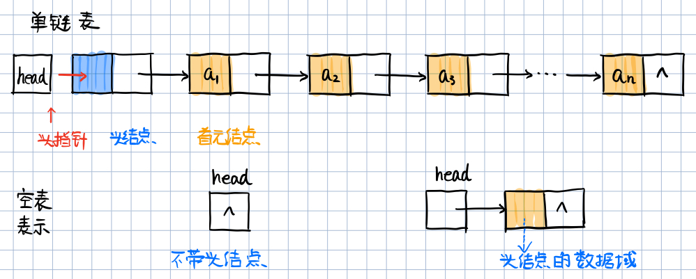

---

**在链表中设置头结点的好处？**

- **便于首元结点的处理**：首元结点的地址保存在头结点的指针域中，所以在链表的第一个位置上的操作和其它位置一直，无需进行特殊处理。
- **便于空表和空表的统一处理**：无论链表是否为空，头指针都是指向头结点的非空指针，因此空表和费空表的处理也就统一了。

---

链表（链式存储结构）的特点

- 结点在存储器中的位置是任意的，即**逻辑上相邻的数据元素在物理上不一定相邻**。
- 访问时只能通过头指针进入链表，并通过每个结点的指针域依次向后顺序扫描其余结点，所以**寻找第一个结点和最后一个结点所花费的时间不等**。

- 顺序表示随机存取，链表是顺序存取。

---

## 2.7 单链表的表示和实现

单链表是由表头唯一确定，因此单链表可以用头指针的名字来命名，若头指针名是L，则把链表称为表L。

指针的类型由指针域指向的对象的类型决定，例如：

```c
int a = 5; // 定义整型变量a
int *p; // 定义指针p
p = &a; // 取地址运算符&，取出a的地址赋给p
```

### 定义单链表

定义结点指针p：`LNode p;` ，`LNode *p;` 

`*LinkList` 为指向LNode结构体类型（有两个成员）的指针。

```c
#include<stdio.h>
#include<stdlib.h>

typedef int ElemType;  // 定义别名 

// 单链表的存储结构 
typedef struct LNode{
	// 声明结点的类型和指向结点的指针类型 
	ElemType data;			// 结点的数据域 
    // *next 为同样的指向LNode类型的指针
	struct LNode *next;		// 结点的指针域 
}LNode, *LinkList; 	
// LinkList为为指向LNode结构体类型（有两个成员）的指针; 
// 其将指向结构体的指针打包定义了 

/*
访问结点的数据域和指针域

定义链表 
LinkList L;

定义结点指针 p 
LNode p;  

p.data;
p.next; 

等价于 

LNode *p; 
p -> data;
p -> next; 
*/ 
```

例如，存储学生学号，姓名，成绩的单链表的结点类型定义：

```c
typedef struct student{
    char num[8];	// 数据域
    char name[8];	// 数据域
    int score;		// 数据域
    struct student *next;
}student, *LinkList;
```

### 初始化单链表

`&L` 为引用型变量。

带头结点的单链表的初始化。算法步骤：

- 生成新结点作为头结点，用头指针L指向头结点；
- 将头结点的指针域置空。

```c
Status InitLinkList(LinkList &L){
	// 从内存中找一块空间分配给LNode
	// LinkList 为取出这块空间的地址，并赋值给L 
	L = (LinkList)malloc(sizeof(LNode));
    if (L == NULL){
        printf("申请内存空间失败！\n");
    }
	L -> next = NULL;
	return OK;
}
```

### 空的单链表 (头结点指针域为空)

判断链表是否为空：

- **空表**：链表中无元素，称为空链表。但头指针和头结点仍然存在。

算法思路：

- 判断头结点指针域是否为空。

```c
// 判断单链表是否为空 
Status LinkListEmpty(LinkList L){
	// 如果表为空，则返回1；如果不为空，则返回0 
	if (L -> next) {
		return 0;
	} 
	else{
		return 1;
	}
}
```

### 销毁单链表 (删除全部结点)

单链表的销毁：**链表销毁后不存在**。

算法思路：

- 从头指针开始，依次释放所有结点。循环结束条件：`L==NULL` 。


算法描述：

```c
// 销毁单链表 
Status DestroyLinkList(LinkList &L){
	// 只想需要删除的结点 
	LNode *p;  // 等价于 LinkList p;
	
    // 没到表尾
	while(L != NULL){
        // 即p指向L（将头结点的指针赋值给p），目的是把头结点一块删除。
		p = L;
		L = L -> next;
		free(p);
	}
} 
```

### 清空单链表 (只保留头结点)

清空链表：**链表仍存在，但链表中无元素**，称为**空链表**（**头指针和头结点仍然在**）。

算法思路：

- 依次释放所有结点，并将头结点指针域设为空。

`p = L->next`：即p指向L的首元结点，因为是清空链表，是删除除头结点以外的所有结点，所以不需要操作头结点，这点与销毁链表不同，需要注意。

q指向需要清除结点p的下一个结点。

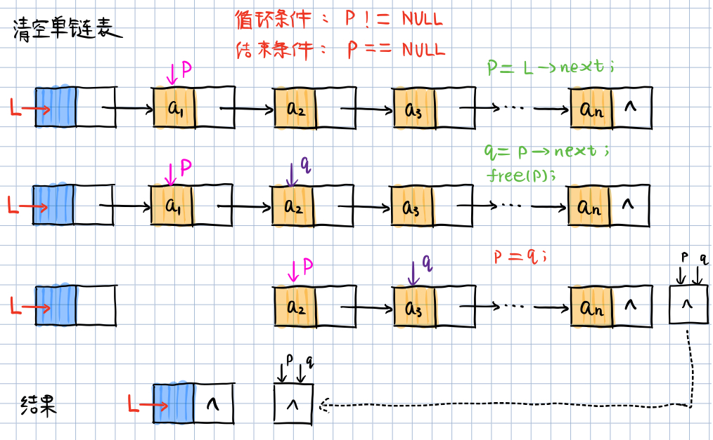

算法描述：

```c
// 清空单链表 
Status DestroyLinkList(LinkList &L){
	// 只想需要删除的结点 
	LNode *p;  // LinkList p;
	LNode *q;  // LinkList q;
	// p 指向第一个结点 
	p = L -> next; 
	// 没到表尾
	while(p != NULL){
		q = p -> next;
		free(p);
		p = q;
	}
	// 头结点指针域置空
	L -> next = NULL;
	return OK; 
} 
```

### 求单链表的表长

算法思路：

- 从首元结点开始，依次计数所有结点。

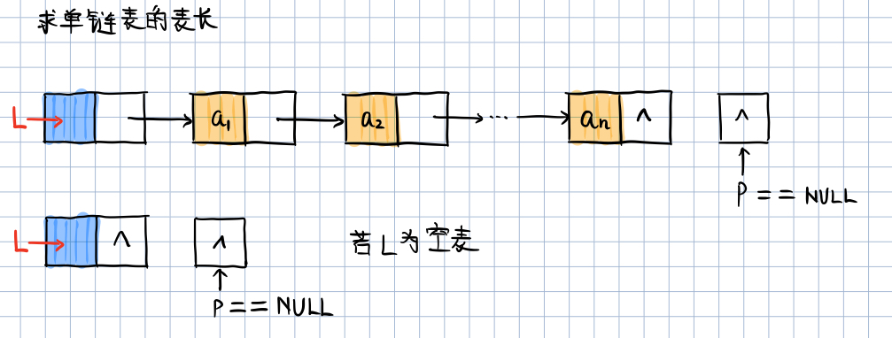

算法描述：

```c
// 不需要对链表操作，所以传值调用即可，不需要引用 &L
// 返回单链表中元素的个数。
Status LengthLinkList(LinkList L){
	// 只想需要删除的结点 
	LNode *p;  // LinkList p;
	// p 指向第一个结点 
	p = L -> next;
	
	int i = 0;
	 
	// 遍历单链表，统计结点数 
	while(p != NULL){
		i++; 
		p = p -> next;
	}
	// 返回链表L中数据元素的个数
	// i初值为0，此处不为i+1，是因为最后一次while循环时 i已经加1了 
	return i; 
}
```

---

## 2.8 取单链表中第i个元素的内容

> update: 2021-5-13

算法思路：

- 从链表的头指针触发，顺着链域 next 逐个结点往下搜索，直至搜索到第i个结点为止。因此，链表不是随机存取结构。

算法步骤：

- 1）从第1个结点(`L -> next`) 顺链扫描，用指针p指向当前扫描到的结点，p初值为`p = L -> next;`
- 2）j 作为计数器，累计当前扫描过的结点数，j初值为1；
- 3）当 p 指向扫描到下一结点时，计数器 j ++；
- 4）当 j==i时，p所指的结点就是要找的第i个结点。

```c
// 求单链表中第i个元素的内容, 并通过变量e返回 
// e需要返回，所以使用引用型变量 &e
Status GetElemLinkList(LinkList L, int i, ElemType &e){
	LNode *p;
	// p 指向第一个结点 
	p = L -> next;
	// 定义计数器变量
	int j = 1; 
	
	// 向后扫描，直至p指向第i个元素或p为空 
	while (p && j < i) {
		p = p -> next;
		++j; 
	}

	// 要查找的第 i 个元素不存在 
	if(!p || j>i ){
		return ERROR;
	}
	else {
		e = p -> data;
		return OK;
	}
}
```

## 2.9 单链表的查找、插入和删除

### 单链表的查找 (按照值查找)

根据指定数据获取该数据所在的位置（地址）。

**返回数据的地址**

算法步骤：

- 从第一个结点起，依次和e相比较。
- 如果找到一个其值与e相等的数据元素，则返回其在链表中的位置或地址。
- 如果遍历完整个链表之后都未找到其值和e相等的元素，则返回0或NULL。

```c
// LNode * 表示这个函数返回的类型是LNode指针类型
LNode *LocateElemLinkList(LinkList L, ElemType e) {
	// 在链表L中查找值为 e 的元素
	// 若找到，则返回L中值为e的元素的地址；否则返回NULL
	
	LNode *p;
	// p指向第一个结点
	p = L -> next;
	
	while(p && p->data != e) {
		p = p -> next;
	} 
	// 如果找到了，则p为元素的地址；如果未找到，则p已经到表尾，其值为NULL 
	return p;
}
```

---

**返回数据的位序**

根据指定数据获取该数据的位置序号。

```c
// 单链表按照值查找
Status LocateElemLinkList(LinkList L, ElemType e) {
	LNode *p;
	p = L -> next;
	int j = 1;
	
	while(p && p -> data != e){
		p = p -> next;
		j++;
	}
	if (p != NULL){
		return j;
	}
	else{
		return 0;
	}
}
```

---

### 单链表的插入 (先连后再接前)

在第i个结点前插入值为e的新结点。

算法步骤：

- 1）首先找到 $a_{i-1}$ 的存储位置 $p$；
- 2）生成一个数据与为 $e$ 的新结点 $s$；
- 3）插入新结点：新结点的指针域指向结点 $a_i$ ；结点 $a_{i-1}$ 的指针域指向新结点。

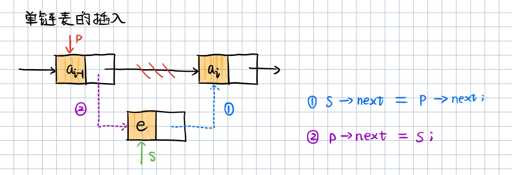

算法描述：

```c
Status InsertElemLinkList(LinkList &L, int i, ElemType e) {
	LNode *p;
	p = L;
	int j = 0;
	
	// 寻找第 i-1 个结点，p指向该结点
	while(!p || j < i-1){
		p = p -> next;
		++j;
	}
    
    // i大于表长+1或小于1，插入位置非法 
	if (!p || j >= i){
		return ERROR;
	}
    
	// 生成新结点s，将s的数据域置为e
	LNode *s;
	s -> data = e;
	// 将结点s插入到L中，以下语句的顺序不能调换！ 
	s -> next = p -> next;
	p -> next = s; 
	
	return OK;
}
```

---

### 单链表的删除 (双指针 p 和 q)

删除第i个结点。

算法步骤：

- 1）首先找到 $a_{i-1}$ 的存储位置 $p$ ，保存要删除的 $a_i$ 的值；
- 2）零 `p -> next` 指向 $a_{i+1}$；
- 3）释放结点 $a_i$ 的空间。

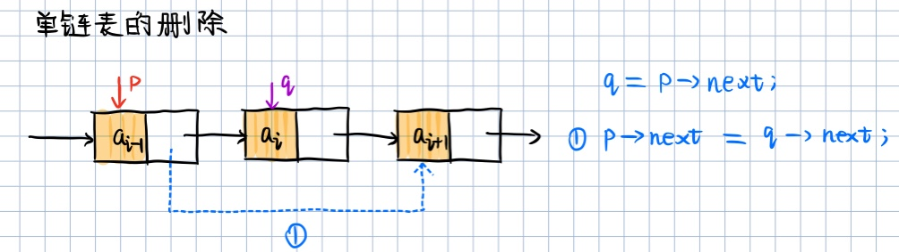

算法描述：

```c
Status DeleteElemLinkList(LinkList &L, int i, ElemType &e) {
	LNode *p;
	p = L;
	int j = 0;
	
	// 寻找位置为 i-1 的结点，p指向该结点
	while(p -> next && j < i-1){
		p = p -> next;
		++j; // j 最大为 i-2，即指针p指向元素的索引
	} 
	
	// 删除位置不合理 
    // !(p -> next) 表示 p 之后无元素，即无法删除
    // j >= i 表明要删除的元素位置超过了表长，此时也无法删除
	if (!(p -> next) || j >= i){
		return ERROR;
	}
	
	// 临时保存被删除结点的地址以备释放
	LNode *q;
	q = p -> next;
	// 改变被删除结点前驱结点的指针域
	p -> next = q -> next;
	// 保存删除结点的数据域
	e = q -> data;
	// 释放删除结点的空间
	free(q);
	
	return OK;
}
```

---

### 算法复杂度分析

单链表的查找、插入和删除算法时间效率分析：

- 查找：因单链表只能顺序存取，即在查找时要从头指针查起，查找的时间复杂度为 $O(n)$。
- 插入和删除：因线性表不需要移动元素，只需要修改指针，一般情况下，插入和删除操作的时间复杂度为 $O(1)$。**但是如果要在单链表中进行前插或删除操作，由于要从头查找前驱结点，所耗时间复杂度为 $O(n)$** 。

## 2.10 单链表的建立

> update: 2021-5-14

### 头插法 (先连后再接前)

元素插入在链表头部，也叫前插法。

算法步骤：

- 从一个空表开始，重复读入数据；
- 生成新结点，将读入数据存放到新结点的数据域中；
- 从最后一个结点开始，依次将各结点插入到链表的前端。


算法描述：

```c
# include <stdio.h>
# include <stdlib.h>
# define InitSize 50   // 定义初始分配容量(以sizeof(ElemType)为单位)

# define ERROR -1
# define OK     1

typedef int Status;	   // 定义别名 
typedef int ElemType;  // 定义别名 


// 单链表的存储结构 
typedef struct LNode{
	// 声明结点的类型和指向结点的指针类型 
	ElemType data;			// 结点的数据域 
	struct LNode *next;		// 结点的指针域 
}LNode, *LinkList; 	// LinkList为为指向LNode结构体类型（有两个成员）的指针; 

// 初始化单链表 
Status InitLinkList(LinkList &L){
	// 从内存中找一块空间分配给LNode
	// LinkList 为取出这块空间的地址，并赋值给L 
	L = (LinkList)malloc(sizeof(LNode));
	if (L == NULL){
		printf("申请内存空间失败！\n");
    }
	L -> next = NULL;
	return OK;
}

// 前插法建立单链表 
// 时间复杂度为O(n)
LinkList HeadCreateLinkList(int n)
{
    LinkList L;
	InitLinkList(L);
	
    ElemType x;
    for (int i=n; i > 0; --i)
    {
    	printf("Please input linklist element[%d]:\n", i);
    	
    	scanf("%d", &x);
        LNode *p;
        p = (LNode *)malloc(sizeof(LNode));
        p -> data = x;
        
        p -> next = L -> next;
        L -> next = p;
    }
    return L;
}

int main(){
	LinkList L, start;
	InitLinkList(L);
	
	int n;
	printf("Please input number of linklist element:\n");
	scanf("%d", &n);
	
    L = HeadCreateLinkList(n);
    for (start = L->next; start != NULL; start = start->next){
    	printf("%d \t", start->data);
	}

	return 0;
}
```

输出：

```c
// 逆序输入链表中元素的值

Please input number of linklist element:
5
Please input linklist element[5]:
555
Please input linklist element[4]:
444
Please input linklist element[3]:
333
Please input linklist element[2]:
222
Please input linklist element[1]:
111
111     222     333     444     555
```

---

### 尾插法 (借助尾指针r)

元素插入到链表尾部，也叫尾插法。

算法步骤：

- 从一个空表L开始，将新结点逐个插入到链表的尾部，尾指针r指向链表的尾结点。
- 初始时，r与L均指向头结点。每读入一个数据元素则申请一个新结点，将新结点插入到尾结点后，r指向新结点。


算法描述：

```c
# include <stdio.h>
# include <stdlib.h>
# define InitSize 50  // 定义初始分配容量(以sizeof(ElemType)为单位)

# define ERROR -1
# define OK     1

typedef int Status;	   // 定义别名 
typedef int ElemType;  // 定义别名 


// 单链表的存储结构 
typedef struct LNode{
	// 声明结点的类型和指向结点的指针类型 
	ElemType data;			// 结点的数据域 
	struct LNode *next;		// 结点的指针域 
}LNode, *LinkList; 	// LinkList为为指向LNode结构体类型（有两个成员）的指针; 

// 初始化单链表 
Status InitLinkList(LinkList &L){
	// 从内存中找一块空间分配给LNode
	// LinkList 为取出这块空间的地址，并赋值给L 
	L = (LinkList)malloc(sizeof(LNode));
	if (L == NULL){
		printf("申请内存空间失败！\n");
    }
	L -> next = NULL;
	return OK;
}

// 尾插法建立单链表 
// 时间复杂度为O(n)
LinkList TailCreateLinkList(int n)
{
    LinkList L;
	InitLinkList(L);
	
	// 尾指针r指向头结点 
	LNode *r;
	r = L; 
	
    ElemType x;
    for (int i=0; i < n; ++i)
    {
    	printf("Please input linklist element[%d]:\n", i);
    	
    	scanf("%d", &x);
        LNode *p;
        p = (LNode *)malloc(sizeof(LNode));
        p -> data = x;
        
        p -> next = NULL;
        // 插入到表尾 
        r -> next = p;
        // r指向新的尾结点 
        r = p; 
    }
    r -> next = NULL;
    
    return L;
}


int main(){
	LinkList L, start;
	InitLinkList(L);
	
	int n;
	printf("Please input number of linklist element:\n");
	scanf("%d", &n);
	
	// 尾插法建立单链表 
    L = TailCreateLinkList(n);
    for (start = L->next; start != NULL; start = start->next){
    	printf("%d \t", start->data);
	}

	return 0;
}
```

---

## 2.11 单链表的逆置

> Ref: http://c.biancheng.net/view/8105.html

未反转的链表：


反转后的链表：


常用的实现方案有 4 种：迭代反转法、递归反转法、就地逆置法和头插法。递归反转法更适用于反转不带头结点的链表；其它 3 种方法既能反转不带头结点的链表，也能反转带头结点的链表。

---

### 迭代反转 (三个指针)

该算法的思想：**从链表的首元结点开始，遍历至链表的最后一个结点，逐个改变所遍历到的结点的指针域，令其指向前一个结点**。

首先定义 3 个指针，并分别命名为 beg、mid、end。它们的初始指向如图所示：


在上图的基础上，遍历链表的过程就等价为：3 个指针每次各向后移动一个结点，直至 mid 指向链表中最后一个结点（此时 end 为 NULL ）。注意，这 3 个指针每移动之前，都需要改变 mid 所指结点的指针域，令其指向和 beg 相同。

- 改变 mid 所指结点的指针域指向，令其和 beg 相同（即改为 NULL），然后再将 3 个指针整体各向后移动一个结点。

  

- 改变 mid 所指结点的指针域指向，令其和 beg 相同（指向结点 1)，再将 3 个指针整体各向后移动一个结点。

  

- 改变 mid 所指结点的指针域指向，令其和 beg 相同（指向结点 2 ），再将 3 个指针整体各向后移动一个结点。

  

- 虽然 mid 指向了原链表最后一个结点，但还需修改 mid 所指结点的指针域指向，令其和 beg 相同（指向结点 3）。

  

> 注意，这里只需改变 mid 所指结点的指向即可，不用修改 3 个指针的指向。

- 最后只需改变 head 头指针的指向，令其和 mid 同向，就实现了链表的反转。

```c
// 单链表的逆置——迭代反转 
LinkList IterReverseLinkList(LinkList &L){
	if (L == NULL || L -> next == NULL){
		return L;
	}
	else{
		LNode *beg = NULL;
		LNode *mid = L;
		LNode *end = L -> next;
	
		while(1){
			// 修改 mid 指针的指向
			mid -> next =beg;
			// 判断end是否为空（到达最后一个结点），如果成立则退出循环
			if (mid == NULL) {
				break;
			} 
			// 整体向后移动 3 的指针
			beg = mid;
			mid = end;
			end = end -> next; 
		}
		// 修改链表L头指针的指向
		L = mid; 
	} 
}
```

---

### 就地逆置 (两个指针)

就地逆置法和头插法的实现思想类似，唯一的区别在于，头插法是通过建立一个新链表实现的，而就地逆置法则是直接对原链表做修改，从而实现将原链表反转。

在原链表的基础上做修改，需要额外借助 2 个指针（假设分别为 beg 和 end）。

- 初始状态下，令 beg 指向第一个结点，end 指向 beg->next：


  

- 将 end 所指结点 2 从链表上摘除，然后再添加至当前链表的头部：
  

- 将 end 指向 beg->next，然后将 end 所指结点 3 从链表摘除，再添加到当前链表的头部：

  

- 将 end 指向 beg->next，再将 end 所示结点 4 从链表摘除，并添加到当前链表的头部：

  

```c
// 单链表的逆置——就地逆置 
LinkList LocalReverseLinkList(LinkList &L){
	if (L == NULL || L -> next == NULL){
		return L;
	}
	else{
		LNode *beg = L;
		LNode *end = L -> next;
	
		while(end != NULL){
			// 将 end 从链表中摘除
			beg -> next = end -> next;
			// 将 end 移动至链表头
			end -> next = L;
			L = end; 
			// 调整 end 的指向，令其指向 beg 后一个结点，为反转下一个结点做准备 
			end = beg -> next; 
		}
	} 
}
```

---

## 2.12 单向循环链表的表示

> update: 2021-5-15

循环链表是一种头尾相连接的链表。即表中最后一个结点的指针域指向头结点，整个链表形成一个环。

优点：从表中任一结点出发均可以找到表中的其他结点。

空的循环链表中，头结点的指针域存储头指针。

**如何判断链表是否到表尾？**

由于循环链表中没有NULL指针，故设计遍历操作时，其终止条件不再像非循环链表那样判断p或p->netx是否为空，而是判断**它们是否等于头指针**。

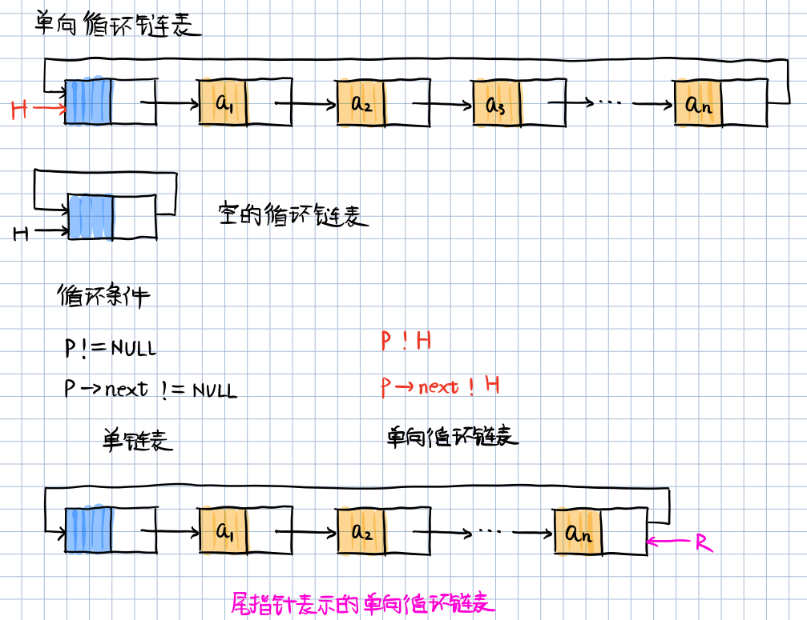

头指针表示单循环链表：

- 找 $a_1$ 结点的时间复杂度为：$O(1)$；
- 找 $a_n$ 结点的时间复杂度为：$O(n)$；

可见头指针的方式不方便，通常表的操作是在表的首尾位置上进行的，故可以使用**尾指针表示单向循环链表**：

- 找 $a_1$ 结点的时间复杂度为：$O(1)$；
- **找 $a_n$ 结点的时间复杂度为：$O(1)$；**

---

## 2.13 单向循环链表的合并 (尾指针)

将表Tb接在表Ta之后。


算法描述 ( 时间复杂度为 `O(1)` )：

```c
# include <stdio.h>
# include <stdlib.h>

# define ERROR -1
# define OK     1

typedef int Status;	   // 定义别名 
typedef int ElemType;  // 定义别名 

typedef struct LNode{
    ElemType data;
    struct LNode *next;
}LNode, *LinkList;

Status InitialLinkList(LinkList &L){
	L = (LinkList)malloc(sizeof(LNode));
	if (L == NULL){
		printf("申请内存空间失败！\n");
    }
    // 单向循环链表的空表表示: 头结点的指针域指向头指针 
	L -> next = L;
	
	return OK;
}


// 时间复杂度为 O(1)
LinkList ConnectLinkList (LinkList Ta, LinkList Tb){
    // 假设Ta Tb均为非空的单向循环链表
    // (1) p保存表Ta的头结点
    LNode *p;
    p = Ta -> next;
    // (2) Tb表头链接到Ta的表尾
    Ta -> next = Tb -> next -> next;
    // (3) 释放Tb表头结点
    free(Tb -> next);
    // (4) 修改指针
    Tb -> next = p;
}

Status printLinkList(LNode *head){
    LNode *p = head;
    while(p -> next != head) {
        p = p -> next;
        printf("%d", p -> data);
    }
    printf("\n");
    
    return OK;
}

Status main(){
	return OK;
}
```

---

## 2.14 双向链表的表示

为什么需要双向链表？

单链表只有指示后继结点的指针域，所以查找后继结点方便。查找某结点的后继结点的执行时间为 $O(1)$ 。但是，查找前驱结点难，只能从表头出发向后查找。即查找某结点的前驱结点的执行时间为 $O(n)$ 。

[**双向链表**]：在单链表的每个结点里再增加一个指向其直接前驱的指针域prior，这样链表中就形成了有两个方向不同的链，故称为双向链表。这样就克服了单向链表的缺点。

```c
typedef struct DLNode{
    ElemType data;
    struct DLNode *prior, *next;
}DLNode, *DLinkList;
```

[双向循环链表]：与单循环链表类似，双向链表也可以有循环表：

- 让头结点的前驱指针指向链表的最后一个结点；
- 让最后一个结点的后继指针指向头结点。

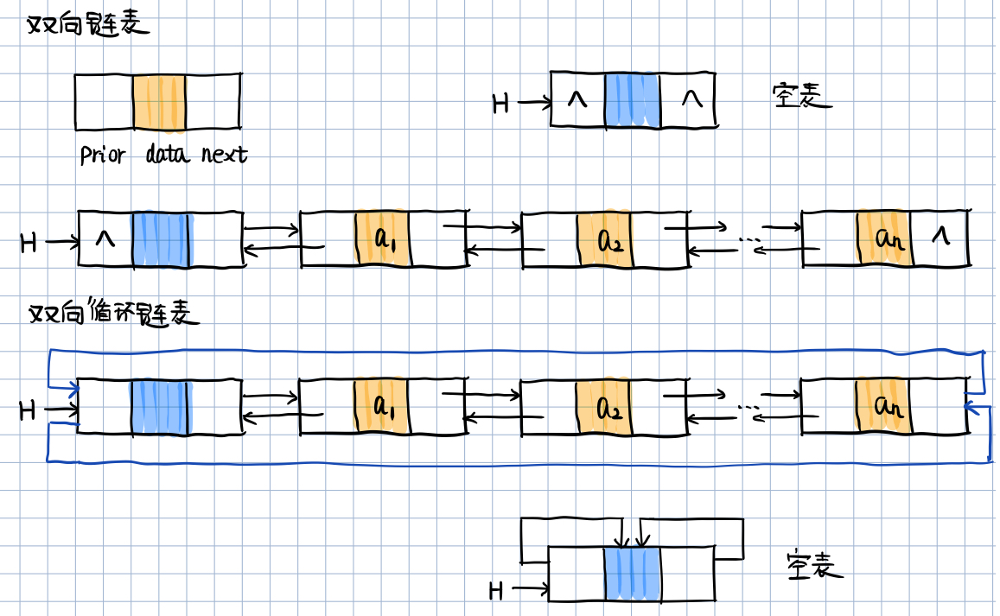

**双向链表结构的对称性**

某一个结点p，p的前驱结点的后继结点为自身，p的后继结点的前驱结点为自身：

```c
// 以下两条语句均等于p自身
p -> prior -> next = p;
p -> next -> prior = p;
```

在双向链表中有些操作（例如：ListLength、GetElem等），因为仅仅涉及一个方向的指针，故它们的算法与线性链表的相同。但在插入、删除时，则需要同时修改两个方向上的指针，两者的操作的时间复杂度均为 $O(n)$ 。

---

## 2.15 双向链表的插入

查找插入位置操作的时间复杂度为：$O(n)$；单纯插入操作的时间复杂度为：$O(1)$。故该算法的时间复杂度为：$O(n)$。


算法描述：

```c
// 在带头结点的双向循环链表L中的第i个位置之前插入元素e 
int InsertDLinkList(DLinkList &L, int i, ElemType e){
	// 查找插入位置p
	if(!( p = GetElemP_DLinkList(L, i) )){
		return ERROR;
	} 
	else{
		// 为待插入结点分配内存空间 
		DLNode *s;
		s -> data = e;
		// 1. 将待插入结点s的prior域 指向 前一个结点 
		s -> prior = p -> prior;
		// 2. 将前一个结点的next域 指向 待插入结点 
		p -> prior -> next = s;
		// 3. 将待插入结点的next域 指向 下一个结点 
		s -> next = p;
		// 4. 将下一个结点的prior域 指向 待插入结点 
		p -> prior = s;
	}
} 
```

## 2.16 双向链表的删除

查找删除位置操作的时间复杂度为：$O(n)$；单纯删除操作的时间复杂度为：$O(1)$。故该算法的时间复杂度为：$O(n)$。

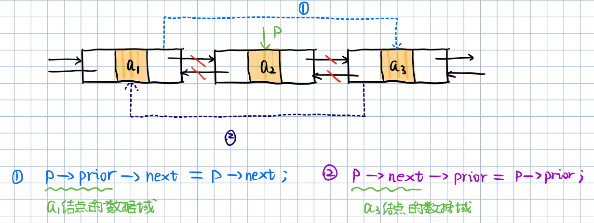

算法描述：

```c
// 删除带头结点的双向循环链表L的第i个元素，并用e返回 
int DeleteElemDLinkList(DLinkList &L, int i, ElemType &e){
	if(!( p = GetElemP_DLinkList(L, i) )) {
		return ERROR;
	}
	else{
		// 将待删除结点的数据域赋值给e 
		e = p -> data;
		// 1. 将前一个结点的next域指向待删除结点的下一个结点 
		p -> prior -> next = p -> next;
		// 2. 将待删除结点的下一个结点的prior域指向前一个结点
		p -> next -> prior = p -> prior; 
		// 3.释放被删除结点的空间
		free(p); 
	}
	return OK; 
} 
```

## 2.17 链表的时间效率比较

|                                 | 查找表头结点(首元结点) | 查找表尾结点                     | 查找节点 *p 的前驱结点                     |
| ------------------------------- | ---------------------- | -------------------------------- | ------------------------------------------ |
| 带头结点的单链表L               | `L->next;` \| $O(1)$   | 从`L->next;`依次向后遍历\|$O(n)$ | 通过 `p->next;` 无法找到其前驱结点         |
| 带头结点仅设头指针L的循环单链表 | `L->next;` \| $O(1)$   | 从`L->next;`依次向后遍历\|$O(n)$ | 通过 `p->next;` 可以找到其前驱结点\|$O(n)$ |
| 带头结点仅设尾指针R的循环单链表 | `R->next;` \| $O(1)$   | `R` \| $O(1)$                    | 通过 `p->next;` 可以找到其前驱结点\|$O(n)$ |
| 带头结点的双向循环链表L         | `L->next;` \| $O(1)$   | `L->prior;` \| $O(1)$            | `p->prior;` \|$O(1)$                       |

## 2.18 顺序表和链表的比较

链式存储结构的**优点**：

- 结点空间可以动态申请和释放；
- 数据元素的逻辑次序靠结点的指针来知识，**插入和删除时不需要移动数据元素**。

链式存储结构的**缺点**：

- 存储密度小，每个结点的**指针域需要额外占用存储空间**。当每个结点的数据域所占字节不多时，指针域所占存储孔家内的比重显得很大。
- 链式存储结构是**非随机存取结构**，对任一结点的操作都要从头指针按照指针链查找到该结点，这**增加了算法的复杂度**。

**存储密度**：结点数据本身所占的存储量和整个结点结构中所占的存储量之比，即：

**`存储密度 = 结点数据本身所占用的空间 / 结点占用的空间总量`**。例如，一单链表的一个结点，其数据域占用8个字节，指针域占用4个字节，可得存储密度为8/12=67%。

一般地，存储密度越大，存储空间的利用率就越高。显然，顺序表的存储密度=1，而链表的存储密度<1。


---

## 2.19 线性表的合并

- 重复元素的处理；

- 顺序问题；**非递减有序排列：存在相等的元素**。

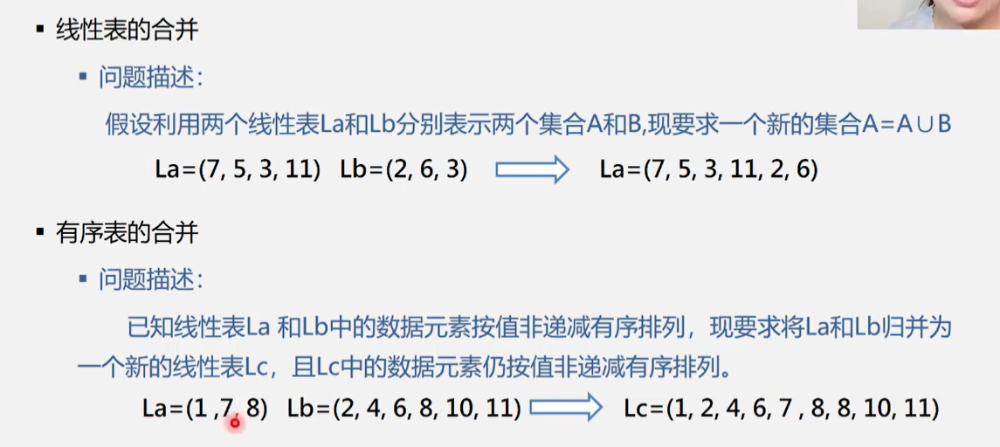

（通用）算法描述：

依次取出Lb中的每个元素，执行以下操作：

- 在La中查找该元素；
- 如果找不到，则将其插入La的最后。

```c
// 时间复杂度为：O(ListLength(La) * ListLength(Lb))

// 两表合并后，通过La返回
void union(List &La, List Lb){
    // 求两个链表的长度
    LaLen = ListLength(La);
    LbLen = ListLength(Lb);
    // 遍历Lb中的元素，看是否存在于La表中
    for(i=1; i <= LbLen; ++i){
        // 找到该元素
        GetElem(Lb, i, e);
        // 如果存在La中，说明重复了，不插入；如果不存在La中，则插入之
        if(!LocateElem(La, e)){
            ListInsert(&La, ++LaLen, e);
        }
    }
}
```

## 2.20 有序表的合并


算法步骤：

- 创建一个新表Lc；
- 依次从La或Lb中摘取元素值较小的结点插入到Lc表的最后，直至其中一个表变为空为止；
- 继续将La或Lb其中一个表的剩余节点插入在Lc表的最后。

### 1) 顺序表实现

注意指向表尾的指针：pa_last和pb_last。


算法描述：

```c
typedef int ElemType;

typedef struct{
	ElemType *elem;  // 存储空间基地址
	int length;		 // 当前长度(个数)
    int MaxSize;     //最大容量
}SeqList;

L.elem = (ElemType *)malloc(InitSize * sizeof(ElemType)); 

// *pa 表示取pa指针所指向地址的内容，即数值

void MergeListSeq(SeqList LA, SeqList LB, SeqList &LC){
    // 指针pa和pb的初值分别指向两个表的第一个元素
    pa = LA.elem;
    pb = LB.elem;
    
    // 新表长度为待合并两表的长度之和
    LC.length = LA.length + LB.length;
    // 为合并后的新表分配一个数组空间
    LC.elem = new ElemType[LC.length];
    // 指针pc指向新表的第一个元素
    pc = LC.elem;
    // 指针pa_last指向LB表的最后一个元素
    pa_last = LA.elem + LA.length - 1
    // 指针pb_last指向LA表的最后一个元素
    pb_last = LB.elem + LB.length - 1
    // 两个表都非空
    while (pa <= pa_last && pb <= pb_last){
        if(*pa <= *pb){
            // 依次摘取量表中值较小的结点
            *pc ++ = *pa ++;
        }
        else{
            *pc ++ = *pb ++;
        }
    }
    // LB表已经到达表尾，将LA中剩余元素插入LC
    while(pa <= pa_last){
        *pc ++ = *pa ++;
    }
    // LA表已经到达表尾，将LB中剩余元素插入LC
    while(pb <= pb_last){
        *pc ++ = *pb ++;
    }
}
```

算法时间复杂度：$O(ListLength(LA) + ListLength(LB))$

算法空间复杂度：$O(ListLength(LA) + ListLength(LB))$

关于语句 `*pc++ = *pa++`，相当于三条语句。

- 首先，由于是后置`++`运算，所以这里先进行赋值运算 `*pc = *pa`；
- 其次，再将两个指针向后移动一位，即 `(*pc)++`，`(*pa)++`。

注意，之所以可以直接使用 `++` 是因为顺序表的特性：逻辑上相邻的元素在物理存储上也相邻，指针 `++` 可以直接指向下一个数据元素，但在链表中就不可以！

关于时间复杂度的理解：当表a和表b已经是非递增有序排列，并且满足表a的最后一个元素，小于表b的第一个元素，此时需要操作的次数最多，为 O(a表长+b表长)。

### 2) 链表实现


两链表中，指针所指的元素比较小的一个赋值给pc。


比较两指针指向的下一个结点。


将pc指向较小的结点。

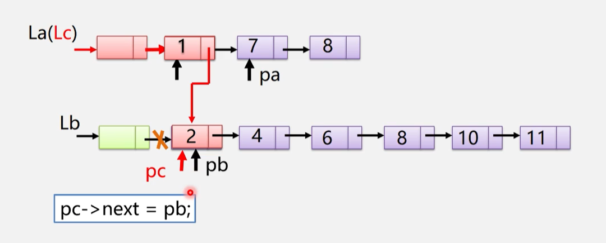

继续向下移动。


插入剩余段：


合并结果：


算法描述：

```c
void MergeList(LinkList &La, LinkList &Lb, LinkList &Lc){
    // 两个指针分别指向链表的首元结点
    pa = La -> next;
    pb = Lb -> next;
    // 额外的指针Lc，指向La的头结点
    pc = Lc = La;
    // 如果两个表都不为空，则比较指针指向的两个结点
    while(pa && pb){
        // 如果表A的结点元素值 <= 表B的结点的元素值
        if(pa -> data <= pb -> data){
            pc -> next = pa;
            pc = pa;
            // 指针pa向后移动
            pa = pa -> next;
        }
        else{
            pc -> next = pb;
            pc = pb;
            // 指针pb向后移动
            pb = pb -> next;
        }
        // 插入剩余段
        pc -> next = pa ? pa : pb;
        // 释放表B的头结点
        free(Lb);
    }
}
```

- 算法的时间复杂度：$O(ListLength(La) + ListLength(Lb))$。

- 空间复杂度： $O(1)$，即不需要额外空间。

---

## 2.21 实例1: 普通多项式运算

一元多项式的运算：实现两个多项式加、减、乘运算。

$P_n(x) = p_0 + p_1 x + p_2 x^2 + ... + p_n x^n$

思路：将多项式中的系数看做一个线性表：$(p_0, p_1, p_2, ..., p_n)$，每一项的指数 $i$ 隐含在其系数 $p_i$ 的序号中。

例如：$P(x) = 10 + 5x - 4x^2 + 3x^2 + 2x^4$

| 指数(下标 i) | 0    | 1    | 2    | 3    | 4    |
| ------------ | ---- | ---- | ---- | ---- | ---- |
| 系数 p[i]    | 10   | 5    | -4   | 3    | 2    |

两个多项式的相加运算：使用顺序表实现，将相同位置的元素对应相加即可。

.png)

## 2.22 实例2: 稀疏多项式运算

对于稀疏多项式，如果使用顺序表存储，则会出现许多为零的项，造成存储空间的浪费，因此使用结构体数组 (顺序存储) 实现，只保存非零项即可。


思路：对于多项式 $P_n(x) = p_1x^{e_1} + p_2 x^{e_2} + ... + p_m x^{e_m}$ ，使用线性表可以表示为：$P = ((p_1, e_1), (p_2, e_2), ..., (p_m, e_m))$。这样就可以将多项式的运算转换为线性表的运算。对于上例则有：


算法实现思路：

- 创建一个新数组 c；
- 分别从头遍历比较 a 和 b 的每一项；
  - 若指数相同，对应系数相加，若其和不为零，则在c中增加一个新项；若其和为零，则不添加新项；
  - 若指数不相同，将指数较小的项复制到c中；
- 一个多项式已经遍历完毕时，将另一个剩余项依次复制到c中即可。

那么数组 c 多大合适呢？上述顺序存储结构的空间复杂度较高，存储空间分配不灵活，因此使用**链式存储**来实现。多项式中的每一项都作为链表中的一个结点。该链表中的每个结点都有两个数据域，一个是系数，一个是指数。

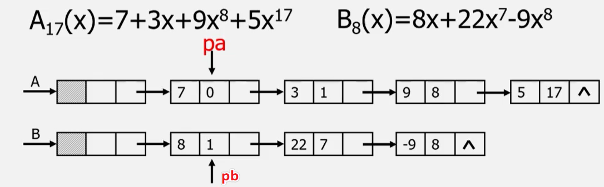

链表定义：

```c
typedef struct PNode{
    float coef;  // 系数
    int expn;  // 指数
    struct PNode *next;  // 指针域
}PNode, *Polynomial;
```

多项式创建——算法步骤（尾插法实现）：

- 创建一个带有头结点的空链表。
- 根据多项式的项的个数n，循环n次执行以下操作：
  - 生成一个新结点 *s；
  - 输入多项式当前项的系数和指数赋给新结点 *s的数据域；
  - 设置一**前驱指针pre**，用于**指向待找到的第一个大于输入项指数的结点的前驱**，pre初值指向头结点；
  - 指针q初始化，指向首元结点；
  - 循链向下逐个比较链表中当前结点与输入项指数，找到第一个大于输入项指数的结点 *q；
  - 将输入项结点 *s插入到结点 *q之前。

多项式创建——算法描述：

注意：该算法可以适用于指数的阶数的输入顺序不做限制的情况。

```c
void CreatPolyn(Polynomial &P, int n){
    P = new PNode; // C++ style
    P -> next = NULL; // 建立一个带头结点的单链表
    // 依次输入n个非零项
    for(i=1; i <= n; ++i){
        s = new PNode; // 生成新结点
        
        scanf("%f", &coef); // 输入系数
        scanf("%d", &expn); // 输入指数
        
        pre = P; // pre 用于保存q的前驱，初值为头结点
        q = P -> next; // q初始化，指向首元结点
        // 找到第一个 > 输入项指数的项 *q
        while (q && q -> expn < s -> expn){
            pre = q;
            q = q -> next;
        }
        // 将输入项 s 插入到 q 和其前驱结点pre之间
        s -> next = q;
        pre -> next = s;
    }
}
```

多项式相加——算法分析：

- 两个链表建立完毕之后，首先比较两个链表中第一个结点，看哪一个的指数比较小，比较小的结点，作为新链表的元素（因为未创建新的链表，所以相当于在原链表中保持不变，例如下图中A的常数项7）；
- 该链表继续向后移动指针，碰到与另一个链表中指数相同的结点，则将系数进行相加，并保存在一个链表中（下例中，x项的系数相加后，保存在了A表中）。

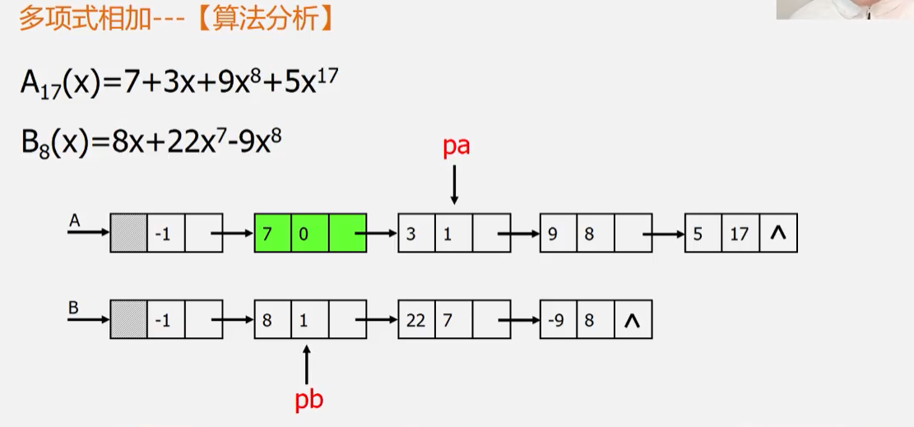

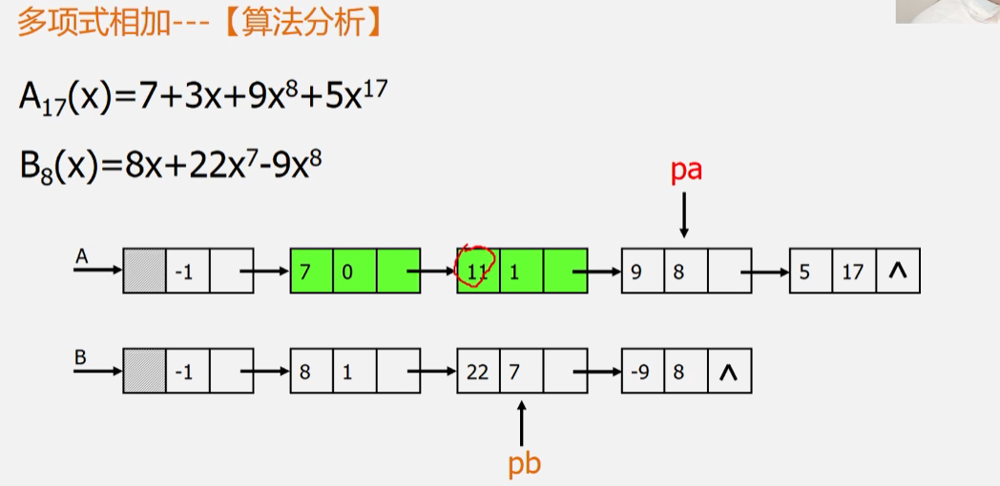

- 如果两个链表不存在相同指数的结点，则保存指数较小的结点元素，并让该表的指针继续向下移动。若两结点的系数求和结果为零，则舍弃该项。

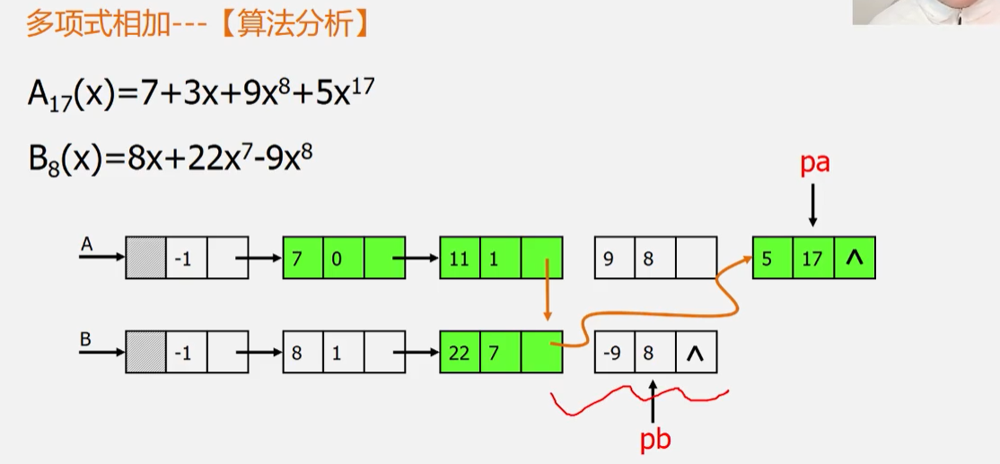

相加结果：

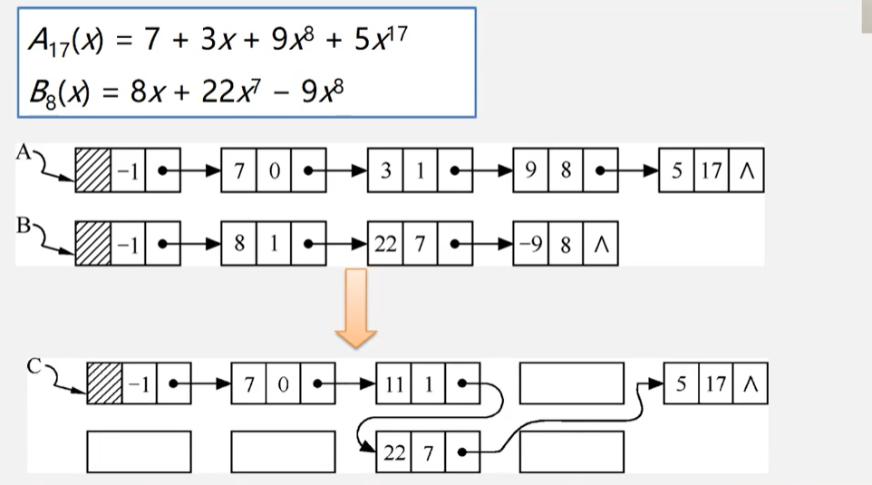

多项式相加——算法步骤：

- 指针p1和p2初始化，分别指向pa和pb的首元结点。
- p3指向和多项式的当前结点，初值为pa的头结点。
- 当指针p1和p2均未到达相应表尾时，则循环比较p1和p2所指结点对应的指数值（p1 -> expn < p2 -> expn），有下列三种情况：
  - p1 -> expn == p2 -> expn 时，则将两个结点中的系数相加；
    - 若和不为零，则修改p1所指结点的系数值，同时删除p2所指结点。
    - 若和为零，则删除p1和p2所指结点。
  - p1 -> expn < p2 -> expn 时，则应摘取p1所指结点插入到 “和多项式” 链表中去；
  - p1 -> expn > p2 -> expn 时，则应摘取p2所指结点插入到 “和多项式” 链表中去；
- 将非空多项式的剩余段插入到p3所指结点之后；
- 释放pb的头结点。

## 2.23 实例3: 图书信息管理

很少做插入删除操作，而经常需要通过序号查询某一本书：顺序表。

经常需要做插入删除操作：链表。

首先定义保存图书信息的结构体：

```c
typedef struct Book{
    char id[20];  //ISBN
    char name[50];  // 书名
    int price;  // 定价
}Book;
```

顺序表和链表的定义：

```c
typedef struct SeqList{
    Book *elem;
    int length;
}SeqList;

typedef struct LNode{
    Book data;
    struct LNode *next;
}LNode, *LinkList;
```

---

## 2.24 易错题


----

> 参考资料：
>
> 1. 严蔚敏《数据结构(C语言描述)》
> 2. 数据结构与算法基础：[bilibili](https://www.bilibili.com/video/BV1nJ411V7bd?p=5&spm_id_from=pageDriver)
> 3. 数据结构复习指导
> 4. 数据结构高分笔记

